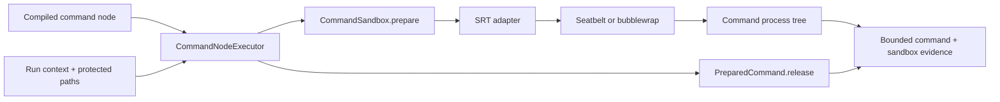

# Issue 8: Fail-closed command sandbox

- Status: accepted after design review
- Date: 2026-08-06
- Issue: https://github.com/synaptiai/flow-harness/issues/8
- Scope: Gate 3b, command-node containment

## Decision summary

Flow will put every command node behind a harness-owned `CommandSandbox` port. The first
adapter will use the Apache-2.0 Anthropic Sandbox Runtime (SRT), the same OS-level runtime
demonstrated by Pi's official sandbox extension. Flow will preserve its argv-only workflow
contract, fail before spawn when containment cannot be established, deny network and ambient
credentials by default, and retain sandbox provenance in durable command evidence.

This decision imports a containment primitive, not a harness policy. Flow owns the public
contract, secure profile, lifecycle, failure semantics, evidence, and tests. SRT remains a
replaceable infrastructure adapter alongside possible future Gondolin, Docker, or OpenShell
adapters.

## Evidence from Pi and OMP

### Pi

Pi intentionally runs with the permissions of its host process and documents external
containment as the security boundary. Its current reference implementations demonstrate two
useful seams:

1. The lightweight sandbox extension replaces Bash operations with SRT-backed execution.
2. The Gondolin extension replaces read, write, edit, list, search, and Bash operations with a
   shared Linux micro-VM while the model runtime and provider authentication stay on the host.

Both examples support the same architectural conclusion: the harness should depend on an
operation interface, not embed host process calls throughout the loop.

Pi's SRT example is not adopted verbatim. It falls back to local Bash when sandbox setup fails,
accepts command strings, inherits the child environment, and enables several network domains by
default. Those choices are unsuitable for Flow's evidence-driven, fail-closed contract.

### OMP

OMP provides a useful authorization vocabulary: read, write, and exec tiers; per-tool
allow/prompt/deny decisions; ordered Bash rules; and hard checks for critical command shapes.
Its Bash executor still runs on the host, so the approval layer does not contain transitive
effects such as package lifecycle scripts or subprocesses.

Flow will reuse the conceptual separation:

```text
operation request -> authorization policy -> sandboxed effect -> durable evidence
```

Issue 8 implements the sandboxed-effect portion. Exact approval grants remain coupled to durable
wait/resume and are a later increment.

## User, operator, and system flows

### Developer flow: run a workflow

1. The developer runs a valid workflow without changing its YAML.
2. Flow resolves the execution workspace and actual run-store path.
3. Before a command can spawn, the sandbox adapter canonicalizes the relevant paths, creates a
   private temporary directory, validates platform dependencies, and initializes SRT.
4. Flow encodes the declared executable and arguments without changing argument boundaries.
5. The command and every descendant run inside the OS sandbox.
6. Flow captures bounded output, hashes, termination state, and sandbox provenance.
7. Flow tears down the sandbox before returning the node outcome.

### Operator flow: missing containment dependency

1. The operator starts a run on an unsupported or incompletely configured host.
2. Sandbox preparation returns a bounded diagnostic before command spawn.
3. The node fails with `command_sandbox_unavailable`, `retryable: false`, and
   `sideEffectStatus: none`.
4. The run ledger remains inspectable; no unsandboxed fallback exists.

### System flow: cancellation or timeout

1. Flow signals the detached sandbox launcher process group.
2. The launcher and its descendants receive termination, followed by the existing forced-kill
   grace path when required.
3. Output and sandbox evidence are retained.
4. SRT state and the private temporary directory are released before the result is returned.

### System flow: cleanup failure

1. The command has already spawned, so Flow cannot claim that no effect occurred.
2. A sandbox teardown failure becomes `command_sandbox_cleanup_failed` with sandbox evidence and
   `sideEffectStatus: uncertain`.
3. The original command outcome is not reported as success.

## Options considered

| Option | Isolation | Setup and compatibility | Harness coupling | Decision |
| --- | --- | --- | --- | --- |
| SRT behind a Flow port | Native Seatbelt on macOS; bubblewrap/network namespace on Linux | Lightweight; Node 20+; Linux needs bubblewrap, socat, and ripgrep | Low; Apache-2.0 adapter is replaceable | Selected |
| Gondolin behind a Flow port | Linux micro-VM with programmable VFS, network, and credential mediation | Strong boundary; QEMU and a roughly 200 MB first-use image; guest/host toolchain compatibility must be managed | Low to medium | Future high-isolation backend |
| Docker or OpenShell runner | Container, VM, or managed remote sandbox | Familiar operational model, but requires daemon/gateway and reproducible execution images | Medium | Future remote/managed backend |
| OMP-style approval rules only | No OS containment | Simple and interactive | High risk: approved commands retain host authority | Rejected as a sandbox |
| Hand-written platform wrappers | Depends on implementation | No runtime dependency, but duplicates subtle filesystem, socket, proxy, and process-tree security work | High maintenance and security risk | Rejected |

## Architecture



### Harness-owned port

The application-facing contract is provider-neutral:

```ts
interface CommandSandboxRequest {
  executable: string;
  args: readonly string[];
  cwd: string;
  protectedPaths: readonly string[];
  signal?: AbortSignal;
}

interface PreparedCommand {
  launch: {
    executable: string;
    args: readonly string[];
    env: Readonly<Record<string, string>>;
  };
  evidence: SandboxEvidence;
  release(): Promise<void>;
}

interface CommandSandbox {
  prepare(request: CommandSandboxRequest): Promise<PreparedCommand>;
}
```

`CommandNodeExecutor` cannot be constructed without a sandbox implementation. Test doubles may
implement the port, but the production CLI always supplies the SRT adapter.

### SRT adapter

The adapter performs these steps in order:

1. Reject unsupported platforms.
2. Canonicalize the workspace and every protected path.
3. Create a private per-command temporary directory.
4. Check SRT dependencies and treat errors or degraded-security warnings as fatal.
5. Initialize a fixed version-1 Flow profile.
6. Serialize the executable and each argument with a POSIX single-quote encoder.
7. Call SRT's argv wrapper and validate that it returned a non-empty launch descriptor.
8. Replace its ambient environment with Flow's explicit environment allowlist.
9. Return a release handle that runs SRT's per-command cleanup, resets the SRT session, and
   removes the private temporary directory under a bounded deadline.

SRT is currently process-global. Flow workflows execute nodes sequentially, so one manager may
own one prepared command at a time across every adapter instance that shares it. Concurrent
preparation fails closed instead of sharing or mutating process-global sandbox state. A teardown
failure poisons that manager for the rest of the process because its effective state is uncertain.
Parallel command execution is a stated non-goal for this increment.

### Secure profile version 1

The first profile is code-owned rather than workflow-configurable:

- Network: deny all domains, direct sockets, local binding, and undeclared Unix sockets.
- Reads: deny the current user home, then allow the canonical execution workspace and private
  temporary directory. System runtime paths remain readable as required by SRT.
- Writes: allow the canonical workspace and private temporary directory, then deny the actual
  run-store root, `.flow`, `.git`, environment files, and key files.
- Environment: retain only a documented execution allowlist such as `PATH`, locale, terminal,
  private temp, and CI indicators. Provider keys, proxy credentials, Node injection variables,
  and unrelated host variables are not inherited.
- Credentials: no injection or masking in this increment.

On Linux, SRT reports missing seccomp support as a warning because filesystem and network
namespaces can still run. Flow treats that warning as fatal: without seccomp, Unix-socket access
is not restricted, which would weaken the declared profile.

The actual run-store path is passed through `RunWorkflowOptions` into `NodeExecutionContext` as a
protected path. This protects relocated `--runs-dir` state rather than relying only on the
conventional `.flow` name.

### Argument preservation

Workflow command nodes remain argv-only. The SRT API internally launches a shell wrapper on
macOS/Linux, so the adapter must convert argv into exactly one safe POSIX command line. Each value
is single-quoted and embedded single quotes are represented with the standard close/escaped/open
sequence. Empty arguments remain explicit empty arguments.

Tests cover spaces, empty strings, quotes, newlines, metacharacters, substitutions, redirects,
Unicode, and values that resemble additional commands. No raw workflow value is concatenated
outside the encoder.

### Evidence and replay

Every newly executed command records:

```text
backend: anthropic-sandbox-runtime
backendVersion: exact installed version
profile: workspace-write-network-deny-v1
policyDigest: sha256 of a canonical semantic profile
```

The digest uses semantic placeholders such as WORKSPACE, PRIVATE_TEMP, and RUN_STORE instead of
machine-specific absolute paths. It is therefore deterministic for the same profile while the OS
adapter still receives canonical absolute paths.

The sandbox field is optional when reading version-1 events so ledgers created before issue 8
remain replayable. Backend and profile names are strict, bounded machine identifiers rather than
SRT literals, so a future adapter does not require a ledger-shape migration. The production
command executor always emits sandbox evidence for new command results.

## Coupling analysis

- `CommandNodeExecutor` couples only to `CommandSandbox`, not SRT.
- The CLI composition root couples the SRT adapter to the command executor.
- `runWorkflow` gains only protected-path context and remains unaware of sandbox vendors.
- Workflow compilation and YAML do not change.
- Durable event parsing gains an additive backward-compatible evidence field.
- Policy authorization remains separate from containment. A future approval cannot weaken the
  sandbox implicitly; it must create an explicit policy/profile change.

## Specification

### Non-goals

- Human approval acquisition, grant persistence, or resuming an approval-paused run.
- Model write, shell, browser, network, or credential tools.
- User-configurable filesystem or network policy.
- Network allowlists or secret injection.
- Windows enablement.
- Gondolin, Docker, or OpenShell adapters.
- Parallel command-node execution.
- Treating command-string inspection as a security boundary.

### Failure modes

| Condition | Required behavior |
| --- | --- |
| Unsupported platform | Fail before spawn with `command_sandbox_unavailable` and side effects `none` |
| Missing SRT dependency | Fail before spawn with an actionable bounded message |
| Workspace does not exist or cannot be canonicalized | Fail before initialization and spawn |
| Protected path cannot be resolved safely | Fail closed; never silently drop the protection |
| SRT initialization rejects | Reset partial state best-effort, remove private temp, and fail before spawn |
| Wrapper returns an invalid descriptor | Release the sandbox and fail before spawn |
| Spawn rejects | Release the sandbox and report the existing spawn failure contract |
| Command exits non-zero | Preserve exit/output evidence and sandbox evidence |
| Timeout or abort | Terminate the process group, preserve evidence, then release the sandbox |
| Release fails after spawn | Fail the node with `command_sandbox_cleanup_failed` and side effects `uncertain` |
| Output exceeds bounds | Preserve existing bounded prefix and full-stream hash behavior |
| Invalid or malicious argv | Preserve exact argument boundaries; do not execute an additional command |
| Ambient secret environment variable exists | Omit it from the child environment |
| Direct or loopback network request | Deny it unless it is SRT's internal mediation channel |

### Timeouts

- Sandbox preparation observes the run abort signal.
- The existing command timeout starts immediately before spawn, not during dependency checks.
- Teardown has a bounded internal deadline; exceeding it is a cleanup failure.
- The existing SIGTERM then SIGKILL process-group policy remains authoritative for commands.

### Partial failures

- A preparation failure has no command side effects and no command evidence.
- A spawn failure has no known command side effect but still requires sandbox release.
- Once spawn succeeds, any ambiguous termination or cleanup failure reports uncertain side
  effects.
- A successful command is not committed as successful until sandbox release succeeds.

### Invalid input

- Empty executables and oversized arguments remain compiler errors.
- Runtime path canonicalization rejects missing workspaces and unresolved protected paths.
- The adapter validates all backend output before passing it to `spawn`.
- Environment names come only from a code-owned allowlist.

### Missing context

- Embedded callers that use the production command executor must provide their durable store path
  in `RunWorkflowOptions.protectedPaths`.
- The CLI always supplies its resolved runs directory.
- An empty protected-path list is valid only for callers with no filesystem-backed control state;
  `.flow` and `.git` are still protected by the profile.

### Interface contracts

- `prepare` either returns a fully enforced launch descriptor or throws before spawn.
- `release` is idempotent from the executor's perspective and is called exactly once for every
  successful `prepare`, including spawn errors, timeouts, and aborts.
- `release` invokes both backend per-command cleanup and backend session reset before removing
  the private temporary directory.
- The launch descriptor is immutable and contains no provider credentials.
- `CommandNodeExecutor` records requested executable/args, not backend wrapper argv, as command
  evidence.
- Sandbox evidence describes the effective semantic profile and is immutable.
- No SRT, Pi, provider, UI, or filesystem implementation type enters the domain workflow model.

## Security limitations retained

- SRT is an Anthropic research-preview project and its API may evolve. Flow pins an exact version,
  tests the adapter contract, and exposes no SRT type outside infrastructure.
- macOS containment depends on the operating system's Seatbelt implementation through
  `sandbox-exec`; Linux containment depends on unprivileged user namespaces, bubblewrap, socat,
  ripgrep, and bundled seccomp support.
- System runtime paths remain readable so ordinary compilers and interpreters can start.
- The profile removes ambient credentials from the child environment and denies the user home,
  but it is not a separate machine identity. Defending against every same-user host-process
  introspection channel requires a stronger VM or managed-sandbox backend such as Gondolin or
  OpenShell.
- Workspace writes are intentionally enabled for builds and tests. Existing environment and key
  files are write-protected, but a declared command may still modify ordinary workspace source.
- This boundary contains command nodes. The Flow process, Pi adapter, and imported JavaScript
  dependencies remain in the host trust boundary.

## Design review record

The design was reviewed in two stages before production implementation.

### Stage 1: specification compliance

- All issue acceptance criteria map to a component and runnable verification command.
- Workflow YAML remains unchanged; the change is isolated to execution context, infrastructure,
  and additive evidence.
- The design covers invalid input, timeouts, missing dependencies, partial initialization, spawn,
  termination, cleanup, replay compatibility, and missing embedded-caller context.
- Human approvals were confirmed as out of scope because exact grants require durable wait/resume.

### Stage 2: security, correctness, portability, and operability

| Priority | Finding | Resolution |
| --- | --- | --- |
| P1 | SRT can report degraded Unix-socket isolation as a warning | Treat every dependency warning as a preparation failure for profile v1 |
| P1 | Protecting only `.flow` misses a relocated run store | Pass the resolved store root as a protected execution-context path |
| P1 | SRT's POSIX API accepts a command string | Add a single audited argv encoder with hostile round-trip tests; spawn only SRT's returned argv with `shell: false` |
| P1 | A command could be reported successful before sandbox teardown | Make successful release a prerequisite for node success; cleanup failure is uncertain |
| P2 | Ambient `process.env` contains provider keys and injection variables | Replace it with a code-owned allowlist and private temp variables |
| P2 | SRT is beta and process-global | Pin exactly, isolate behind a port, reject concurrent preparation across adapter instances, poison the manager after teardown failure, and document the limitation |
| P2 | A native sandbox is weaker than a VM for host-process isolation | State the residual risk and retain Gondolin/OpenShell as stronger future backends |
| P2 | Existing runtime cancellation fixtures write outside their execution cwd | Move their execution cwd to the controlled fixture workspace instead of broadening the sandbox |

No unresolved P1 or P2 design findings remain. Implementation may proceed under the verification
map above.

### Post-implementation adversarial review

| Priority | Finding | Test | Resolution |
| --- | --- | --- | --- |
| P1 | The upstream manager is process-global, but the initial lease was adapter-instance-local | Two adapters sharing one fake manager could prepare concurrently | Track active/poisoned state per manager object; reject cross-adapter overlap |
| P1 | A teardown error allowed a later command to reuse uncertain global state | Preparation succeeded after injected cleanup failure | Poison that manager for the process after any teardown error or timeout |
| P2 | `SandboxEvidence` used an SRT-only backend literal despite the backend-neutral port | A valid hypothetical Gondolin record failed event parsing | Use strict bounded backend/profile identifiers while preserving the evidence shape |
| P2 | Real boundary coverage protected a relocated run store but asserted `.flow`/`.git` only through adapter configuration | Live child write attempts were absent | Add real denied writes to the compiled-runtime boundary suite |

All findings were reproduced before their fixes. No unresolved P1 or P2 implementation findings
remain after the focused tests and complete local quality gate.

## Acceptance criteria verification map

| Criterion | Verification command | Evidence expected |
| --- | --- | --- |
| Sandbox precedes every spawn and preparation fails closed | `npx vitest run test/unit/infrastructure/process/command-node-executor.test.ts` | Fake sandbox/launcher ordering and zero-spawn assertions |
| Argument boundaries are preserved | `npx vitest run test/unit/infrastructure/sandbox/posix-argv.test.ts` | Table and generated hostile argv cases round-trip exactly |
| Environment is allowlisted | `npx vitest run test/unit/infrastructure/sandbox/srt-command-sandbox.test.ts` | Secret and injection variables absent; required safe keys retained |
| Workspace works and protected paths are denied | `npx vitest run --config vitest.runtime.config.ts test/runtime/sandbox-boundary.runtime.test.ts` | Real workspace write succeeds; sibling-home read and run-store, `.flow`, and `.git` writes fail |
| Network is denied | `npx vitest run --config vitest.runtime.config.ts test/runtime/sandbox-boundary.runtime.test.ts` | Reachable host loopback server is unreachable from sandboxed command |
| Timeout/cancel kills descendants | `npx vitest run --config vitest.runtime.config.ts test/runtime/cli-process.runtime.test.ts` | Existing process-tree cases pass through sandbox wrapper |
| Evidence and replay are durable | `npx vitest run test/integration/fs/jsonl-run-store.test.ts test/unit/run/reducer.test.ts` | Sandbox evidence round-trips; legacy event remains readable |
| macOS/Linux dependency behavior is explicit | `npx vitest run test/unit/infrastructure/sandbox/srt-command-sandbox.test.ts` | Supported, unsupported, error, and warning paths classified |
| Workflow YAML remains compatible | `npx vitest run test/unit/workflow/compiler.test.ts test/integration/cli/main.test.ts` | Existing fixtures compile and run unchanged |
| Full quality contract | `npm run check && npm run test:coverage && npm run pack:check` | Formatting, lint, types, tests, build, runtime, coverage, and package pass |

## Documentation changes required

- `README.md`: secure command behavior and Linux prerequisites.
- `docs/architecture.md`: authorization/containment boundary and composition.
- `docs/capability-sourcing.md`: SRT imported capability; Pi/OMP/Gondolin findings.
- `docs/roadmap.md`: Gate 3b delivery status and remaining approval/resume work.
- `docs/testing-and-evaluation.md`: real sandbox boundary tests and CI dependencies.
- `docs/workflow-spec.md`: command effects, environment, network, and protected state.
- `SECURITY.md`: threat boundary, remaining limitations, and reporting expectations.
- `THIRD_PARTY_NOTICES.md`: SRT attribution.

## Primary references

- Pi security: https://pi.dev/docs/latest/security
- Pi containment patterns: https://github.com/earendil-works/pi/blob/main/packages/coding-agent/docs/containerization.md
- Pi SRT extension: https://github.com/earendil-works/pi/blob/main/packages/coding-agent/examples/extensions/sandbox/index.ts
- Pi Gondolin extension: https://github.com/earendil-works/pi/blob/main/packages/coding-agent/examples/extensions/gondolin/index.ts
- OMP settings and approvals: https://github.com/can1357/oh-my-pi/blob/main/docs/settings.md
- OMP Bash implementation: https://github.com/can1357/oh-my-pi/blob/main/packages/coding-agent/src/tools/bash.ts
- SRT source and security model: https://github.com/anthropic-experimental/sandbox-runtime
- Gondolin source and security model: https://github.com/earendil-works/gondolin
