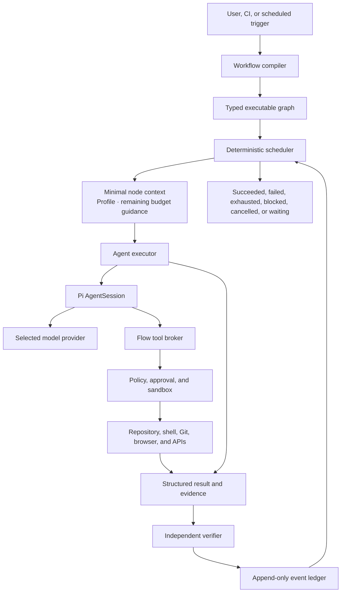

# Architecture

## Context

Flow turns a collection of useful software-development practices into an enforceable harness. The previous plugin described workflows through Markdown commands, skills, YAML metadata, and host hooks. Claude Code still owned the actual agent loop, scheduling, tool semantics, context, and session lifecycle.

The standalone harness reverses that relationship. Flow owns workflow execution and delegates only bounded node work to an embedded agent runtime.

This document describes the target architecture unless a section is explicitly labeled as the
current executable slice. The delivery roadmap is the source of truth for implementation status.
Gates 1 and 2 provide compiled graphs, evidence-based completion, bounded Pi agent nodes,
cancellation, and replayable local ledgers. Gate 3 adds the Flow policy broker, hash-anchored edits,
argv-only agent commands, fail-closed native command containment, exact deterministic-command
approval, and exact per-call approval for live agent `exec` tools. Gate 4 adds committed-boundary
recovery, exclusive local ownership, typed edit reconciliation, proof-safe fresh agent attempts,
durable budgets, detachable waits, and bounded authenticated local supervision. Gate 5 adds typed
results and verifiers, replay-safe conditions, joins, concurrency, bounded loops and optimization,
evidence-bound graph approvals, isolated child workflows, and candidate promotion. Gate 6 adds
strict local and exact installed Agent Skills, versioned verifier packages, and declarative command
tool packages. It also adds inert workflow packages and deterministic bundle distribution. Exact
publisher-authenticated OCI acquisition, a content-addressed project store, and immutable snapshots
are included.

Gate 7 adds reviewed adaptive changes above the evaluation layer. Prompt and Agent Skill candidates
can change bounded prompt or package surfaces. A model-routing candidate can replace one exact model
tuple on one existing root agent node. A child-specialist candidate can replace one embedded child
agent's instructions or select an exact subset of Agent Skills already in the immutable closure.
One supplemental-memory candidate can add, replace, or remove one bounded reference entry for one
existing root or embedded-child agent. An operator can also request one bounded model suggestion
for an add or replacement. The operator fixes the target and operation, and the output remains an
inert candidate under the same evaluation and activation gates.
Flow evaluates each change under shared non-candidate controls, then activates one complete
effective harness state.

Flow includes first-party terminal and local browser presentation hosts over the public run
projection. A strict A2UI v0.9.1 profile lets an exact inert package arrange the closed host-owned
widget catalog for one session. Executable or remote UI extensions remain later work.
Explicit signed capability metadata provides project-local freshness and revocation. One explicit
public HTTPS check can stage inert signed candidates for review, while activation remains a
separate explicit command. A standards-based TUF repository can now select exact signed package
envelopes through threshold roles, sequential root rotation, freshness metadata, consistent
snapshots, and bounded delegations. The operator supplies the initial root locally. Flow contains
the standard client in disposable staging, reopens its output, repeats package and Sigstore
verification, and publishes only inert Flow-owned candidates. Private repositories and online root
bootstrap remain later work. An operator can explicitly replace one
established same-surface bundle with a strictly newer reviewed candidate. Flow publishes the new
immutable blob first and replaces the old active lock entry in one atomic lock generation.
An optional foreground watcher can perform that replacement for one already-installed package.
It binds the exact publisher and permits patch updates by default. Same-major minor updates require
an explicit policy. It never installs a first version or accepts a major or policy-package update.
A separate finite first-activation controller can install one exact missing package. It binds the
exact version and publisher, waits a complete interval before each check, requires active Flow
metadata, and accepts only inert non-policy package surfaces. Durable waiting, prepared, and settled
records make the operation restart-safe. A settled record consumes the authority and prevents later
reinstallation. Explicit retired-blob maintenance previews a bounded physical store and applies one
digest-bound plan under the package mutation lock. POSIX open-file handles preserve complete reader
generations.
Opaque provider-session continuation and general failure or fallback
retries remain later work. The same is true for broader configurable policy, model network
tools, and arbitrary evaluator runtimes. Stronger VM or managed sandbox backends also remain later
work.

Gate 8 provides the first installable preview, current source-build environment diagnostics, and a
guided quick start. The diagnostic checks only the selected requirements. Quick start publishes a
minimal project and reuses the ordinary attached workflow boundary. Its explicit coding mode also
publishes one reviewed fixture, admits only read, list, and hash-bound edit tools, and delegates
acceptance to a deterministic command verifier. Neither path grants new execution authority or
makes an optional runtime a base dependency.

Gate 9 currently adds a revisioned goal workspace, read-only semantic code queries,
content-addressed retained command artifacts, durable work profiles, and private provider-neutral
model-session records. A work profile gives each model attempt fixed pacing guidance and a
point-in-time remaining-budget view. It does not change run authority. The artifact boundary keeps
bounded previews in the run ledger, exact bytes in a project store, and immutable producer
references in command evidence. The model-session boundary commits completed context and request
identity separately from workflow authority, then renders a bounded untrusted-data turn for an
eligible fresh recovery.
Gate 9 also adds a dedicated reference-first compaction experiment. It projects verified artifact
references before one optional bounded summary and compares three modes on held-out tasks. It does
not enable a production compaction policy.
Gate 9 also lets an operator attach a bounded, evidence-backed relationship sidecar to reviewed
supplemental memory. Relationship admission resolves exact run events, while execution uses only
the immutable effective runtime. Contradictions remain explicit and unresolved. No live graph or
retrieval service is added.
Only an explicitly selected, policy-controlled tool can read bounded windows. Operators control
retention and exact-plan pruning. The semantic boundary freezes one
operator-selected language server. It runs one bounded LSP 3.18 request in a short-lived sandbox.
It then verifies source currentness and records a private canonical receipt. Goal text and semantic
results remain context rather than workflow authority.

Gate 10 now provides a prompt-only local ACP v1 executor. An operator can select one exact local
binary or Node package closure for validation, attached execution, or detached execution. Flow
freezes that identity in the run capability snapshot. It routes eligible work through one fresh
contained process and session for each attempt. Recovery rejects identity drift.

Gate 10 also provides a closed ACP interoperability qualification. It binds two distinct exact
agents to one agent-to-result workflow, shared controls, private canonical result verification, and
a complete paired schedule. The report separates proven conformance failure from missing evidence
and makes no claim for an untested agent pair.

Gate 10 also adds exact phase-aware model routing. One immutable candidate assigns reviewed roles
and routes to every model-bearing root or embedded-child node. Flow records the decision with each
durable provider request. It qualifies the exact profile pair on held-out quality, cost, latency,
and safety evidence. Only a complete qualified artifact can activate. Learned routing and silent
fallback remain outside runtime authority.

Gate 10 also adds one bounded local delegation experiment. A reviewed candidate can give one exact
embedded Pi manager a sealed empty-input tool for one exact foreground child. The capability binds
the objective, child workflow, package closure, executor, typed result, five resource ceilings,
depth, and call count. Durable preparation and settlement reuse isolated child-run identity,
recovery, replay, cancellation, cleanup, and accounting. Paired evaluation reports both
delegation-suitable and sequential-control tasks, but no result can activate delegation.

Recovery starts a fresh session only when the durable proof permits it. Runs without the selection
retain the embedded Pi path.

## Architecture at a glance

Flow is distributed as one Node.js command-line package. It can start local supervisor and worker
processes and pinned local containers for Prime evaluation and Lean proof verification. The diagram follows a request from
the person or automation that starts it to the systems that perform work and the records that
survive interruption.

```mermaid
flowchart TB
    people["People and automation<br/>Developers · operators · CI"]

    subgraph delivery["0. Distribution — publishes one reviewed package"]
        direction LR
        release["Preview automation<br/>Build once · test x64 · attest"]
        reference["Generated capability reference<br/>Stable JSON · readable Markdown"]
        channels["Immutable GitHub release<br/>npm preview channel"]
    end

    subgraph access["1. Ways to use Flow"]
        direction LR
        cli["Command line"]
        quickstart["Guided quick start<br/>Foundation · provider check · bounded coding proof"]
        diagnostics["Environment diagnostics<br/>Read-only selected-path preflight"]
        presentation["Terminal, local web, and ACP editor views"]
    end

    subgraph control["2. Control plane — decides what can happen"]
        direction LR
        supervisor["Local supervisor<br/>Queues detached work and recovery"]
        engine["Workflow engine<br/>Compiles the plan and selects the next safe step"]
        rules["Rules and safeguards<br/>Policy · approvals · budgets · verification"]
        workContext["Model work context<br/>Durable profile · remaining budget view"]
        descriptors["Shared public capability descriptors<br/>Tools · limits · package families · adapters"]
        capability["Capability governance<br/>Checks, freezes, and maintains exact package bytes"]
        executorIdentity["Local ACP executor selection<br/>Exact identity · accounting contract"]
        proposals["Proposal generation<br/>Creates one bounded, inert model suggestion"]
        adaptation["Evaluation and adaptation<br/>Compares reviewed root and child candidates"]
        qualification["ACP qualification<br/>Two exact agents · one verified result contract"]
        phaseRouting["Phase routing qualification<br/>Exact roles · held-out quality and efficiency"]
        delegation["Bounded delegation evaluation<br/>One sealed local child · no activation"]
        proofQualification["Proof qualification<br/>Coverage · faithfulness · tests · lifecycle"]
        compaction["Context experiment<br/>References first · bounded summary · no activation"]
        memory["Reviewed agent context<br/>Immutable entries · evidence-backed relationships"]
        goals["Goal workspace<br/>Reviews and freezes one project revision"]
    end

    subgraph execution["3. Execution plane — performs bounded work"]
        direction LR
        agents["Agent router and adapters<br/>Pi · local ACP · OMP · Prime"]
        acpProcess["Isolated local ACP agent<br/>Fresh process · fresh session · prompt-only"]
        semantic["Semantic query service<br/>Short-lived LSP · read-only projection"]
        commands["Command sandboxes<br/>SRT · Docker"]
        proofAppliance["Lean proof appliance<br/>Compiler · SafeVerify · Nanoda"]
    end

    subgraph state["4. Durable project state — survives restart"]
        direction LR
        ledgers[("Run and evidence ledgers")]
        sessions[("Private model session records")]
        artifacts[("Retained artifact blobs and catalog")]
        goalLedger[("Goal revision ledger")]
        stores[("Run, package, activation, and evaluation stores")]
        workspaces[("Isolated workspaces")]
        proofState[("Proof runtime attestation and leases")]
    end

    subgraph external["5. External systems"]
        direction LR
        models["Model providers"]
        project["Project files and Git"]
        sources["HTTPS, OCI, and TUF package sources"]
        docker["Local Docker Engine<br/>Linux x64 · cgroup v2"]
    end

    people -->|"Approves a preview release"| release
    release -->|"Publishes one verified archive"| channels
    release -->|"Checks generated bytes"| reference
    descriptors -->|"Generates stable JSON and Markdown"| reference
    descriptors -->|"Defines public runtime surfaces"| agents
    reference -->|"Ships with the archive"| channels
    channels -->|"Installs exact package bytes"| cli
    people -->|"Starts attached work"| cli
    people -->|"Starts the first bounded run"| quickstart
    people -->|"Checks a selected path"| diagnostics
    people -->|"Observes and steers"| presentation
    cli -->|"Runs now"| engine
    cli -->|"Reviews and compares candidates"| adaptation
    cli -->|"Qualifies two exact local agents"| qualification
    cli -->|"Qualifies one exact route pair"| phaseRouting
    cli -->|"Compares one sealed specialist"| delegation
    cli -->|"Qualifies one exact proof profile"| proofQualification
    cli -->|"Compares three context modes"| compaction
    cli -->|"Requests one inert proposal"| proposals
    cli -->|"Queues detached work"| supervisor
    cli -->|"Reviews or selects a goal revision"| goals
    quickstart -->|"Publishes reviewed configuration and fixture"| project
    quickstart -->|"Selects an explicit bounded policy"| rules
    quickstart -->|"Starts one attached run"| engine
    quickstart -->|"Returns explicit follow-up commands"| presentation
    diagnostics -->|"Admits an optional workflow"| rules
    diagnostics -->|"Checks only the configured sandbox"| commands
    diagnostics -->|"Checks selected local adapters"| agents
    diagnostics -->|"Reads configuration and access"| project
    presentation -->|"Reads public state and sends bound actions"| supervisor
    supervisor -->|"Starts or resumes"| engine
    capability -->|"Fetches and authenticates inert bytes"| sources
    capability -->|"Supplies an immutable snapshot"| engine
    capability -->|"Freezes one local executor identity"| executorIdentity
    executorIdentity -->|"Binds compatible accounting to the run"| engine
    executorIdentity -->|"Supplies an exact revalidated launch"| acpProcess
    proposals -->|"Uses one zero-tool model turn"| agents
    proposals -->|"Returns an inert candidate for review"| adaptation
    adaptation -->|"Runs paired trials"| engine
    qualification -->|"Runs a complete paired schedule"| engine
    phaseRouting -->|"Runs paired held-out profiles"| engine
    delegation -->|"Runs paired task classes"| engine
    proofQualification -->|"Checks the complete declared denominator"| engine
    compaction -->|"Runs held-out trials"| engine
    adaptation -->|"Stages one atomic entry and relationship change"| memory
    memory -->|"Supplies exact target context"| engine
    goals -->|"Supplies bounded cross-run context"| engine
    goals -->|"Appends full revisions with exact CAS"| goalLedger
    goalLedger -->|"Replays the current immutable revision"| goals
    adaptation -->|"Stores evaluation and activation evidence"| stores
    qualification -->|"Stores identity-bound verdict evidence"| stores
    phaseRouting -->|"Stores request-bound qualification evidence"| stores
    delegation -->|"Stores content-free child observations"| stores
    proofQualification -->|"Stores content-free qualification evidence"| stores
    compaction -->|"Stores a dedicated report"| stores
    ledgers -->|"Supplies exact evidence references"| memory
    memory -->|"Persists entries, claims, and assessments"| stores
    engine -->|"Asks what is legal"| rules
    engine -->|"Derives one read-only snapshot"| workContext
    workContext -->|"Supplies pacing guidance"| agents
    rules -->|"Authorizes bounded agent work"| agents
    rules -->|"Authorizes bounded commands"| commands
    rules -->|"Requires exact human approval and proof identities"| proofAppliance
    agents -->|"Makes bounded model requests"| models
    agents -->|"Routes ACP work"| acpProcess
    commands -->|"Contains it"| acpProcess
    engine -->|"Runs an admitted proof verifier"| proofAppliance
    agents -->|"Can propose one exact-routed proof"| proofAppliance
    proofAppliance -->|"Uses a fixed no-network container"| docker
    cli -->|"Prepares and attests an exact image"| docker
    docker -->|"Records image identity and durable lifecycle"| proofState
    proofState -->|"Re-admits runtime and recovery identity"| proofAppliance
    acpProcess -->|"Calls one provider"| models
    acpProcess -->|"Returns evidence"| agents
    agents -->|"Appends completed portable events"| sessions
    sessions -->|"Supplies measured context history"| compaction
    sessions -->|"Supplies one fresh untrusted-data turn"| agents
    agents -->|"Uses workspace tools through Flow policy"| project
    agents -->|"Requests bounded code context"| semantic
    semantic -->|"Reads an isolated project projection"| project
    semantic -->|"Uses the selected containment profile"| commands
    commands -->|"Performs contained file and process operations"| project
    agents -->|"Uses isolated trial files"| workspaces
    commands -->|"Uses isolated command files"| workspaces
    engine -->|"Appends events and replays prior state"| ledgers
    engine -->|"Creates, claims, and links safe summaries"| sessions
    sessions -->|"Returns redacted integrity metadata"| cli
    commands -->|"Publishes exact bounded command streams"| artifacts
    ledgers -->|"Binds immutable producer references"| artifacts
    agents -->|"Reads authorized byte windows"| artifacts
    cli -->|"Manages exact artifact plans"| artifacts
    capability -->|"Publishes immutable packages"| stores
    capability -->|"Prunes only reviewed retired package blobs"| stores
    supervisor -->|"Records queues and ownership"| stores
    presentation -->|"Reads a sanitized public projection"| ledgers
    agents -->|"Returns evidence for durable append"| ledgers
    semantic -->|"Returns settled query receipts"| ledgers
    commands -->|"Returns effect receipts for durable append"| ledgers
    proofAppliance -->|"Returns compiler, checker, and cleanup evidence"| ledgers
```



Read the diagram from top to bottom:

0. Release automation builds one npm archive. Shared production descriptors generate the public
   capability reference, and the release gate rejects stale bytes. Linux x64 and macOS x64 consume
   the same archive before provenance and protected publication make it available.

1. People and automation use the command line, guided quick start, read-only diagnostic, or a
   first-party presentation view. Quick start publishes one project and starts one attached run.
   Coding mode adds one reviewed fixture and an explicit tool and budget boundary.

2. The control plane compiles the workflow, reconstructs durable state, selects reviewed per-agent
   context and evidence-backed relationships, and decides which action is legal. Proposal generation
   can ask a model for one bounded memory value. The model cannot select its target, declare a
   relationship, authorize a transition, or write runtime memory. Local ACP selection freezes one
   runtime identity, checks accounting support, and routes only prompt-only attempts through the
   isolated process boundary. ACP qualification alternates two distinct frozen identities through
   the same workflow and keeps the expected typed result outside their input. Phase-routing
   qualification compares two complete immutable profiles and admits only request-bound evidence
   from exact targets. Bounded delegation compares the same root and package closure with and
   without one sealed foreground child, and it never creates activation authority. Proof
   qualification keeps mathematical coverage, human statement
   faithfulness, ordinary tests, policy, cost, latency, and cleanup as separate complete fields.

3. The execution plane performs only the bounded work that the control plane admits. Agent and
   command adapters do not own workflow state. A selected ACP attempt gets a fresh process, private
   directory, session binding, provider-domain network route, and credential lease. The semantic
   service starts one exact language server for one request against a read-only, network-denied
   project projection. The Lean appliance compiles one exact statement in a disposable container,
   then requires SafeVerify and Nanoda to agree before it returns proof evidence.

4. Durable project state records events, evidence, private model context, goal revisions,
   ownership, installed capabilities, evaluations, and isolated workspace identity. Flow replays
   these records after interruption instead of trusting process memory. Only the run ledger
   controls graph state.

5. Model providers, project files, Git, and package sources remain external dependencies. Flow
   validates their input at the relevant boundary and does not treat a live external response as
   durable authority.

The arrows show authority and durable data flow, not every function call. Failures do not bypass
the control plane. Flow records a transition before advancement and verifies deterministic evidence
before success. It stops on unresolved side-effect or settlement uncertainty.

### Map the diagram to the repository

| Diagram area | Code owner | Responsibility |
| --- | --- | --- |
| Preview release automation | `src/domain/release/`, `src/infrastructure/release/`, `scripts/build-package-release.mjs`, `scripts/verify-package.mjs`, and `.github/workflows/preview-release.yml` | Builds one bounded archive, records its installed-file identity, verifies the same archive on supported x64 hosts, generates provenance, and gates immutable publication. |
| Command line | `src/cli/` | Parses public commands, composes dependencies, and projects safe output. |
| Guided quick start | `src/application/guided-quickstart.ts`, `src/cli/main.ts`, and `src/infrastructure/fs/flow-config-store.ts` | Orders workflow preparation, no-replacement project and fixture publication, selected provider checks, bounded coding policy, ordinary attached execution, deterministic verification, and a bounded public result. |
| Environment diagnostics | `src/application/environment-doctor.ts`, `src/domain/host-requirements.ts`, and selected `src/infrastructure/` probes | Checks only the selected host, project, workflow, provider, sandbox, or Prime requirements and returns a bounded, value-free report. |
| Public capability reference | `src/domain/capability/public-capability-reference.ts`, `src/application/public-capability-reference.ts`, `src/infrastructure/runtime/production-public-capability-reference.ts`, `src/infrastructure/fs/public-capability-reference-files.ts`, and `src/cli/public-capability-reference.ts` | Shares exact production descriptors with runtime composition, renders deterministic JSON and Markdown, and rejects stale checked-in or packaged references without reading host-specific capability state. |
| Local ACP executor | `src/domain/capability/acp-agent.ts`, `src/application/acp-agent-sandbox.ts`, `src/infrastructure/fs/local-acp-agent.ts`, `src/infrastructure/acp/acp-agent-*.ts`, `src/infrastructure/sandbox/srt-command-sandbox.ts`, and `src/infrastructure/runtime/production-node-executor.ts` | Admits one exact local ACP v1 runtime, freezes it in the run capability snapshot, routes eligible attempts, starts and terminates one isolated process and session per attempt, rejects authority or identity drift, and records complete executor provenance. |
| ACP interoperability qualification | `src/domain/evaluation/plan.ts`, `src/domain/evaluation/agent-result-verifier.ts`, `src/domain/evaluation/records.ts`, `src/domain/evaluation/aggregate.ts`, `src/application/evaluation-adapter.ts`, `src/application/run-evaluation.ts`, `src/infrastructure/fs/local-evaluation-plan.ts`, and `src/infrastructure/fs/local-evaluation-store.ts` | Admits two distinct exact ACP executors for one closed workflow, verifies each canonical typed result privately, persists identity-bound observations, and derives complete paired qualification verdicts offline. |
| Phase-aware model routing | `src/domain/adaptation/phase-routing-candidate.ts`, `src/infrastructure/fs/local-phase-routing-candidate.ts`, `src/application/run-workflow.ts`, `src/domain/run/model-session.ts`, `src/application/evaluation-adapter.ts`, `src/domain/evaluation/aggregate.ts`, and `src/application/prepare-effective-harness-activation.ts` | Admits and composes complete exact route profiles, resolves root and child targets before provider I/O, records durable request decisions, derives held-out qualification, and activates only the exact qualified artifact. |
| Bounded delegation evaluation | `src/domain/adaptation/delegation-evaluation*.ts`, `src/domain/run/events.ts`, `src/application/run-workflow.ts`, `src/infrastructure/pi/workspace-agent-tools.ts`, `src/infrastructure/pi/pi-agent-executor.ts`, `src/application/evaluation-adapter.ts`, `src/domain/evaluation/records.ts`, `src/domain/evaluation/aggregate.ts`, and `src/infrastructure/fs/local-evaluation-*.ts` | Admits one sealed embedded Pi manager and foreground child, attenuates authority at the child boundary, persists replay-safe preparation and settlement, derives task-class observations and resource deltas, and provides no composition or activation path. |
| Exact Lean proof verification | `src/domain/proof/lean-proof-verification.ts`, `src/application/verifier-executor.ts`, `src/infrastructure/oci/local-lean-proof-driver.ts`, `src/infrastructure/oci/local-lean-proof-lease-store.ts`, `src/infrastructure/oci/local-lean-proof-runtime-admission.ts`, `src/infrastructure/oci/production-lean-proof-oci-preparation.ts`, `scripts/prepare-proof-runtime.mjs`, and `proof-container/` | Binds one exact specification, statement, proof, human approval, and runtime; prepares and admits a reproducible Linux x64 appliance; requires compiler, SafeVerify, Nanoda, and cleanup agreement; and preserves content-free public evidence. |
| Lean proof qualification | `src/domain/evaluation/lean-proof-qualification.ts`, `src/infrastructure/fs/local-lean-proof-qualification.ts`, and `src/cli/main.ts` | Requires one identity-consistent trial per declared task and reports complete proof, faithfulness, ordinary-test, cost, latency, policy, cleanup, and missingness evidence without activation authority. |
| Workflow rules and safeguards | `src/domain/` | Defines provider-neutral workflows, state transitions, policy, evidence, budgets, and validation. |
| Workflow engine, evaluation, adaptation, and capability governance | `src/application/` | Coordinates use cases through ports, asks the domain for legal transitions, and prepares evaluated state changes. |
| Goal workspace | `src/domain/goal/`, `src/application/goal-workspace.ts`, and `src/infrastructure/fs/local-goal-workspace-store.ts` | Validates bounded full revisions, resolves immutable run-event references, performs exact compare-and-set updates, and freezes selected context into run snapshots. |
| Reviewed agent context | `src/domain/adaptation/supplemental-memory*.ts`, `src/application/resolve-supplemental-memory-relationship-evidence.ts`, and `src/infrastructure/fs/local-supplemental-memory-candidate.ts` | Validates immutable target-specific memory, resolves exact run-event evidence, applies atomic incident-relationship changes, and renders bounded execution context without locators. |
| Detached work and recovery | `src/supervisor/` | Owns bounded queueing, worker adoption, cancellation, event paging, and detached lifecycle. |
| Semantic code boundary | `src/domain/semantic/` and `src/infrastructure/lsp/` | Defines canonical read-only code queries and receipts, runs one strict LSP 3.18 subset, isolates each server session, and rejects stale or unsettled results. |
| Retained artifact boundary | `src/domain/artifact/`, `src/application/artifact-store.ts`, and `src/infrastructure/fs/local-artifact-store.ts` | Binds exact command bytes to immutable producer references, authorizes bounded same-run reads, and separates append-only evidence from mutable retention and physical availability. |
| Portable model-session boundary | `src/domain/run/model-session.ts`, `src/application/model-session-inspection.ts`, `src/infrastructure/fs/jsonl-model-session-store.ts`, and `src/infrastructure/pi/pi-agent-executor.ts` | Records completed provider-neutral context and write-ahead request identities privately, renders bounded fresh-turn recovery context, and exposes only redacted integrity metadata. |
| Context compaction experiment | `src/domain/run/context-compaction.ts`, `src/domain/evaluation/context-compaction-evaluation.ts`, `src/application/evaluation-adapter.ts`, `src/infrastructure/fs/local-context-compaction-evaluation-plan.ts`, `src/infrastructure/fs/local-context-compaction-evaluation-store.ts`, and `src/infrastructure/pi/pi-agent-executor.ts` | Projects verified artifact references, records bounded summary lifecycle evidence, runs the balanced three-mode evaluation, and prevents production activation. |
| Presentation, storage, package, sandbox, and runtime adapters | `src/infrastructure/` | Implements application ports for local files, HTTP, OCI, TUF, ACP, Pi, OMP, Prime, SRT, terminal, and browser boundaries. |
| Prime evaluation container | `prime-container/` | Provides the fixed Go supervisor, kernel bridge, driver protocol, and hardened image used by the Prime adapter. |

## Keep the architecture view current

Update the Mermaid overview and repository map in the same change when you:

- Add, remove, or rename a top-level runtime module.
- Add a first-party entry point, presentation host, worker process, or deployable unit.
- Add an execution adapter, sandbox boundary, durable store, or external trust dependency.
- Change the owner of authorization, scheduling, persistence, recovery, or verification.

Run the architecture documentation test with the public documentation gates:

```sh
npx vitest run test/integration/package/architecture-documentation.test.ts
npm run docs:style
npm run docs:links
npm run docs:ste
```

The test enumerates the top-level `src/` modules and requires the plain-language diagram groups and
maintenance policy. It detects structural additions and removals. Manual architecture review must
still check semantic changes within an existing module.

## Target flows

Architecture is derived from these flows.

### User flows

| Flow | Trigger | Outcome |
| --- | --- | --- |
| Initialize | A user runs `flow init` in a repository | Validated project configuration and provider readiness |
| Complete a quick start | A user runs `flow quickstart` in an existing directory | One minimal project, one terminal attached run, durable evidence, and explicit inspection and browser commands; coding mode adds one reviewed hash-bound edit and deterministic verifier |
| Diagnose | A user runs `flow doctor` for a project, workflow, or Prime profile | A bounded read-only report for only the selected path, with fixed remediation and no private values |
| Execute | A user selects a goal and workflow | Verified success, explicit failure, a durable wait state, or a precise blocker |
| Maintain long-horizon context | An operator initializes or updates the project goal workspace | One complete immutable revision or a no-change conflict; a new run can freeze the current revision explicitly |
| Query code semantics | A user selects one exact language server for a workflow that declares `semantic` | Bounded diagnostics or navigation context plus a private canonical receipt; no file mutation or workflow authority |
| Manage retained command artifacts | An operator inspects a reference or previews an exact prune plan | Bounded same-run reads, explicit retention state, or reviewed byte removal while immutable run provenance remains |
| Observe | A user opens status, the TUI, or the local browser host | Current graph position, attempts, evidence, costs, approvals, and blockers |
| Steer | A user pauses, cancels, supplies input, or approves an operation | A durable, attributable state transition |
| Resume | A user reopens an interrupted run | Reconciled state and continuation from the next safe node |
| Extend | A user installs a capability package | Validated and explicitly enabled skills, tools, workflows, evaluators, or policies |
| Distribute | A publisher packs inert capability sources and an operator installs exact HTTPS bytes | Reproducible bundle identity, reviewable lock state, and no runtime/provider lock-in |
| Discover metadata | An operator or external scheduler invokes one explicit signed-channel check | One authenticated inert candidate and a bounded latest-check observation; no package or active-policy mutation |
| Activate metadata | An operator reviews and activates one exact candidate | Reverified monotonic active metadata for future admission; installed packages and existing run snapshots stay unchanged |
| Discover repository packages | An operator initializes an explicit trusted root and invokes a repository check | One atomically committed verified repository generation plus bounded inert candidates; no package installation or activation |
| Activate a repository candidate | An operator supplies one exact candidate digest and publisher policy | Offline TUF replay, repeated Sigstore verification, and one ordinary package-store installation under active metadata authority |
| First-activate one repository package | An operator supplies one exact missing package, version, publisher, full interval, and finite check count | Durable one-shot waiting, prepared, and settled states around TUF checks, offline Sigstore verification, and metadata-required installation |
| Replace an established repository package | An operator supplies one exact candidate digest, current version, and publisher policy | Two-target metadata, offline TUF and Sigstore replay, one atomic active lock switch, and retained prior content for old readers |
| Watch one established repository package | An operator starts one foreground watcher with an exact package, publisher, interval, and update policy | Full-interval TUF checks, deterministic candidate selection, offline atomic replacement, fixed JSON Lines status, and no overlapping Flow watcher |
| Reclaim retired package blobs | An operator previews, reviews, and applies one exact prune plan | Active blobs and durable snapshots stay unchanged while retired content is unlinked with generation-safe reader settlement |
| Compare one model route | An operator supplies one route candidate and a paired plan | Two ordered profiles use exact model tuples under shared tasks, budgets, retries, network policy, and verification |
| Compare one child specialist | An operator supplies one candidate for one agent in an embedded child workflow | Two ordered profiles use exact complete harness states under one shared evaluation plan; only instructions or an existing skill selection differs |
| Compare one supplemental-memory entry | An operator supplies one add, replace, or remove candidate for one existing agent | Two ordered profiles use exact complete harness states; only one bounded reviewed reference entry differs |
| Compare context compaction | An operator supplies one dedicated held-out plan | Six balanced mode orders compare complete history, verified references, and one optional bounded summary without activation authority |
| Qualify two ACP agents | An operator supplies two exact manifests and one qualification plan | A complete paired report proves qualification, proves nonconformance, or names the evidence that remains insufficient; it doesn't infer broader ACP compatibility |
| Qualify phase-aware routing | An operator supplies one exact route pair and held-out plan | A complete paired report qualifies the exact artifact, rejects a failed threshold, or names missing route, quality, cost, latency, environment, or safety evidence. |
| Evaluate bounded delegation | An operator supplies one reviewed sealed child candidate and paired holdout plan | The same manager runs with and without one optional foreground specialist; the report separates task classes, child outcomes, resources, missingness, and constraint failures without activation authority |
| Activate one reviewed adaptation | An operator previews and applies one superior evaluated candidate | One complete immutable harness state becomes the head for future runs. Retained states remain rollback targets. |

### Operator flows

- Configure credentials, model routing, budgets, policy, sandboxing, and concurrency.
- Select a durable work profile for model pacing without changing run authority.
- Inspect and recover crashed, blocked, rate-limited, or abandoned runs.
- Audit actions and export an evidence bundle.
- Approve an exact consequential action with a target, arguments, scope, and expiry.
- Benchmark model and routing profiles on held-out workflows.

### Target system flow



The system contains two loops:

1. The inner agent loop lets a model use allowed tools to solve one bounded node.
2. The outer Flow loop decides readiness, transitions, retries, joins, approvals, evaluation, and termination.

The inner loop may propose a transition. It cannot authorize one.

## Components and dependency direction

```text
CLI / presentation hosts
        |
        v
local supervisor ------> detached worker
        |                       |
        v                       v
flow-application ------> flow-domain
        |                    ^
        v                    |
runtime-pi             store-local / tools-* / adapters-*
```

### Public capability composition

Production composition aggregates immutable descriptors for built-in model tools, public limits,
capability-package families, the ordinary model-execution seam, and evaluation adapters. Runtime
constructors and the reference generator consume those shared descriptors. The generator doesn't
discover provider credentials, models, installed package instances, or other host-specific state.

The generator writes a versioned JSON catalog and a readable Markdown reference. Its check mode
compares the expected bytes with both checked-in files without changing them. The ordinary quality
gate runs that check after compilation, and package verification confirms that users receive both
files.

### Flow domain

Owns workflow and goal contracts, graph rules, lifecycle state machines, exact condition, join,
bounded-loop, accept-best optimization, and typed-result contracts, omission state, evidence contracts, policy decisions,
approvals, budgets, and failure classifications. It imports no Pi, OMP, Prime Agent, provider, UI,
filesystem, or database types. Child contracts contain only provider-neutral workflow, run-link,
workspace-provenance, typed-result, and resource projections.

### Flow application

Compiles workflows, including finite expansion of bounded loop bodies and optimization candidates, selects the next legal
executable or control transition, assembles minimal context, calls domain ports, evaluates results,
and records transitions. It binds model verifiers and typed results to exact complete durable source
attempts. It recursively schedules independently-ledgered child workflows through an isolation
port, reserves their ceilings against ancestors, and imports only typed results and resource
evidence. A candidate-workspace port captures and promotes typed deltas behind durable lifecycle
callbacks. Application modules import domain contracts and application-owned ports, not
infrastructure implementations. The same state-based selector checks recovered history. It never
executes tools directly. Result, condition, join, loop-check, optimization-check, and controller
nodes never enter an executor port.

The guided quick-start use case is an application coordinator. It owns phase order, but it does not
own filesystem, provider, sandbox, or run-store authority. The CLI supplies those production ports
and serializes the bounded result. Coding mode compiles one package-owned workflow with fixed tools,
budgets, fixture bytes, and command verification. The ordinary Pi adapter, policy broker, effect
journal, sandbox, verifier executor, goal reducer, and run store retain their existing authority.

### Presentation hosts

`flow tui <run-id> --actor <label>` follows the same bounded supervisor event pages as `flow
events`. The application reduces each page with the authoritative run reducer and projects only a
strict public `FlowPresentationDocument`. The document has a closed component and action grammar.
It is not durable state and cannot select a workflow, tool, provider, file, or policy.

All non-Flow display values become terminal-safe text before the infrastructure renderer receives
them. The Pi terminal package supplies alternate-screen, input, and layout primitives only. It does
not parse source data, sanitize text, retain run history, or route actions. Flow disables mouse and
does not use Markdown, hyperlinks, clipboard controls, images, or URL opening. The renderer adds
only Flow-owned ANSI styling after strict document validation.

An optional presentation package is resolved before supervisor startup, terminal takeover, or
browser listener creation. Its
A2UI messages select the fixed `flow-run` surface and one versioned Flow catalog. Catalog v1 only
arranges the six opaque host widgets. Catalog v2 also contains one final bounded `FlowPackageNotes`
leaf.

The projector maps its static strings to one attributed section of existing headings and
informational notices. Packages control no section id, component kind, tone, or action. Neither
catalog accepts bindings, functions, themes, actions, assets, links, remote resources, or dynamic
children. Selection is not durable run authority and does not enter replay.

`flow web <run-id> --actor <label>` serves the same document from one explicit IPv4 loopback
listener on an ephemeral port. A 256-bit session capability enters the initial URL fragment. The
fixed client moves it to tab-scoped `sessionStorage`, removes the fragment, authenticates a bounded
streaming fetch, and renders with DOM node creation and text insertion. Tab storage supports reload
and can follow browser session restoration. A related browser context can receive an initial copy,
but the fixed client never opens one. Terminal observation removes the capability, which never
enters a cookie, `localStorage`, a request URL, or durable Flow state.

Exact host, origin, Fetch Metadata, bearer, header, body, JSON, observer, write, and reconnect checks
precede data or action authority. Static HTML, CSS, and JavaScript are fixed first-party constants.
The host provides no CORS, cookie, service worker, external resource, package code, raw event,
remote listener, or proxy mode. It renders validated package note strings only through DOM text
insertion in the public presentation document.

Browser actions carry the latest positive document sequence and one opaque action id. The existing
application controller rebinds both before the approval or cancellation boundary. Only a settled
action is consumed. An uncertain failed attempt can be retried and is revalidated.

Browser close or reload ends observation, not the run. One bounded latest complete document supports reload. A
terminal document has a bounded delivery rendezvous before listener cleanup.

The loopback capability is not an isolation boundary against a malicious same-UID process. A
local ACP v1 stdio adapter can carry the already-sanitized presentation and exact input actions to
an editor. Its durable session descriptor binds one ACP session id to the same Flow run id,
canonical project, admitted policy digest, and actor. The supervisor command and run ledger bind
the selected workflow after `/flow-run`. Load and replay use those durable records.

The ACP adapter accepts only its two Flow commands, project-confined workflow sources, and the
implemented standard session methods. It does not consume editor filesystem, terminal, MCP, or
extension authority. Its strict byte and protocol streams bound frames, JSON structure, active
requests, cancellation-notification work, permission waits, output ordering, and cleanup. The
bridge captures one policy configuration for its lifetime. It reconciles the bounded gap between
supervisor acceptance and the first ledger event without resubmitting work. ACP remains a transport
boundary rather than the package ABI, browser API, supervisor protocol, or durable event model.

An approval, denial, or cancellation keypress carries one current opaque action id. The application
rebinds that id to the latest validated document and invokes the existing approval or supervisor
cancellation boundary. The renderer never writes a ledger or supervisor record. A stable command
UUID identifies cancellation settlement. Non-interactive use fails before configuration,
supervisor startup, storage access, or terminal takeover. JSON `inspect`, `events`, `approve`,
`deny`, and `cancel` remain the automation and recovery interfaces.

### Local ACP executor

The local editor bridge and local executor have opposite roles. The bridge presents Flow as an ACP
agent to an editor. The executor makes Flow an ACP client for one admitted agent attempt. They share
strict transport utilities, but neither role grants authority to the other.

A strict `AcpAgent` manifest declares ACP v1, `prompt-only-v1`, and one exact launch. It also binds
model mappings, provider authority, configuration assignments, and accounting support. It names a
credential environment variable but never contains its value. The local loader uses bounded,
no-follow reads.

The loader binds hashes, sizes, stable file identities, and the exact Node runtime. It doesn't
search `PATH`, a registry, a package manager, or a home directory.

The command line stores the validated identity only in the immutable run capability snapshot. It
doesn't add an executor selector to workflow YAML or change the workflow digest. Attached runs,
detached workers, child runs, public projections, and recovery use the same capability digest. The
production router chooses ACP only when that snapshot contains a selected agent. Otherwise, it
returns the embedded Pi executor outcome unchanged.

The ACP executor revalidates runtime identity immediately before launch. It rejects nodes that
declare tools, Agent Skills, tool packages, or command approval. It also rejects missing exact
model, provider, or reasoning mappings. Each accepted attempt creates a private directory and one
new local process. The inverse ACP stream advertises no client filesystem, terminal, elicitation,
MCP, or extension capability. It accepts only the strict initialize, session configuration,
session creation, prompt, update, and response sequence needed by the prompt-only profile.

SRT supplies one attempt-scoped sandbox policy. The process can read only its admitted runtime. It
can write only private disposable state and connect only to the declared provider domain. SRT
leases the selected credential through its host-scoped masking sentinel. The process cannot read
the project, home directory, Flow state, protected paths, or source credential.

Flow records a tool call, permission request, or undeclared client request by fixed category. The
violation terminates the attempt.

The executor bounds prompt and result bytes, ACP frames, JSON structure, output streams, active
requests, timeout, and cleanup. It terminates the complete process tree and requires confirmed
settlement. A disconnect or failure after the prompt starts is nonretryable and carries uncertain
side-effect status because the provider might have observed work. Successful evidence binds the
agent digest, hashed ACP session identity, run, workflow, node, attempt, sandbox policy, process
containment, confirmed termination, usage provenance, and update count. Model-verifier evidence
preserves the same ACP projection.

Recovery never resumes an opaque ACP or provider session. An eligible later Flow attempt starts a
fresh process and session and receives the bounded durable model-session recovery capsule. Runtime
identity drift, unconfirmed termination, uncertain cleanup, or an open verifier attempt refuses
recovery. Token and cost observations remain independently complete or unavailable. A budget that
needs an unavailable dimension fails before the first durable run event.

The ACP qualification purpose reuses this executor boundary without widening it. It admits two
distinct capability snapshots against the same closed agent-to-result workflow and shared model
controls. Every task uses a private canonical result verifier. The report requires confirmed
termination, zero tool or authority activity, and zero policy violations. It also requires complete
token and cost observations for every comparable scheduled pair before it returns `qualified`.

A conformance failure returns `not_qualified`. Missing evidence returns `insufficient_evidence`.

This result qualifies only the exact pair and admitted environment. It does not establish that
arbitrary ACP agents conform to Flow's stricter prompt-only profile or justify broader brokered
authority.

### Pi runtime

Implements one Flow-owned `AgentExecutor` port. It creates node-scoped in-memory sessions, selects
models and tools, streams events, supports cancellation, supplies an attempt-scoped Flow policy
broker, and translates Pi values into Flow contracts. The optional `flow_exec` tool delegates exact
argv requests to the production SRT executor used by command nodes. A compiled
`toolApproval.exec` declaration inserts a provider-neutral live promise gate between policy
allowance and durable command preparation. The application writes the exact request, waits on a
decision-source port, validates run/workflow/node/attempt/cwd/argv/timeout/digest identity, and lets
the sole run owner append the decision. The port distinguishes invalid input from transient
unavailability: the application audits the former and retries the latter with bounded abortable
backoff under the node signal. Denial returns a bounded tool error to Pi; grant consumption and
command preparation are one reducer transition. A run-scoped queue serializes pending human
decisions across concurrent agent nodes, while already granted commands remain free to prepare.

For an admitted `delegation-v1` candidate only, the exact manager session also receives
`flow_delegate`. The tool has a strict empty object schema, executes sequentially, and calls an
application-owned one-shot delegation session. Pi cannot replace the sealed objective, child,
executor, packages, result schema, or budget. The application writes durable preparation before
child creation and returns the typed result only after terminal child evidence and workspace
cleanup settle. The child session receives no delegation capability.

Linux preparation resolves a canonical root-owned Bubblewrap executable outside the workspace,
configures SRT with that absolute path, and accepts only SRT's canonical outer-shell descriptor with
the same executable and position-checked secure lifecycle tail. Flow rejects unknown options;
process-group-only macOS preparation is released and denied. The deadline covers sandbox
preparation and is checked again at spawn. Unconfirmed descendant termination is attempt-fatal:
the command settles durably, later command preparations are denied, Pi is aborted, and terminal
success is rejected. Flow disables Pi assistant-turn and provider retry layers; the adapter executes
one Flow attempt, while durable Flow policy alone can authorize a later fresh attempt.

### Portable model sessions

The domain owns the closed `flow.model-session/v1` event vocabulary, canonical hash chain,
transition rules, independent byte and event bounds, request-identity comparison, public summary,
and deterministic resume rendering. It imports no Pi, provider, filesystem, presentation, or
workflow-reducer types. The application owns creation before `node_started`, attempt settlement,
recovery ordering, and the rule that session state never authorizes a graph transition.

The filesystem adapter keeps one owner-only JSONL record for each model-backed node. It uses the
same strict committed-prefix and exclusive same-host ownership principles as the run store, but it
is a separate private record. Pi wraps the stream-function boundary and commits
`model_request_prepared` before provider input/output (I/O). Awaited lifecycle events add only
completed user, assistant, tool, usage, and settlement data. Provider handles, credentials, hidden
reasoning, thought signatures, raw diagnostics, and streamed partials don't enter portable
history.

For the dedicated experiment, Pi can replace eligible large command results with validated
artifact references before capacity checks. It can also generate one bounded summary from a closed
older range. The domain requires exact protected constraints, one accepted summary at most, and no
more than two generations. Durable start and settlement events preserve the append-only primary
history. The specialized evaluator measures provider surfaces, summary usage, artifact reopening,
task success, and constraint retention. It does not feed an activation store.

For a proof-safe retry, the application appends the private interruption boundary before the
authoritative workflow disposition. Pi creates a new in-memory session and receives one canonical
untrusted-data capsule derived from committed primary history. Public inspection reads the private
record only to refresh digests and counts. Storage errors become an `unavailable` marker and fixed
mismatch categories. The projection doesn't return private values. Read
[Inspect and recover portable model sessions](guides/model-sessions.md) for operator guidance,
[Evaluate reference-first context compaction](guides/context-compaction.md) for the experiment, and
the [Workflow specification](workflow-spec.md#portable-model-session-record) for the persisted
contract.

### Portable Agent Skills

The infrastructure scanner discovers strict local Agent Skills metadata below `.flow/skills`, but
the workflow—not discovery—selects capability. Before admission the application collects root and
child selections and creates one bounded immutable capability snapshot containing canonical
metadata, exact file bytes, provenance, trust state, permission requests, and nested SHA-256
identities. The `run_started` event is the replay boundary; attached execution, the detached job,
child ledgers, and recovery receive that same content identity rather than reopening mutable package
paths.

Pi's ambient skill discovery remains disabled. The adapter injects a metadata-only catalog into the
locked Flow system prompt and routes `skill://` reads through a snapshot-backed session inside the
Flow-owned `flow_read` tool. The session checks node selection and resource identity but never adds
workspace, execute, network, or policy authority. Agent evidence projects selected package digests
and exact observed resource reads back into the provider-neutral ledger. Domain replay validates
receipts against frozen bytes; workflow recovery additionally validates each selection against the
compiled node. A future non-Pi executor can implement the same contract without changing workflow
or history formats.

### Versioned verifier packages

The verifier catalog discovers strict local `VERIFIER.yaml` manifests below `.flow/verifiers`.
Each package declares an exact SemVer identity and either an argv-only command definition or a
bounded model rubric. Directories may contain only that inert manifest: symbolic links, executable
resources, unknown fields, duplicate names, source races, and package or aggregate bound failures
reject admission. Metadata operations validate identity and provenance without invoking a driver;
inspection omits the model rubric.

The workflow selects an exact package tuple with `packaged-command` or `packaged-model`. A command
package owns the existing command declaration. A model package owns only the rubric, while the
workflow retains evidence order, provider/model choice, thinking level, and timeout. The compiler
preserves that reference in its digest and control graph. Before admission, application composition
collects root and child references and adds their exact manifest bytes and parsed definitions to
the same tagged immutable capability snapshot used by Agent Skills.

Immediately before execution, the scheduler resolves the selected definition from the frozen
snapshot into the ordinary inline verifier shape. The existing verifier executor therefore retains
command containment, zero-tool model isolation, input bounds, cancellation, and verdict semantics.
It records package name, version, and digest on typed verifier evidence. `run_started` separately
persists each node requirement; domain replay reconciles requirement, snapshot, control graph, and
evidence without consulting the live catalog or provider. Detached jobs transport the snapshot
unchanged, child ledgers use their declared subset, and recovery refuses any caller replacement.

This is a declarative package boundary, not a general plugin host. Packages cannot execute hooks,
register tools, add credentials or network, mutate policy or graph structure, select a model, or
import Prime Verifiers environments. Digest-pinned remote distribution of this inert ABI uses the
[capability installation boundary](capability-sourcing.md#digest-pinned-bundle-distribution).
Future executable package sources require a separate out-of-process authority and containment
design.

### Versioned command tool packages

The command tool package catalog discovers `.flow/tools/**/TOOL.yaml` as inert project data. A
package declares one exact SemVer identity, one provider-safe tool name, required scalar inputs, a
closed Flow-owned command-driver profile with an argv-only template, and only the
`process.execute` permission. Its directory may
contain no executable payload or extra resource. The no-follow scanner rejects symbolic links,
special files, duplicate identities, source races, unknown fields, unsupported driver versions,
partial input interpolation, and bounded-size overflow.

Profiles are the admission boundary between data and code. The initial registry contains only
`posix-printf-v1`, which binds `/usr/bin/printf` and whose fixed format may use `%%` and `%s` data
conversions, and `git-status-v1`, which binds `/usr/bin/git` plus one exact hardened vector. Project
packages cannot register executable identities or profiles, and shells, interpreters, dispatchers,
alternate paths, and unsupported argument roles fail before tool registration. The system paths are
part of Flow's host trust base; this is not binary signing or remote attestation. Profile definitions
and the live agent-command byte/timeout envelope are checked while parsing the manifest, not deferred
until the model calls the tool.

Before admission, composition collects every root and child selection and adds the exact manifest
bytes, parsed definition, trust/provenance metadata, and nested digests to the immutable capability
snapshot. A command tool package is visible only on the agent that selects its exact name and
version; duplicate model names and collisions with Flow tools fail the complete workflow. Pi is an
adapter at this seam: Flow translates the provider-neutral definition into one custom Pi tool while
keeping Pi extensions and package loading disabled.

When the model calls the tool, Flow validates its closed scalar input object and renders each input
as one literal argv element. It then annotates the ordinary normalized agent-command request with
package, tool, input, and digest provenance. The existing recorder remains the sole authority for
policy, live approval, sandboxing, write-ahead prepare/settle events, cancellation, output bounds,
and budget accounting. Replay independently rerenders the command from durable inputs and the
snapshot, then reconciles the workflow selection, an independent raw-exec/package requirement, the
control graph, request, decision, approval, and settlement. Detached workers transport the snapshot unchanged, child ledgers bind only their
declared subset, and recovery never consults the live catalog.

This is intentionally narrower than Pi or OMP in-process extensions and Prime-style Python skills.
Package code cannot enter the host runtime, intercept results, add hooks, mutate the graph, select a
provider, or widen policy. Digest-pinned remote acquisition has its own transport and installation
trust boundary. Future executable drivers require a separate out-of-process containment design.

### Versioned workflow packages

The workflow package catalog treats `.flow/workflows/**/WORKFLOW.yaml` as inert source data with an
exact SemVer identity. A root locator or child reference selects an exact package; admission
discovers the bounded transitive set and then performs the authoritative compile through a closed
immutable snapshot and the standard workflow compiler. No filesystem, bundle lock, URL, provider,
or package hook is available to that final resolver.

Compiled packaged workflows retain `{name, version, digest}` provenance. Capability binding,
`run_started` requirements, the projected control graph, detached job digests, child ledgers, and
recovery reconcile that identity with the exact manifest and embedded workflow hashes. Inline roots
and embedded children retain their existing structures and digests because provenance is absent
unless a package was explicitly selected.

This is composition, not a second runtime. Package source remains subject to the ordinary compiler,
scheduler, budgets, approvals, child isolation, policy, containment, evidence, and replay rules.
Packages cannot load executable modules, register hooks or tools, choose providers, add credentials,
or widen policy. Policy packages use a separate inert narrowing contract. Parameterized templates,
compatibility solving, and executable UI extensions require separate public contracts. The inert
A2UI-profile terminal package has its own closed contract.

### Tool broker

The current broker normalizes and canonically resolves every model-requested `read`, `ls`, and `edit` filesystem operation and every argv-only `exec` request, derives its authority class, authorizes only declared operations, and emits bounded decisions tied to the exact run/node attempt. A directory listing is one logical authorization even when it returns many bounded entries. Edit authorization binds a digest of the complete model request. For writable attempts, the application supplies a narrow provider-neutral effect journal. The editor durably records the canonical target, operation digest, before/after SHA-256 values, and permission mode before rename while holding the target lock, then durably settles the effect after the commit boundary while journal publication remains available. A rejected settlement append poisons the journal and leaves the prepared effect unresolved. During recovery, a separate provider-neutral reconciler observes only an open typed edit and publishes through an application-owned callback while the same target lock remains held. It rejects non-regular targets before open and hashes only the initially observed size through bounded chunks. When missing ancestry makes the sibling lock impossible, it may publish only a rechecked `target_missing` observation under the in-process target queue; any observable target is refused. Replay matches every prepared effect, including not-applied effects, to a distinct allowed write decision. Terminal receipts are exact projections of executor-settled committed or unknown effects and must agree with their effect events; recovery observations never become terminal receipts.

For `exec`, the broker binds `process.execute` authorization to the normalized executable, literal arguments, and deadline. The application appends `node_agent_command_prepared` before the shared sandbox executor can spawn, then appends `node_agent_command_settled` with the complete bounded command outcome. Settlement charges retained stdout/stderr immediately, including when the outer agent turn is later interrupted, and terminal agent evidence does not charge it again. Open commands block terminal publication and recovery; arbitrary execution is never treated as proof-safe read-only work. The domain contract distinguishes read, write, execute, network, credential, and destructive authority without importing runtime types. Dynamic model-tool approval, configurable profiles, and network tools remain subsequent Gate 3 slices. Tool implementations cannot select or advance graph nodes.

### Command sandbox

Every command executor depends on a Flow-owned `CommandSandbox` port. The built-in operator profile
is `native`. Its production composition uses Anthropic Sandbox Runtime (SRT) with a fixed, versioned
profile. Workspace and private temporary writes are allowed. Network, home-directory reads, ambient
credentials, run-store writes, and writes to sensitive project state are denied.

Sandbox dependency errors and degraded-security warnings fail before spawn. Same-policy concurrent commands share one
process-global SRT session. Each wrap receives its own private temporary directory and complete
per-exec filesystem configuration.

A reference-counted Flow coordinator serializes initialization and teardown. It queues an
incompatible workspace or policy until the active session resets. It
invokes SRT's per-command cleanup once per wrap, honors cancellation while queued, and resets only
after the final compatible command releases. Cleanup must complete before a node can succeed.

A trusted operator can select `container` on Linux x64. The composition then uses one Docker
container per command under the fixed `flow-container-v1` policy. It projects the runtime, image,
socket, executable, seccomp, and policy identity from the prepared Prime OCI attestation. It checks
currentness before create and again immediately before launch. The application still supplies one
backend-neutral preparation request and receives one immutable execution and release contract.

The Docker adapter preserves the exact executable and ordered argument vector as the container
entrypoint and command. It does not add a shell. It submits one read-write workspace bind and only
explicit read-only runtime support binds. It uses a read-only root, private cgroup namespace, no task
network, and no IPC. It adds no capability and sets no new privileges. It uses fixed seccomp,
bounded temporary storage, and fixed resource limits.

The prepared command exposes a provider-neutral managed execution operation. The Docker adapter
attaches to standard output and standard error before it starts the verified full container ID. It
then starts through API 1.51 and waits for the not-running state. The command deadline signal owns
that long wait. The ordinary short Docker-query timer does not replace it.

The adapter decodes each bounded non-TTY multiplex frame. It forwards only task bytes to the
executor's cumulative bounded capture. Attach, start, wait, stream, and attachment-release faults
map to closed stages. The legacy launch descriptor remains inert compatibility metadata while
managed execution is present.

An attach failure is before start and has no command side effects. Later control failures may occur
after task execution begins. They retain bounded task evidence and report uncertain side effects.
Confirmed container absence proves termination, but it does not reverse workspace mutation.

The fixed process ceiling is the container cgroup `pids.max` value. The adapter does not submit an
`nproc` rlimit. The command runs with the trusted host operator UID so that the workspace bind stays
writable. Linux accounts `RLIMIT_NPROC` across that UID outside the container PID namespace, which
would couple command availability to unrelated host processes instead of bounding this container.

The command-only seccomp profile derives from the admitted Prime profile. It removes socket
creation and socket-specific syscalls before Flow hashes and submits the Docker configuration. The
Prime profile keeps its private loopback support. An ordinary command inherits no network socket
and cannot create, bind, connect, listen, accept, send, or receive through one.

Project `.flow` is always protected from the trusted project root. Each protected child of the
workspace becomes an inspected masked path. A protected path at or above the workspace rejects.
A workspace that contains the project root also rejects. A runtime support path cannot overlap
protected state.

Bounded, cancellation-aware sensitive workspace discovery runs before engine preparation. Existing
environment files, private-key files, `.flow` directories, and private Flow workspace collections
become masked paths. Existing Git metadata becomes an inspected read-only path inside the original
workspace bind. A linked or special `.git` entry becomes masked. This scan is not an atomic host
filesystem snapshot and does not contain concurrent mutation by the trusted host user or root.

The sandbox observes one versioned workspace snapshot after protection resolution. The snapshot
binds readable regular-file bytes, modes, directories, symlink targets, and masked exclusion
identities. It accepts at most 100,000 entries and 10 GiB of file content. Masked secret content is
not hashed. The workspace snapshot digest enters the submitted Docker labels. Flow re-observes the
same snapshot immediately before launch and rejects a mismatch.

The adapter inspects the complete selected Docker configuration before it grants launch authority.
Its canonical configuration digest becomes the public sandbox evidence policy digest. The digest
transitively binds the attested runtime-policy identity. It directly binds the submitted process,
environment, mount, mask, read-only path, workspace snapshot, and resource values.

The adapter publishes one owner-only durable intent before Docker create. It replaces that record
with the verified full container ID before it returns a launch. The record binds the boot identity,
process ID, process start ticks, complete Docker configuration digest, runtime identity, private
directory, and ownership nonce.

Before every prepare, recovery claims only records whose exact process owner is dead. Concurrent
prepares may share one active scan. A later prepare always starts a new scan. Thus, an owner that
dies after an earlier command cannot escape recovery.

Recovery rechecks current runtime authority and reconciles only an exact intent or full ID. It
removes the container, confirms absence, removes the private directory, and removes the durable
record last.
Foreign or unverifiable objects remain untouched and block progress.

The engine also retains a same-process settlement closure for a failed preparation or returned
lease. A later prepare settles every retained closure before descriptor resolution or Docker
create. This matters because the durable store must skip an intent whose exact owner process is
still alive. An ambiguous create remains an intent until a later authority check reconciles one
verified full ID. A known full ID can retry stop, remove, absence proof, private-directory removal,
and durable-record removal from its last proved phase.

The container profile separates filesystem, mount, PID, IPC, cgroup, and network namespaces. It
shares the Linux kernel and Docker daemon with the host. It is not a microVM, kernel-independent
boundary, or multi-tenant isolation layer.

On Linux, SRT can hide a read-denied directory with an ephemeral mask. A write call in that mask can
report success. The write changes only the mask and cannot change the host path. macOS rejects the
same write call. Flow tests the host path after each native command.

Flow creates new isolated child directories in an owner-only project-sibling collection. The
collection name is `.<project-name>.flow-workspaces`. A hash of the canonical physical run-store
path separates workspace groups. Filesystem aliases for one run store select one group. The project
workspace, the protected project `.flow` directory, and
the configured run store do not contain the collection. Flow rejects a linked collection or owner
directory. Attached runs use the canonical configured project root. Detached job records save the
same optional root and bind it to the job digest. For an old job without these fields, the worker
can infer the root from the durable `.flow/runs` ancestor. It accepts the root only when the job
directory is in that project.

Flow gives every child command the complete protected-path read and write deny list. Flow also
protects the `.flow` path in the child workspace. The broker denies each historical
`.flow-workspaces` or named `.<name>.flow-workspaces` path segment. Before command spawn, SRT scans
at most 200,000 execution-root entries and adds each existing private collection as a literal
protected path. It rejects linked or indirect collections. For a child, SRT denies reads from every
ancestor collection but permits writes in the selected workspace. Thus, a child cannot read a
sibling workspace at any nesting level. The snapshot copier omits these collections. A root command cannot read or write
an existing private workspace collection. On Linux, Flow rejects a command root that strictly
contains the configured project root. Linux SRT cannot protect a matching path that does not exist
when the sandbox starts.

Recovery can find a workspace in the old run-store location. Flow validates the old manifest with
its old exclusion identity. For a nested child, Flow translates the new parent path to its old
parent path. Flow then moves and syncs the complete workspace identity directory to the
project-sibling collection. Across filesystems, Flow uses a bounded, verified, and synced staging
copy. It publishes the copy with one rename and removes the old identity last. Flow reopens the
moved workspace. Its first recovery event records the old and new paths in
`run_resumed.workspaceRelocation`. A parent records this event before it starts recovery in that
child. Flow does not create new workspaces in the old location.

The port isolates Flow from the backend. Pi's official SRT and Gondolin examples validate this
tool-routing seam. Flow imports SRT as a containment primitive but owns policy, lifecycle, evidence,
and failure semantics.

The pinned SRT Linux implementation tracks concurrent active sandbox wraps. Mount-point cleanup
waits for the last command. Flow's coordinator preserves that backend contract. The container
adapter implements the same port without changing workflow or ledger
contracts. A future Gondolin, OpenShell, microVM, or managed adapter can do the same.

### Deterministic concurrent scheduler

An omitted workflow concurrency declaration preserves one active executable node. An explicit
`maxNodes` allows the scheduler to fill deterministic quiescent waves from declaration-ordered
ready nodes. Starts are durable before any admitted executor is invoked; all members settle before
outcomes are committed in admission order. Conditions, joins, approvals, and terminal decisions are
barriers. Once one member fails or cancellation is observed, no later wave is admitted, but the
current wave is allowed to quiesce so the ledger never invents abandoned work.

Each new run also resolves one `fast`, `standard`, or `long` work profile. The scheduler writes it
to `run_started` before execution. After a scheduling wave's starts are durable, the scheduler
derives one immutable five-dimension remaining-budget view for model-backed attempts. All model
attempts in that wave receive the same snapshot. Command and child executors do not receive it.
The snapshot provides pacing guidance and has no scheduler, policy, approval, tool, or model
selection authority.

A bounded loop is compiled into one finite local DAG per possible iteration, an exact-evidence check
after each body, and a pure controller under the author-facing loop id. Iterations never overlap:
the next body entry depends on the prior check and requires its durable `continue`. Existing
`maxNodes` concurrency still applies to independent nodes inside the active body. A first `stop`
omits the remaining finite instances; a final `continue` fails the controller rather than
converting exhaustion into success. When the graph omits an enclosing condition branch, omission
propagates through that branch's loop controller instead of being interpreted as loop exhaustion.

A bounded optimization is compiled into one isolated child and one pure check for every possible
candidate, plus a pure controller under the author id. The first candidate depends on the typed
baseline; each later pair requires the prior check to continue. Checks recompute metrics and
invariants from canonical evidence, and only strict valid improvements can call the promotion
port. Stagnation omits the remaining finite pairs. Optimization is a graph barrier: every top-level
workspace mutation is ordered before or after it, so promotion never races an admitted parent wave.
The promotion adapter validates typed leaf identities and every unchanged intermediate directory
before prepare, then rechecks directory ancestors at each mutation boundary. An intermediate path
replaced by a stable symlink therefore fails stale instead of redirecting promotion outside the
workspace. This is pathname hardening for a cooperating local workspace, not an atomic defense
against a hostile same-user process racing between checks and filesystem operations.

The design deliberately separates completion timing from durable ordering. Effect prepare and
settlement events remain real-time write-ahead facts, while node outcomes, dependency release, and
primary-failure selection are deterministic. The reducer independently enforces the persisted
capacity, graph dependencies, outcome order, full-wave quiescence, and ordered cancellation set.
Concurrency is not workspace isolation for ordinary branches: mutations in the shared parent still
require explicit graph ordering. Authors can choose an explicit child node when independent
history, budget, result, and workspace isolation are required.

### Isolated child run trees

A compiled `child` node contains a recursively compiled workflow, its digest, one unconditional
terminal typed-result contract, and no runtime-specific session type. The compiler requires all
four child budget ceilings, rejects human waits, limits nesting to four levels, limits every
embedded source to 1 MiB, and counts the complete expanded tree against a 1,024-node ceiling.

The root-tree scheduler—not Pi, SRT, or the supervisor—owns child admission. Before materialization,
the parent appends a deterministic link derived from parent run, node, and attempt. A child-only
wave prevents parent-workspace executors from mutating the source while sibling snapshots begin.
Each child ceiling is reserved against bounded ancestor remainder, including sibling reservations;
actual resource totals are later charged to every ancestor in addition to the child node start.
This keeps the supervisor's one-worker-per-root-tree model and avoids routing descendants through a
capacity queue that could deadlock behind their own parent.

`WorkspaceIsolator` is an application port with create, reopen, and idempotent cleanup operations.
The initial backend materializes an owner-only reflink where supported and otherwise copies the
current dirty/untracked tree. It preserves modes and symlinks without following them, excludes Flow
and protected run state by normalized source-relative policy, verifies regular-file content and
source stability, rejects special files, records a durable manifest, and atomically exposes the
completed directory. The backend protects the parent from child mutations but is not an atomic
filesystem snapshot, process sandbox, or hostile-code boundary. A native APFS/Btrfs/ZFS/overlay,
Gondolin, OpenShell, container, or managed implementation can replace it behind the same port.

The child recursively invokes the normal run application with its own run id, owner record, JSONL
history, working directory, budget, and persisted execution-workspace provenance. The parent and
child share the root work profile, cancellation signal, and executor composition, but no mutable
scheduler state. Recovery compares the profile across each parent-child link. On
terminal settlement, the parent imports only the canonical typed result, child terminal sequence,
resource totals, duration, workflow identity, snapshot identity, and cleanup disposition. Ordinary
workspace changes are discarded. A compiler-registered optimization candidate instead retains a
successful workspace until its check captures, rejects, or promotes the delta; no other child may
enter that protocol. Cancellation between durable candidate success and evaluation starts no check
or later candidate and leaves the isolated workspace retained for diagnosis.

`CandidateWorkspaceManager` extends isolation with capture, promote, and reconcile operations.
Capture verifies the full parent snapshot still matches the fork, records bounded sorted
before/after identities, and stores content-addressed candidate blobs. It independently bounds
entry count, logical file bytes, and the 128 KiB serialized evidence manifest; an exact previously
captured manifest is reopened idempotently after interrupted event publication. Promotion rechecks affected
paths and removed-directory closures, stores rollback blobs before prepare, and applies a
deterministic saga under process and filesystem ownership. The local journal distinguishes
prepared, applying, rolling back, rolled back, committed, and unknown states. Replay-visible
lifecycle callbacks are the authority for prepare and settlement; the filesystem adapter cannot
advance the graph itself.

Recovery uses two write-ahead boundaries. Parent `node_started` fixes child identity before
materialization. Child `run_started` fixes workspace provenance before child execution. With no
child ledger, the claimed parent can discard a stale pre-ledger directory and recreate it. With any
child event, recovery must reopen the exact manifest and resume the exact ledger; it never creates a
replacement. A terminal child history can be imported after an idempotent cleanup even when the
parent outcome append previously crashed. Missing or divergent nonterminal state fails with typed
recovery refusal.

Ready child workflows can overlap under parent concurrency. The current SRT backend has a narrower
process-global lifecycle: same-workspace command wraps share a session, while incompatible child
workspaces wait for reset and reinitialization. This serializes those command phases without
changing graph admission or rejecting the second child. A backend with independent sessions can
provide full command overlap without changing domain or application contracts.

### Live agent-command decision transport

The application owns a provider-neutral decision-source port. The local implementation stores one
owner-only JSON receipt below
`.flow/runs/<run-id>/agent-command-approvals/<request-id>.decision.json`. Submission writes and
syncs a temporary file, then atomically hard-links it into the final no-overwrite path. Attached and
detached execution use this same mechanism; no supervisor-only RPC is required. The owner opens the
receipt non-blocking and no-follow, requires a regular file, and reads at most 16 KiB through a
fatal UTF-8 decoder before strict JSON validation.

The receipt is transport evidence, not execution authority. The CLI derives its fields from the
current read-only ledger projection and cannot append while the live owner holds the run. The owner
revalidates every identity field before appending `agent_command_approval_granted` or
`agent_command_approval_denied`. Invalid, broken, or aborted waits append a typed cancellation and
never prepare a process. Receipts remain immutable for audit. Reducer state makes grants expiring
and single-use and rejects dangling grants at node settlement.

This design intentionally does not solve remote or multi-user approval. Actor labels are local
attribution, not authenticated identities, and a same-user writer to the run directory is inside the
administrative trust boundary. A process crash while Pi has an open tool call remains an opaque
session-continuation problem and fails closed on recovery.

### Event and evidence store

Persists transitions before the scheduler advances. Model transcripts are optional diagnostic
artifacts; they are never authoritative for graph position or completion. `run_started` persists a
bounded control-graph projection whenever control semantics or concurrent execution require it.
`node_result_published`, `node_condition_evaluated`, `node_loop_checked`, `node_loop_completed`,
`node_omitted`, and `node_joined` record resource-neutral control transitions. For a typed result,
replay reparses the original durable evidence with the persisted bounded schema, reproduces its
RFC 8785 canonical JSON, and verifies source, schema, canonical bytes, and value hashes. Other
control replay recomputes source identity, selected case or loop decision, guard, dependency
propagation, and completion result before accepting it. Truncated source evidence produces a typed
control failure. Child starts persist deterministic run/workflow/result/schema linkage; child
outcomes bind terminal sequence, typed value, resource totals, workspace backend/digest, and cleanup
disposition. Replay validates that projection against the persisted child control contract and
charges its resources to the parent. Optimization events persist recomputable metric/invariant
observations, complete typed delta entries, promotion boundary, settlement, cleanup, best state,
and stop reason. Replay rehashes the delta manifest and validates every transition against the
finite graph and child evidence. Policy decisions prove authorization. `node_effect_prepared` proves Flow reached a
specific edit boundary before rename; `node_effect_settled` records an executor's committed,
not-applied, or post-commit-unknown state; `node_effect_reconciled` records what recovery later
observed for a still-open edit; terminal receipts project only executor-settled effects. None is
substituted for another. The effect journal constrains failure classification as a lower bound: an
unknown settlement requires uncertainty and a committed settlement forbids a side-effect-free
failure, while provider or cleanup uncertainty may conservatively remain uncertain even when every
recorded edit is committed or not applied. A recovery observation never terminalizes its open
attempt. Only a separate `node_attempt_interrupted` event—validated against the persisted opt-in,
attempt cap, effect proof, and resource limits—archives the attempt and permits the scheduler to
start the exact next fresh attempt.

Fresh and recovered execution publish an atomic per-run ownership record containing a process ID and random token before appending. A live owner blocks competitors; an exited owner can be displaced atomically. Recovery replays the committed JSONL prefix and verifies the exact compiled workflow digest, node set, budget, concurrency, approvals, and recovery requirements. It reconciles every open effect and classifies every open attempt in workflow declaration order. Every proof-safe attempt receives one `node_attempt_interrupted` event before the single `run_resumed`; an unsafe sibling still blocks execution without erasing the durable safe dispositions or reconciliation prefix. A crash among these dispositions is replay-safe because archived attempts are already pending with their counters retained. A final unterminated record is uncommitted and is truncated before the recovered owner appends. Ownership is local-host coordination, not a distributed lease or security boundary.

### Local detached supervision

The auto-started local supervisor is a control-plane router, not another scheduler. A detached
submission contains the exact workflow source, normalized execution directory, run identity, and
run/resume mode plus the effective policy digest. The supervisor compiles that input before mutation
and first journals an exact request digest. Under one serialized admission operation, it either
reserves active capacity, assigns a durable FIFO queue ticket, or records deterministic queue-full
rejection. Dispatch and queue decisions persist the immutable job snapshot before the admission
event; queue-full rejection retains only compact command and admission facts. Active capacity is
reserved before process launch. The worker alone constructs the executor, claims the run store, and
calls the existing application scheduler.

Admission is a separate owner-only append-only JSONL ledger under `<runs-dir>/.supervisor`. Its
strict reducer enforces active and queued bounds, unique increasing queue tickets, FIFO dispatch,
job identity, and legal cancellation/release transitions. Records are appended and synced before
acknowledgement. Recovery repairs only an unterminated final fragment and fails closed on committed
corruption. The store atomically compacts a committed prefix to a complete replayable snapshot after
a bounded number of transitions or before its byte ceiling would be crossed. Run events remain the
only graph authority; admission events prove only control-plane capacity and ordering.

Concurrent clients serialize auto-start through an owner-only startup record. Only its holder may
remove a stale socket and spawn a generation; other clients poll the advertised endpoint. A dead
holder can be displaced, while a live or PID-reused holder blocks conservatively.

An authenticated worker adoption gate separates process creation from job acceptance. The worker
publishes an owner-only descriptor and private control socket, then waits. After a supervisor
requests adoption, the worker durably changes to `running`, returns its worker id, run id, PID,
random token, and immutable job digest, and waits for that identity response to flush before
entering the scheduler. This closes both the fast-job race and the immediate-cancellation gap. If
resume durably narrows an open effect and then refuses the unfinished attempt, the worker records a
typed recovery code and the replayed `running` run status before exiting. The admission plane
releases that worker slot without relabeling the authoritative run as failed.

Client and worker control use strict, versioned, one-request JSONL frames with bounded UTF-8 bytes,
unknown-field rejection, request identifiers, and structured failures. Event replay reads the
normal validated Flow ledger in pages strictly after an exclusive sequence cursor; the supervisor
does not retain an unbounded client queue or reinterpret run state. Submissions and cancellations
are durably journaled before their consequential step and are idempotent by command id and exact
request digest. Cancellation reaches only a token-authenticated active worker. Mid-node
cancellation preserves settled evidence and records an attributed `run_cancelled` event; already
committed budget exhaustion retains terminal precedence. CLI callers may supply and persist a UUID
before the first mutating request; generated keys are returned for interactive convenience but
cannot by themselves recover a response lost before the caller observes it.

Workers are independent process groups. A supervisor crash therefore does not terminate them. A
new generation scans durable claims and descriptors and adopts only workers that pass the same
identity handshake. PID liveness alone never grants authority because PIDs can be reused. A dead
worker with an open node attempt remains governed by the same persisted recovery policy and effect
proof as foreground work. The control plane does not invent an outcome or independently replay the
work; unconfigured attempts still report `uncertain_operation`, and ineligible opt-ins report
`recovery_retry_ineligible`.

The supervisor descriptor, every stateful request, and the admission ledger bind the canonical
effective capacity digest and exact limits. Read-only status reports the live binding even when the
caller's newly resolved values differ; every stateful command fails before mutation on that
mismatch. Shutdown refuses active or queued admission; explicit idle shutdown archives the old
ledger so a later generation may bind changed effective values. Status work is proportional to live
claims and admission state rather than lifetime worker history, and returns only bounded worker
summaries plus active/queued counts.

Durable control metadata lives under `<runs-dir>/.supervisor` with owner-only directories and files,
no-follow reads, bounded schemas, atomic replacement, and sync-before-acknowledgement. Ephemeral Unix
sockets live in a short owner-validated `/tmp/flow-harness-<uid>` directory because macOS limits
socket path length. A digest of the canonical runs directory namespaces endpoints. This is
same-host, same-user coordination—not authentication against the same user, a distributed lease,
or a sandbox.

### Durable command approval

The current approval slice is a scheduler pre-start gate for deterministic command nodes. Run start
captures the approval declaration and normalized execution directory. When the node becomes ready,
the scheduler derives an exact `process.execute` operation, persists its SHA-256-bound request, and
returns `waiting_for_approval` before `node_started`, sandbox preparation, or process spawn.

Approval and denial are separate application operations over the recoverable event-store port. They
require no workflow file, executor, Pi session, or model credential. Approval records an attributable
single-use grant with a bounded expiry but does not execute; resume with the exact workflow and
working directory consumes it. An unused expired grant returns to a new durable wait. Denial creates
a side-effect-free committed node failure and terminal run. The same owner record serializes
decision-versus-decision and decision-versus-resume races.

The actor label is asserted local audit metadata, not authenticated identity. Request ids are
sequence-derived locators rather than bearer secrets. Remote callbacks remain separate.

### Live agent-command approval

An agent `toolApproval.exec` rule is an in-session barrier over a single Flow-owned tool call. The
active owner persists the complete request and suspends the Pi tool promise. A second local CLI
process reads that projection and publishes one immutable decision sidecar without claiming the
ledger. The owner validates the exact context and appends the authoritative decision. Grant
consumption and command preparation are atomic; denial returns to Pi as a tool error. The same
decision-source port and filesystem channel serve attached and detached execution.

This capability does not imply opaque recovery. If the owner dies with Pi suspended, Flow keeps the
request inspectable but cannot recreate the transcript or promise and refuses resume. Remote
callbacks, authenticated multi-user decisions, and persisted Pi session continuation remain
separate capabilities.

### Durable graph approval

An `approval` node is a pure control barrier over already-durable evidence. Its declaration binds a
bounded prompt and one to sixteen ordered, unique source references. Every source is a compatible
direct dependency selecting command standard output/error or agent text. The scheduler waits for a
quiescent executable wave, rejects truncated evidence, and persists a request snapshot containing
the workflow digest plus each source node, attempt, field, and hash.

Approval and denial reuse the same exclusive application decision path and CLI as command approval,
but emit dedicated events. Approval immediately succeeds the control node; denial immediately
creates a side-effect-free, non-retryable node failure. Neither transition invokes an executor or
consumes a node start. There is no grant or TTL because no later operation creates a
time-of-check/time-of-use boundary. The request does not authorize a command or model tool and does
not expand policy or containment authority.

### Durable resource accounting and budgets

Every run reconstructs provider-neutral resource consumption from authoritative events: committed
node starts, evidence duration rounded up to whole milliseconds, four model-token components,
provider-reported cost normalized to integer micro-USD, and UTF-8 bytes in retained primary
executor payloads. The Pi adapter obtains its observation from
`getSessionStats()` and translates it before the application or domain sees it. A future executor
must produce the same Flow evidence shape; provider transcripts and runtime-specific settings never
become graph authority.

An optional compiled budget limits starts, total model tokens, reported model cost, active
execution duration, and retained artifact bytes. The scheduler consults only reduced run state
before work and after outcome settlement. It appends `run_budget_exhausted` and produces distinct terminal
`resource_exhausted` state rather than treating exhaustion as success, cancellation, or an invented
node failure. Recovery validates the exact persisted limits and reaches the same decision after a
crash between the node outcome and terminal event.

The work-profile context projects the existing remaining values. It renders an absent dimension as
`unbounded` and never creates a numeric allowance. `fast`, `standard`, and `long` select only fixed
pacing text. They don't change admission, timeouts, concurrency, accounting, model settings, or the
terminal decision. The model-facing block is smaller than 2 KiB. A model verifier reserves that
fixed maximum inside its existing aggregate input limit.

The active-time limit also narrows executor authority: a node receives the lesser of its declared
timeout and remaining allowance. For approval-required commands, this effective timeout is part of
the exact persisted operation before the client detaches. Human wait and process downtime consume
no active duration because only committed evidence contributes.

Artifact bytes are derived from command standard output/error, agent text, model-verifier raw
output, nested command-verifier output, and verified child totals. Derived verdict/reason/result,
approval, hash, policy, effect, sandbox, and control metadata is not charged again. Failed evidence
is charged when committed; missing evidence is zero. Child ceilings are reserved before launch,
while only the verified child tree total becomes consumed evidence and rolls up once per ancestor.
Before a nonterminal parent resumes, the application recursively re-reduces every settled child
ledger and compares the complete imported projection, so a forged terminal sequence, outcome,
result, provenance, duration, or resource total fails closed before more work starts.

These are settlement ceilings, not prepaid billing or physical-storage controls. Provider usage is
authoritative only after a response, so one response can overshoot. Flow keeps the full observation
and schedules no downstream work. External organization quotas, price catalogs, invoice
reconciliation, distributed reservation, CPU/memory/disk limits, artifact storage,
spill, and download remain separate capabilities. Local content-addressed command retention and
explicit pruning use a separate project store. They don't change run budgets or provide a project
disk quota, background collection, remote storage, or distributed collection. Per-run graph-node
concurrency and supervisor-wide detached-worker admission are independently bounded.

### Evaluators

The goal evaluator is a pure domain transition: it receives only a compiled criterion-to-verifier binding and authoritative node outcome metadata. It receives no prompt, transcript, filesystem handle, executor, or tool, and therefore cannot mutate the workspace or infer acceptance from implementation rationale. A terminal legacy command retains its exit-based decision. A first-class verifier projects its typed `accepted`, `rejected`, or `inconclusive` verdict directly.

The verifier executor is a separate application seam. Its command driver delegates to the existing sandboxed command executor and preserves nested evidence and side-effect uncertainty. Its model driver receives only declared durable evidence, invokes a separate Pi session with a dedicated immutable system prompt and zero tools or project discovery, and parses one bounded strict JSON verdict. The persisted contract contains Flow-owned provenance, hashes, usage, and source observations rather than Pi or provider types. Only accepted evidence succeeds the node. This isolation limits authority and context but does not make probabilistic evaluation prompt-injection-proof or equivalent to deterministic hidden checks.

### Exact Lean proof verification

The proof verifier is a distinct evaluator driver behind the same application port. The domain
contract binds a bounded private specification and one exact theorem or lemma header. It also binds
a separate proof term, the target declaration, an attested runtime identity, and a human approval.

The proof decision is pure. It accepts only matching compiler, SafeVerify, Nanoda, axiom-policy,
and cleanup evidence. It doesn't call Docker, parse tool output, or invoke a provider. It also
doesn't infer statement faithfulness.

OCI infrastructure owns preparation, admission, write-ahead container leases, exact Docker
configuration, output bounds, recovery, and confirmed removal. The supervisor validates effective
Linux namespaces, seccomp, capabilities, mounts, cgroups, resource limits, environment, and network
state before reading the request. It compiles untrusted source as an unprivileged user and freezes
the resulting artifacts across the root-owned verifier boundary. The appliance receives no source
specification, provider credential, project mount, network, or workflow-completion authority.

Proof qualification is another pure domain boundary. It requires one trial for every declared task
and keeps mathematical proof, human statement approval, ordinary tests, cost, latency, policy, and
cleanup as separate fields. A complete failure is `not_qualified`. Absent evidence is
`insufficient_evidence`. Neither state can activate or complete a workflow.

## Current trust boundaries

Pi intentionally has no built-in security boundary and the host-side agent runtime still runs with the invoking user's operating-system permissions. Flow therefore distinguishes the agent-tool authorization boundary from the command containment boundary.

- Agent nodes receive only declared Flow-provided tools: `read`, `ls`, `edit`, `exec`, `semantic`,
  and `artifact`. Nodes can also receive exact selected declarative commands while implicit
  extensions and resource discovery remain disabled.
- Reads include an exact-byte SHA-256 version, and edits require that version and exact Unicode-scalar
  replacements. Same-host Flow processes coordinate same-file mutations and atomically replace one
  existing UTF-8 target. Flow protects sensitive project paths at every depth and rejects stale
  versions without fuzzy or three-way recovery.
- Every command node and descendant executes inside SRT on Linux or macOS. Agent commands execute only after Linux SRT binds a canonical root-owned Bubblewrap executable outside the workspace and proves PID-namespace lifecycle containment; process-group-only macOS preparation is denied before spawn. Flow preserves argv boundaries through an audited POSIX encoder, passes an explicit environment allowlist, denies network and undeclared Unix sockets, and protects the actual run-store path. Linux execution canonically resolves and re-exposes only SRT's required seccomp helper read-only when the harness installation is outside the selected workspace.
- Missing dependencies, seccomp degradation, unsupported platforms, initialization errors, and invalid launch descriptors fail closed with no command spawn. There is no unsandboxed fallback.
- Each new command result records the backend, exact backend version, named profile, and semantic policy digest. Backend and profile values use bounded machine identifiers rather than an SRT-only persisted union, preserving the event shape for future adapters. Generic command-node replay keeps the added field optional for older ledgers; protocol-v1 agent-command settlements require it, independently bind retained stdout/stderr prefixes by hash and UTF-8 byte count, and persist distinct timeout, abort, and termination observations.
- Approval-required commands persist the exact executable, argv, normalized working directory,
  timeout, digest, request, and grant lifetime before a start. A grant authorizes only that scheduler
  transition; it neither expands the sandbox profile nor predicts every transitive process effect.
- Graph approval requests persist the exact prompt and ordered hashes of complete durable evidence.
  Approval completes only that pure node; it grants no execution, tool, sandbox, or policy authority.
- Run budgets constrain scheduler admission and effective timeouts, but they are not a sandbox,
  provider-side reservation, account quota, or guarantee that one in-flight response cannot exceed
  its remaining reported-cost allowance.
- Supervisor metadata and random worker tokens coordinate processes belonging to one local account.
  They do not defend against that same operating-system user or root, and no TCP or remote control
  endpoint is exposed.
- Operator/project capacity configuration can bound detached workers and queue depth, but it is not
  process containment, a provider quota, or a run resource budget. Projects may narrow an operator
  ceiling and cannot widen it.
- The Lean proof appliance runs only from an exact locally attested Linux x64 image. It has no
  network, credentials, host bind mounts, ambient home directory, or project-write authority. Its
  shared Docker and Linux kernel remain external trusted computing-base dependencies, so it isn't
  a hostile multi-tenant or virtual-machine boundary.

Native sandboxing is not equivalent to a microVM. SRT is a beta dependency built on Seatbelt on macOS and bubblewrap, namespaces, and seccomp on Linux. Kernel or sandbox-runtime vulnerabilities remain outside Flow's enforcement model, and the host-side Pi process is not contained by this command adapter. Hostile workloads still require a reviewed container, microVM, Gondolin, OpenShell, or managed isolation boundary.

The application-level workspace broker prevents ordinary traversal and symlink escapes. A target-local lock prevents concurrent edits by cooperating Flow processes on the same host and recovers locks whose same-host owner has exited. It is not a distributed lease and does not make pathname authorization and use atomic against a concurrently hostile or non-cooperating process. The command sandbox reduces the authority of command descendants; it does not turn the whole harness into a complete host security boundary.

Approval remains separate from containment. OMP-style allow/prompt/deny rules can decide whether an exact operation is authorized, but authorization cannot replace containment of that operation's transitive effects. Flow currently proves that separation for deterministic command gates and evidence-bound graph gates; dynamic agent tools still require resumable session state.

## Target invariants

1. Editing workflow YAML changes execution without editing a prompt manual.
2. Only the compiled graph can select a ready node.
3. A transition is not visible until its event and outputs are durably recorded.
4. A criterion cannot pass without current evidence linked to that run and criterion.
5. Deterministic evidence wins over conflicting model judgment.
6. Project configuration and packages cannot weaken the immutable safety floor.
7. A skill or package can narrow authority but cannot expand its own authority.
8. Every side-effecting node declares idempotency and recovery behavior.
9. Compaction and model changes cannot erase authoritative state.
10. Cancellation propagates to the model stream, active tool process, and children; it starts no
    later optimization decision or promotion. Candidate cleanup is replayed only after a durable
    rejection or conclusive settlement, while a pre-evaluation retained candidate remains diagnostic
    state.
11. Resource consumption and exhaustion are reproducible from Flow events without a provider transcript.
12. Supervisor health metadata cannot override, repair, or replace authoritative ledger state.
13. Every detached worker has a prior durable active reservation, and active plus queued admission
    never exceeds the effective policy.
14. A writable node cannot publish a terminal outcome while a prepared workspace effect is
    unresolved or while its terminal receipts differ from the settled effect journal.
15. A fresh attempt cannot start until the prior attempt's interruption disposition is durable and
    every recorded effect is proven not applied.
16. An unselected branch is represented by durable omission, and only its declared join may
    reconcile omitted alternatives with the selected successful terminal.
17. Every loop is finite at compile time; iteration identity, exact stop evidence, and unused
    iteration omission are replay-authoritative rather than inferred from prompts or node ids.
18. No later loop iteration starts unless the immediately prior check durably continued, and
    reaching the final bound without a stop fails closed.
19. A typed result is reproduced from durable source evidence and its closed schema during replay;
    stored canonical bytes or hashes alone never authorize publication.
20. Every child event history has one deterministic parent node attempt, exact workflow/result
    contract, independent owner, and persisted workspace provenance.
21. A child workspace is never replaced after its first durable child event, and no child result is
    imported until the workspace has a recorded cleanup disposition.
22. Only a strict invariant-preserving metric improvement can prepare candidate promotion; every
    rejected candidate leaves the parent unchanged.
23. Promotion prepare, local settlement, cleanup, check completion, and controller completion are
    distinct durable boundaries; unknown affected-path state blocks all downstream execution.
24. A later optimization candidate cannot start after the immediately prior check reaches
    stagnation, cancellation, or resource exhaustion.
25. A model request cannot begin provider I/O without a durable request identity. The identity
    binds its route, instructions, tools, authority, history, runtime surface, and coordinates.
26. A model-session event cannot authorize scheduling, effects, approvals, or criterion acceptance.
    A resume surface cannot authorize node success or workflow completion.
27. ACP qualification cannot accept an incomplete denominator, duplicate executor identity,
    unverified result, or incomplete token or cost observation. It also rejects authority activity,
    policy violations, and unconfirmed process termination.
28. Proof acceptance cannot survive a changed request, statement, runtime, compiler environment,
    checker result, axiom policy, human approval, or cleanup identity.
29. Proof qualification cannot combine mathematical acceptance with missing statement
    faithfulness, ordinary tests, cost, latency, policy, or cleanup evidence.
30. A delegation manager cannot change sealed child authority or call more than once. It cannot
    report success after an unsuccessful child or settle with an open or mismatched receipt. The
    child cannot receive delegation authority. Child resources cannot appear in manager usage.

## Failure modes

| Failure | Required behavior |
| --- | --- |
| Invalid workflow or configuration | Reject with path-specific diagnostics before creating side effects |
| Workflow package locator, identity, manifest, or exact version is invalid or unavailable | Reject admission before constructing a run ledger or invoking an executor; never select a range, tag, or implicit latest version |
| Workflow package changes during capture or disagrees with its durable snapshot | Stop the bounded capture or reject the mismatch; never fall back to live source |
| Workflow package cycle, expansion limit, or undeclared replay package is observed | Reject compilation or replay before any affected node starts |
| Result JSON is malformed, duplicated-key, non-I-JSON, oversized, too complex, truncated, or schema-incompatible | Record the exact typed side-effect-free control failure and start no dependent work |
| Result publication identity, schema, canonical value, or hash is forged | Reject replay before advancing or executing another node |
| Child source, nesting, result, wait, budget, or tree bound is invalid | Reject the root workflow before creating its ledger or workspace |
| Child ceiling exceeds an ancestor remainder | Fail the child node before workspace materialization |
| Child workspace is missing or divergent after its ledger starts | Refuse recovery; never create a replacement or infer an outcome |
| Child cleanup fails | Retain the workspace, record retained disposition, and fail the parent child node |
| Parent crashes after child terminalization | Replay the terminal child ledger, retry idempotent cleanup, and import the same evidence once |
| Candidate result is equal, worse, invariant-failing, failed, cancelled, exhausted, or has no file delta | Record rejection and stagnation; discard its workspace and leave the parent unchanged |
| Parent or an affected directory closure changed after candidate isolation | Refuse promotion before prepare and preserve the newer parent state |
| Promotion fails after prepare | Complete deterministic compensation or record unknown; never infer acceptance |
| Process exits after promotion prepare or local commit | Reconcile the exact journal and delta; do not rerun the child or reapply a proven commit |
| Persisted optimization metric, invariant, delta, settlement, cleanup, or stop claim is forged | Reject replay before any later candidate or downstream node starts |
| Condition source is truncated or incompatible | Record a typed control failure and never select a branch from partial or mismatched evidence |
| Branch or join event is forged, premature, or inconsistent | Reject replay before advancing or executing another node |
| Loop graph, check, omission, completion, or iteration order is forged | Reject replay before advancing or executing another node |
| Loop stop evidence is truncated | Record `loop_source_truncated`; execute no later iteration |
| Final loop check continues | Record `loop_limit_reached`; start no downstream work |
| Missing credentials | Fail startup or enter a durable operator-wait state |
| Provider outage or rate limit | Record the attempt and apply only the declared bounded retry or fallback policy |
| Model-session record is missing, corrupt, unsafe, or over a limit | Refuse required recovery before provider I/O; never invent or replace private history |
| Provider stream stops before a completed model event | Persist no partial model message; settle or interrupt the prepared request and apply only the workflow's proof-safe fresh recovery policy |
| Model request surface exceeds selected-model capacity | Reject before provider I/O; never truncate protected instructions, tools, authority, or portable history implicitly |
| Malformed model output | Schema-reject, retry within the node budget, then block with evidence |
| Unauthorized tool request | Deny before execution and record a policy event |
| Stale or invalid edit before preparation | Reject the entire replacement before rename and record no effect event or receipt |
| Edit is prepared but fails before rename | Settle it as not applied when publication remains available; record no terminal receipt |
| Edit fails after atomic rename | Settle it as post-commit unknown when publication remains available, project an uncertain receipt, and fail the node with uncertain side-effect status |
| Settlement append rejects | Poison later publication and retain the unresolved prepared effect; do not infer an outcome from target bytes |
| Process dies between edit boundaries | Reconcile each open typed edit under its target lock; retry only an opted-in attempt whose complete replay proves every effect not applied |
| Sandbox unavailable or degraded | Fail before command spawn; never fall back to host execution |
| Sandbox cleanup failure after spawn | Fail with uncertain side-effect status; never report command success |
| Process-tree termination is unconfirmed and sandbox cleanup also fails | Preserve termination failure as the primary outcome, record cleanup failure as bounded secondary context, and retain unconfirmed termination evidence |
| Tool timeout or crash | Terminate the process tree where possible and classify side-effect uncertainty |
| Partial external mutation | Reconcile authoritative external state; compensate only when explicitly supported |
| Verification failure | Record failing or inconclusive evidence and never coerce success |
| Proof runtime identity, effective containment, or output is missing or inconsistent | Stop before proof acceptance; never substitute a host toolchain, moving image, or partial result |
| Proof compiler or checker is unavailable, rejects, or disagrees | Preserve each exact state and return rejected or inconclusive according to the closed proof decision |
| Proof cleanup or prior container reconciliation is unconfirmed | Retain the durable lease, block automatic retry, and never settle an accepted proof |
| Proof qualification evidence is incomplete | Return `insufficient_evidence`; return `not_qualified` when complete evidence establishes a failure |
| ACP qualification trial, identity, result, accounting, containment, or pair evidence is incomplete | Return `insufficient_evidence`, or `not_qualified` when committed evidence proves conformance failure; never infer compatibility from a partial denominator |
| Delegation candidate, executor, package, manager, child, result, budget, depth, or call identity is invalid or stale | Reject admission or the trial before granting the sealed tool; never substitute a live or model-selected value |
| Delegation is prepared but child settlement is missing | Reconcile the exact derived child and workspace, append only proven settlement, return `uncertain_operation`, and never retry the manager automatically |
| Delegated child fails, is cancelled, exhausts resources, or lacks a typed result | Return bounded non-success to the manager and reject manager success even when its receipt matches the durable identity |
| Delegation observations, paired task classes, or constraint evidence are incomplete | Return `insufficient_evidence`; return `constraint_failed` for complete proven violations; never create activation authority |
| Concurrent workspace changes | Detect baseline drift and pause before absorbing the changes |
| Crash during persistence | Recover to the last committed event and tolerate an incomplete trailing record |
| Client exits after detached acceptance | The authenticated worker continues with independent standard streams and process group |
| Supervisor exits while workers run | Workers continue; a replacement generation adopts only token-authenticated matching identities |
| Worker exits with an open attempt | Preserve ledger truth; apply the same opt-in proof gate during a later resume and never infer or retry ambiguous work |
| Duplicate detached submission | Reuse the durable immutable job/claim for the exact request or reject a conflicting request without a second worker |
| Concurrent supervisor auto-start | One startup-lock holder launches; all other clients attach to the resulting generation |
| Active capacity exhausted | Persist one FIFO queue ticket when queue capacity remains; otherwise return a durable `queue_full` rejection without retaining a workflow snapshot |
| Queued cancellation races dispatch | Serialize both transitions; either remove the queued job without creating a worker/run ledger or continue through authenticated active cancellation |
| Effective capacity changes | Reject a mismatched stateful request before mutation; require explicit shutdown after the old generation becomes idle |
| Admission ledger grows | Atomically compact a committed prefix to a replay-equivalent snapshot before transition or byte bounds are exceeded |
| Cancellation acknowledgement is lost | Reconcile the durable command record with ledger state; never blindly dispatch an uncertain mutation again |
| Oversized, malformed, or incompatible IPC | Reject the bounded frame before a mutating handler runs |
| Corrupt state or failed migration | Preserve original data, fail closed, and provide exportable diagnostics |
| Resource exhaustion | Preserve the full committed observation, append explicit exhaustion, start no downstream work, and never infer success |
| Approval grant expires unused | Execute nothing, record expiry, and return to a fresh durable request; never infer consent |
| Incompatible package | Reject or quarantine it without changing active runs |
| Agent Skill is missing, duplicated, unsafe, oversized, or changes while being snapshotted | Reject before ledger creation or detached reservation; never fall back to partial or live content |
| Agent Skill source changes after submission | Continue from the immutable submitted snapshot; do not absorb the changed source into attached, queued, child, or resumed work |
| Agent reports an undeclared selection or forged resource read | Fail the node before persisting success, or reject replay/recovery before later work starts |
| Verifier package is missing, malformed, unsafe, oversized, kind-incompatible, version-mismatched, or changes during capture | Reject the complete selection before ledger creation or detached reservation; execute no verifier |
| Live verifier manifest changes after submission | Continue from the immutable submitted snapshot; bind no live replacement during attached, queued, child, or resumed work |
| Verifier evidence reports the wrong package identity | Fail before persistence or reject replay; never infer identity from a successful driver result |

## Evaluation layer

Harness evaluation is an application layer above ordinary workflow execution. An ordinary run
ledger remains authoritative for one profile trial; a separate evaluation ledger owns the admitted
plan identity, deterministic paired schedule, terminal trial classifications, cross-run metrics,
and comparison verdict. Neither reducer imports the other's event vocabulary.

The `HarnessEvaluationAdapter` port receives one fresh workspace and one task instruction. It also
receives public trial identity and fixed controls. It receives no verifier body or store authority.

For `delegation-v1`, both profiles use the same root workflow, package closure, model controls, and
paired filesystem-verified holdouts. The baseline snapshot contains no delegation authority. The
candidate snapshot binds one exact manager, private objective, local child, typed result, embedded
Pi executor, complete child ceiling, depth of one, and one call. The adapter derives a content-free
observation from replay-validated parent and child ledgers. Offline aggregation requires complete
observations and pairs, reports outcomes and child resource deltas by task class, and preserves only
the existing comparison verdicts. Candidate composition and activation reject this surface.

For `acp-interoperability-v1`, both profiles use `flow-workflow-v1`, the same workflow digest, and
different ACP capability snapshots. The adapter extracts a bounded qualification observation only
from replay-validated result evidence and the authenticated source-agent evidence. It retains the
canonical result hash and byte count, not raw result text or ACP command-discovery payloads.

The `agent-result-v1` verifier compares that canonical identity with the private admitted result
identity. The evaluation record binds the observation into the existing hash chain. Offline
aggregation reconciles workflow and capability identities, includes every scheduled pair in the
denominator, and reports executor identity, latency, usage, and failures. It also reports result
outcomes and explicit limitations. The ordinary superiority report remains present for format
compatibility. It does not own the ACP qualification claim.

The `flow-workflow-v1` adapter executes an admitted workflow through the Flow scheduler.
`pi-native-v1` and `omp-native-v1` use the same separate process runtime. All three adapters return
the same trial result contract.

The native external runtime has three parts:

1. A trusted registry verifies the driver, executable, local modules, harness closures, and SRT
   closure.
2. Linux SRT starts the driver in a verified PID namespace with protected host paths and no task network.
3. A host broker makes model requests without giving credentials to the child.

Two private pipes carry strict signed JSONL frames. The parent owns timeout, cancellation, process
termination, and process evidence. Each driver owns its harness translation and bounded metrics.
The model can use only workspace-confined `read` and `edit` tools.

The Pi driver runs the pinned Pi SDK under Node.js. The OMP driver runs the pinned OMP SDK under
Bun. The OMP session disables ambient extensions, skills, rules, MCP, memory, LSP, project context,
and persistence. Its custom provider sends bounded model context to the Flow host broker.

The OMP registry accepts only complete executable hashes from the built-in official Bun release
attestations. It hashes runtime Markdown and the package-resolution graph. It observes each
directory that can change dependency resolution. Bun starts without environment-file loading,
automatic installation, or workspace configuration.

The OMP descriptor supplies a canonical `NODE_PATH` for selected package resolution. This value is
trusted search metadata. SRT grants read access only to the exact selected package roots. It keeps
each search container and each unselected sibling package denied. Flow rejects a package root that
contains an unselected nested package.

Immediately before process start, the external runtime compares the prepared SRT containment,
backend, version, profile, and policy digest with the admitted runtime identity. It releases the
sandbox and rejects the trial if a value differs.

The application stores a durable adapter-start record before it calls either adapter. A restart
converts an unresolved start to one interrupted failure. It does not repeat the adapter call.

The native external runtime fails before spawn on macOS and Windows. Process-group cleanup does not
prove full descendant termination.

Prime Agent implements the same provider-neutral runtime port through an OCI adapter. The public
plan, record, report, and verifier contracts stay Flow-owned.

The adapter builds one fixed image twice during explicit preparation. It binds both OCI digests,
the software inventory, Node, Python, Prime Agent, the supervisor, and the driver.

One final-image probe hashes the Flow driver closure and each native executable. The protected
attestation stores these values. Plan admission does not look for container binaries on the host.

Each trial gets one durable container lease and one daemon-global slot. The host broker owns model
access. A signed inner protocol and a bounded outer protocol keep the container untrusted.

The supervisor imports one exact fixture tree into quota-backed memory storage. It removes every
Python process before it exports one exact result tree. Flow then replaces the host workspace
through its durable replacement journal.

Normal completion, timeout, cancellation, and recovery all require confirmed container removal.
An uncertain removal keeps the durable lease and blocks later Prime work.

Admission hashes portable fixture content, the instruction, workflow source and compiled graph,
private verifier identity and assertion count, controls, suite version, profiles, and seeds. The plan digest derives an
alternating paired schedule. Every trial receives a fresh reflink-or-copy workspace and a second
fixture observation before adapter execution. The private Flow-owned filesystem verifier runs only
after adapter settlement. A trial record is then appended to a separate digest chain under a
single-writer owner, after which the ephemeral workspace is discarded. Resume removes deterministic
committed or uncommitted workspace residue before starting the missing suffix. Offline inspection
reproduces the report from the redacted header and committed records without consulting live source
files or a provider.

Offline replay reconciles each record to the admitted verifier digest and assertion count. Comparative
inference uses only complete holdout pairs whose runtime environment and starting snapshot match.
This separation makes missing trials, crashes, false completion, and unavailable metrics explicit.
It does not make task selection representative, control provider stochasticity through the schedule
seed, or turn a bootstrap interval into a universal performance claim. See
[Reproducible harness evaluation](evaluation.md).

## Adaptive candidate and activation layer

Gate 7 sits above evaluation. A complete evaluation can produce a canonical tuning-only evidence
packet. The packet omits regression data, holdout data, verifier evidence, run handles, and schedule
positions. Admission rejects contradictory outcomes, incomplete pairs, and impossible schedules.

A `PromptCandidate` is inert supplemental state. It binds an exact baseline, exact tuning evidence,
a workflow scope, and prompt replacements for existing root agent nodes. Admission performs stable
no-follow reads and verifies each declared hash. It changes only the declared prompt fields.

An `AgentSkillCandidate` is a sibling inert source. It binds the same evidence model to one exact
workflow and one selected Agent Skill package. Admission snapshots the baseline package once,
projects only declared existing UTF-8 resource replacements, and produces immutable baseline and
candidate capability snapshots. Package authority fields and the workflow identity cannot change.

An `AgentSkillPackageCandidate` is a third inert source. An operator-owned content-free blueprint
fixes one package authority, one root agent target, and 1–16 exact paths. One zero-tool model turn
returns only inert UTF-8 contents. Flow publishes `CANDIDATE.json` beside the exact generated
`skill/<name>/` tree. It excludes scripts, executable or binary files, links, special files, and
model-selected paths.

A `ModelRoutingCandidate` is a fourth inert source. It identifies one existing root agent node and
declares one exact before route and one exact after route. Each route contains a provider, model id,
and thinking level. The candidate cannot contain credentials, endpoints, fallback routes, prices,
or availability rules. Flow changes only the declared model tuple.

A `ChildSpecialistCandidate` is a fifth inert source. It identifies one agent in one embedded child
workflow and declares exactly one change axis. The axis replaces bounded instructions or changes the
agent's ordered Agent Skill selection to names already present in the effective state's immutable
package closure. Flow rejects packaged-child targets, new package bytes, and every unrelated root or
child field.

A `SupplementalMemoryCandidate` is a sixth inert source. It identifies one stable entry for one
existing root agent or one agent in an embedded child workflow. It declares one add, replace, or
remove operation against the exact current state, package closure, target, and prior entry identity.
It can also declare a bounded set of removals and additions for relationships incident to that
entry. Flow resolves every added relationship to exact durable run-event evidence and stores the
accepted bytes, closed claims, and deterministic assessment inside the complete effective state.
It doesn't create a live memory store, graph service, retrieval service, provider session, or model
write path.

For a generated memory source, the operator fixes the complete target and add or replace operation.
One zero-tool model turn can return only one bounded value. Flow binds the canonical request,
response, model, usage, evidence, prior entry, and active head before it publishes the same ordinary
inert source. Generation never composes or activates the proposal.

The generation services use the provider-neutral `AgentExecutor` port. The Pi adapter is the first
implementation. Flow creates one agent request with no tools, skills, or packages. Prompt
generation includes only selected root-agent prompts and tuning-only packets. Agent Skill
generation includes the closed workflow identity, exact public package identity, tuning-only
packets, and only the selected existing UTF-8 resource bytes. A future model adapter can use the
same application port and strict domain contracts.

The model returns one strict prompt-replacement, Agent Skill resource-replacement, declared-file
content object, or supplemental-memory value object. Flow adds trusted source hashes and generation
provenance. Flow checks all source identities again, validates the ordinary candidate projection,
and publishes through a same-directory no-replace operation. Package synthesis uses a private
staged directory and an exact output lock. It syncs and reopens the complete tree, refuses an
observed existing output, and then uses one same-parent rename.

A failure before the hard-link commit leaves no final candidate file. A failure after the commit
returns `publication_uncertain`. One complete final file can exist in this state. A pre-commit
failure with an unsettled lock returns `cleanup_uncertain`. No candidate commits in that state, but
the lock can block another publication.

The standard compiler creates the projected workflow. The `flow-workflow-v1` adapter evaluates that
projection against the exact declared baseline. The evaluation header stores the complete public
candidate identity without prompt bodies.

For an Agent Skill candidate the compiler output is identical for both profiles. The adapter passes
the original package snapshot to the baseline and the projected package snapshot to the candidate.
The workflow runner performs the ordinary capability binding and evidence checks. The scheduler,
executor, verifier, policy, sandbox, and result contracts do not branch on candidate kind. Durable
identity stores both capability digests without resource contents. Trial execution and offline
inspection do not consult live catalogs.

For an Agent Skill package candidate, the baseline profile compiles the original workflow and has no
capability package. The candidate profile compiles the one-field skill-selection projection and has
exactly the generated package. The durable plan and store recompute both workflow identities, both
capability states, and the candidate cross-bindings before execution or replay.

For a model-routing candidate, the evaluation plan stores an ordered `modelRoutes` pair. The
baseline entry must match the declared before route. The candidate entry must match the declared
after route. Both entries target the same root agent node. The shared `model` control still applies
to every other agent and model verifier.

For a child-specialist candidate, both profiles use the same package closure and ordinary child
runtime. The baseline profile selects the complete pre-change effective state. The candidate
profile selects the complete projected state. Shared model, task, fixture, seed, budget, network,
retry, order, and verification controls remain exact.

For a supplemental-memory candidate, both profiles select one complete effective harness artifact.
The profiles share workflow bytes, package bytes, tasks, fixtures, seeds, model routes, budgets,
network denial, retries, order, and verification. Only the declared entry and its incident
relationships can differ. Public evidence stores the exact target, operation, byte counts,
relationship counts, and integrity digests without storing entry content or evidence locators.

Both effective profile bindings also store the admitted workflow ID and must match the candidate
scope. Trial adapters receive only their selected model tuple.

An operator can activate only a complete superior evaluation. Preview creates a deterministic
proposal from the current head, target, actor, and reason. Apply holds one cross-process mutation
lock and requires the exact proposal digest.

Legacy activation remains unchanged. Its store contains immutable content-addressed artifacts, one
atomic index, and a hash-chained transition history. Existing readers preserve the original bytes,
digests, public views, execution behavior, and rollback selectors.

The effective harness layer composes later reviewed changes. `candidate compose` reads one ordinary
candidate, the exact current head, and its complete state. It projects only the declared prompt,
Agent Skill resource, generated Agent Skill package, model route, child-specialist, or
supplemental-memory surface. The resulting immutable artifact contains the complete states,
baseline head, candidate identity, and content-free delta.

Composition authenticates the ordinary candidate against its own immutable baseline before it
rebases that one declared surface onto the current complete state. Prompt rebasing copies only the
declared prompt fields. Resource rebasing replaces only the exact selected package. Generated
package rebasing changes only the declared empty-to-selected skill field and adds that package.
Model-route rebasing changes only the declared model tuple on the exact target node.
Child-specialist rebasing changes only the declared embedded agent instructions or skill selection
and preserves the package closure.
Supplemental-memory rebasing changes only one declared entry and preserves every unrelated entry,
relationship, workflow field, and package. Replacement or removal fails unless every relationship
incident to the prior entry version is explicitly removed or rebound in the same projection.
The current target must equal the candidate's before-state, so an orthogonal reviewed change is
retained while a stale same-surface candidate fails closed.

An effective state contains exact workflow bytes, the complete ordered non-policy package closure,
an optional canonical supplemental-memory catalog, and an optional canonical relationship sidecar.
The sidecar binds closed predicates, exact versioned endpoints, durable event references, set
identity, and deterministic assessment. The state excludes policy packages and nested activation
objects. Its digest binds the canonical project scope, workflow identity, and optional root workflow
package. It also binds every package, memory target, byte identity, relationship-set digest, and
assessment digest.

States without relationships retain their historical shape and digest. The head also binds the
workflow, generation, selected state, selected activation, and last transition. This binding
prevents an ABA change. An old state cannot appear as the current baseline after an intervening
change.

The effective store writes state and candidate dependencies before it replaces one atomic index.
The index retains every activated state, artifact, transition, and workflow origin. Staged states
and artifacts remain inert physical inventory until activation and count toward the same fixed
store ceilings. History is hash-chained.
Apply rechecks the exact head under the shared activation mutation lock. A pre-head failure keeps
the old head authoritative.

A post-head failure reopens the durable index. It reports a settled or uncertain result. This
release performs no automatic garbage collection.

New runs can use `activation:<workflow-id>`. Admission prefers an effective head and falls back to
the legacy store only when no effective head exists. Effective admission reconstructs the selected
state from its workflow bytes, ordered package closure, and compact runtime proof. It rejects
missing, extra, reordered, or substituted packages. Current policy packages are then applied as a
separate overlay and are not part of the rollbackable state.

The run stores the complete selected workflow, packages, supplemental-memory bytes, relationship
state, content-free head, and runtime proof in its capability snapshot. Attached execution and all
recovery paths use the saved snapshot. Detached workers, child ledgers, replay, and public
inspection do the same. They do not read the current index, review directory, candidate, blueprint,
relationship evidence, registry, credentials, or live skill catalog.

Before one agent attempt, the scheduler selects only entries whose root workflow, child-node path,
and agent node match the current execution. It renders a canonical escaped block after Flow's fixed
system instructions. It then selects only relationships for that exact target and renders a
separate canonical block containing entry IDs, entry digests, predicates, and unresolved
contradiction status. The combined context precedes the selected Agent Skill catalog. Fixed notices
state that these are explicit reference claims and don't grant authority.

The notices don't authorize inferred relationships. Evidence locators never enter either block.
Untargeted agents receive no block. Every attempt starts fresh model context. The default Pi path
uses a new in-memory session. A selected ACP path uses a new local process and ACP session.

Attached execution protects the canonical project `.flow` directory. A detached job stores the same
protected path in its immutable record. The worker gives the saved path to each node executor.

Effective rollback appends a distinct transition and selects any retained complete state by digest.
It changes only the head for future runs. It does not change active runs, restore prior policy,
rewrite source files, or delete retained dependencies. Once a workflow has an effective head, the
legacy writer and legacy rollback selectors cannot replace it.

A prompt candidate cannot change graphs, tools, skills, packages, models, policy, approvals,
budgets, verifiers, retries, or routing. An Agent Skill candidate can change only declared existing
resource bytes while preserving skill selection and package authority. An Agent Skill package
candidate can change only one root agent selection. It changes the selection from no skill to one
exact generated skill and introduces that exact inert package.

A model-routing candidate can change only one existing root agent model tuple. It cannot change a
model verifier, child workflow, graph edge, prompt, tool, skill, package, budget, policy, retry, or
sandbox field. Flow does not select a route dynamically and does not fall back to another route.

A child-specialist candidate can change one agent inside one embedded child workflow. It cannot
replace a packaged child, add or mutate a package, change graph topology, tools, models, budgets,
results, policy, approvals, retries, or sandboxing. Flow does not discover, delegate to, or fall
back to another agent at runtime.

A supplemental-memory candidate can change only one declared memory entry and relationships
incident to that entry. It cannot change an unrelated relationship, prompt, model, graph, tool,
skill, package, policy, approval, budget, verifier, retry, sandbox, or result contract. It cannot
grant authority, infer truth, trigger retrieval, persist a conversation, or let a model write
future memory or relationships.

Model-authorized evaluation and activation remain unavailable. Agent Skill package installation,
signing, publication, and executable-resource generation remain unavailable. Multi-skill generation
also remains unavailable.

## Non-goals

- Flow does not retain Claude Code plugin compatibility.
- Flow does not provide a general compatibility layer for Claude Code, OMP, and Prime Agent.
- Flow does not apply one exact ACP pair's qualification to another version, model, or environment.
  It also does not apply the result to another ACP feature or agent.
- Flow does not fork or rebrand Pi, OMP, or Prime Agent.
- Flow does not reproduce OMP's full tool surface in the initial release.
- Flow does not make Markdown an executable orchestration language.
- Flow does not initially provide distributed or multi-host scheduling.
- Flow does not provide recursive, parallel, detached, background, remote, A2A, MCP-task, or
  multi-host delegation. The local one-shot delegation surface is evaluation-only.
- Flow does not guarantee exactly-once behavior for arbitrary external side effects.
- Flow does not guarantee prepaid or invoice-authoritative model-cost caps, currency conversion, or distributed quota reservation.
- Flow does not autonomously merge, release, deploy, or weaken its safety floor.
- Flow does not let a model activate an adaptive prompt candidate.
- Flow does not treat conversations, provider sessions, ACP sessions, or model output as durable
  supplemental memory.
- Flow does not permit live mutation of policy, evaluator definitions, or graph semantics.
- Flow does not make a Python or JavaScript kernel a mandatory core primitive.
- Flow does not treat process or worktree isolation as a security sandbox.
- Flow does not copy, export, merge, or promote changes from an ordinary child workspace; only a
  compiler-generated bounded optimization candidate may use the typed promotion saga.
- Flow does not permit arbitrary dependency cycles, nested or unbounded loops, nested
  optimization, or model-authorized acceptance.

## Architectural litmus tests

Flow is acting as a harness only when:

- Reordering workflow nodes changes execution without prompt changes.
- Removing a required edge cannot be overridden by model prose.
- Restricting a node's tools prevents undeclared calls structurally.
- Restarting after interruption identifies the same next safe node.
- A confident completion narrative cannot pass a failing deterministic check.
- Changing providers does not migrate workflow, run, or evidence schemas.
- Equivalent executions produce equivalent Flow transition ledgers across models.
