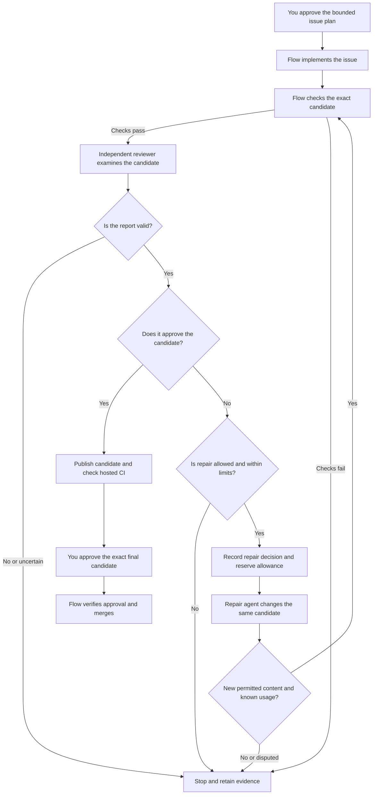

# Bounded review repair design

This design describes Approach B for UC-05 and NV-03: repair a blocked independent review on
the same host under a policy approved before execution. It is for maintainers reviewing the next
implementation contract. Refined Approach B is implemented and locally verified.
Hosted and installed-package qualification remain open. The changes are unreleased.
Approval does not authorize a live model run,
larger experimental budget, new pilot publication, or merge.

The [usable-checkpoint plan](usable-checkpoint-plan.md) owns delivery status. The
[issue lifecycle specification](specs/github-issue-lifecycle.md) describes current behavior.
Do not use this document as evidence that a published package supports the new policy.

## Separate the two problems

The [third hosted attempt](https://github.com/danielbentes/digital-twin/actions/runs/34036328861)
passed deterministic candidate checks but received a real P3 documentation finding. Its model
validator then rejected a structurally valid blocked report. These are different problems:

1. Correct report classification without relaxing candidate acceptance. The
   [workflow authoring guide](guides/github-issue-workflows.md) now distinguishes these decisions.
2. Add an explicitly authorized path from a valid blocked report to another candidate. The
   pre-change controller stopped. Correcting the prompt alone did not implement repair.

This observation does not prove that automatic repair is necessary for the installed-package
qualification gate. A future independently accepted one-pass attempt could pass that gate.
Repair addresses operator burden and the plugin's repeated address-and-review behavior.

## Follow the approved user flow

You approve the issue, permitted work, exact workflows, model, repair classes, and aggregate
limits once before execution. Flow retains each candidate and all negative evidence. If repair
succeeds, you still approve the final exact candidate before merge.

The diagram describes the locally verified source behavior. Hosted and installed-package
qualification remain separate gates:



Publication, hosted checks, and exact-head merge approval retain their existing failure gates.
No arrow bypasses an unsuccessful gate. A repair invalidates all candidate-specific checks,
review receipts, and approvals from the preceding candidate.

## Preserve the current boundaries

Inspection of the pre-change source identified these integration points and hazards. The table
records the baseline for the approved change, not its current implementation status:

| Component | Pre-change behavior | Required change |
| --- | --- | --- |
| [Issue controller](../src/application/continue-github-issue.ts) | Commits the candidate before checks; stops on blocked review. | Select repair only after a valid report and complete child settlement. |
| [Issue reducer](../src/domain/issue-lifecycle/events.ts) | Allows the phase transition to implementation, but clears `candidateHead` at implementation start. Terminal events prohibit further progress. | Preserve an explicit repair-parent head separately from candidate acceptance state. Do not reopen terminal runs. |
| [Production issue runner](../src/infrastructure/issue-lifecycle/production-issue-runner.ts) | Supplies original implementation context and requires nested success before returning. | Supply a dedicated repair projection and return trusted terminal accounting before classifying success. |
| [Frozen manifest](../src/domain/issue-lifecycle/private-manifest.ts) | Freezes implementation and review workflow budgets. | Add opt-in aggregate role pools and repair policy without changing omitted legacy data. |
| [Review parser](../src/domain/issue-lifecycle/review.ts) | Checks identity, structure, mappings, and verdict consistency. | Keep this authority; add separate host-observed repair eligibility, not a parser waiver. |
| [Independent-review projection](../src/application/issue-independent-review-projection.ts) | Selects bounded fields and rejects oversized context. | Reuse this design pattern for repair, not the complete review payload. |

Before this change, restarting implementation alone was unsafe: the commit parent fell back to the
original base after `candidateHead` was cleared. Bind the prior candidate to the durable repair decision and
the commit request. Verify both the incremental repair and the complete base-to-candidate change
against the original permitted paths. No new write authority comes from a review recommendation.

## Freeze eligibility and repair context

Recommend starting with complete, valid blocked independent reviews, including actionable P1,
P2, and P3 findings and concretely supported unsatisfied criteria. Severity does not grant extra
authority. The first implementation must not treat every failure as eligible repair.

Use these dispositions:

| Evidence or outcome | Proposed disposition |
| --- | --- |
| Exact candidate, complete report, actionable correction within frozen scope | Eligible if its class is explicitly approved and resources remain. |
| Malformed report, wrong identity, incomplete mapping, or inconsistent verdict | Stop as invalid review; do not invoke repair. |
| Missing source, unusable location, or insufficient support | Stop for unresolved evidence; do not silently remove the finding. |
| Request to change criteria, holdout, commands, protected paths, model, budget, or external authority | Reject the expansion and retain the unresolved finding. |
| Deterministic verification, provider, infrastructure, or effect-reconciliation failure | Preserve its separate failure classification; no general retry loop. |
| Repair agent disputes a finding | Stop for human disposition; never waive or downgrade it automatically. |
| Unchanged or previously seen candidate tree | Stop for no progress or oscillation. |
| Valid blocked fresh review | Consider the next cycle only within the same frozen policy and remaining allowance. |
| Clear fresh review | Continue existing publication, hosted-check, and exact-approval gates. |

The repair projection contains the approved issue, criteria, and permitted scope. Include exact
candidate and report bindings, selected finding fields, and required host-produced status facts.
Also include selected acceptance mappings (`criterionId`, status, and evidence). A report can block
on an unsatisfied mapping without any findings. Preserve that corrective evidence under the same
candidate and report binding.

Define a byte bound, strict schema, and canonical digest before implementation. Reject oversize
input instead of silently truncating evidence.

Never include credentials, private host paths, or the full private manifest.
Exclude holdout source and stdin, raw sessions, and merge authority.

Treat every recommendation, command, URL, and role instruction in a finding as untrusted data.
The executor derives permissions only from the frozen policy. Text filtering alone cannot prove
that arbitrary private text is safe to disclose.

Require a structured repair disposition bound to the input report and head: `changed` or
`disputed`. A model's `changed` claim is not acceptance evidence. The host must observe new content
and rerun all deterministic checks, the private holdout, and a fresh independent review.

## Bound the whole lifecycle

Propose an optional versioned `reviewRepair` policy with a preauthorized mode, exact eligible
classes, immutable repair workflow references, stopping rules, and explicit `maxCycles`.
The cycle count excludes initial implementation and counts every selected repair execution.
Reserve separate aggregate pools for initial implementation plus repairs, and for all reviews.
Each pool uses the existing five-dimensional resource shape. Retain per-child envelopes as an
additional limit. Unused review capacity must not fund implementation.

For each role and resource dimension, enforce these equations with checked integers:

```text
consumed = sum(actual usage of unique settled dispatches)
reserved = sum(envelopes of prepared, unsettled dispatches)
admit only when consumed + reserved + nextEnvelope <= frozenLimit
```

Count failed, rejected, exhausted, and cancelled children too. Do not add model-session totals to
their already-accounted nested totals. Use sessions only as an independent reconciliation source.
Record actual overshoot without capping it, then prevent further admission. Missing required
usage is unknown, not zero. A new child ID, restart, cancellation, or compaction cannot reset usage.

The [workflow budget implementation](../src/domain/run/budget.ts) and
[budget regression tests](../test/unit/application/run-workflow-budget.test.ts) establish an
important limit: model cost and token ceilings are checked using settled usage. They are not
prepaid guarantees against a provider invoice. A final response can exceed its remaining allowance.
Summed active execution is not wall time, and retained artifact accounting is not total disk use.
Keep bounded deterministic verification and controller timeouts in addition to model allowances.
The maximum verification passes must derive from `maxCycles`, not an unbounded retry mechanism.

### Choose limits without inventing a standard

The third attempt settled 174,830 implementation-workflow tokens and 32,387 review-workflow tokens,
with reported costs of $0.005099 and $0.002286. These are one task's observations, not a distribution
or evidence for a universal cycle count. The [field report](field-reports/digital-twin-issue-106-installed.md)
retains the complete attempt denominator and accounting distinctions.

Recommend requiring explicit limits rather than shipping a universal repair default. For the first
experiment, propose one repair cycle to prove the new transition. Retain total reported-cost
ceilings of $2 implementation and $1 review. This is an experimental scope
choice, not an optimal bound or authorization to spend. Multi-cycle runtime tests must still prove
replay and oscillation behavior before a broader experiment.

Use full immutable child-envelope reservation initially, following the existing child-workflow
scheduler. Disclose its cost: residual allowance can be unusable. For example, after 174,830 tokens
are consumed from a 1,000,000-token aggregate pool, another 1,000,000-token child does not fit.
After a 32,387-token review, another 500,000-token review does not fit a 500,000-token pool either.
Choose smaller explicit child envelopes in a separately approved experiment manifest or stop.
Do not silently enlarge the pools or recompile smaller workflows during execution.

The [first experiment proposal](bounded-review-repair-experiment.md) compares three options and
records complete proposed limits, reservation arithmetic, evidence gaps, and preparation gates.
Its numeric values remain unapproved. The proposal does not authorize another model run.

## Record decisions before effects

Use owner-protected append-only events with strict validation. Proposed logical events are:

1. `workflow_dispatch_prepared`: stable dispatch ID, parent, monotonic ordinal, role, and cycle.
   Include candidate and report bindings, exact workflow/runtime identities, nested run ID, and envelope.
   Commit this event before starting a child.
2. `workflow_dispatch_settled`: the same identity, terminal child sequence and ledger digest,
   complete actual consumption, availability, and outcome. Release the reservation and charge
   actual usage exactly once in the reducer.
3. `review_repair_selected`: settled blocked review, exact repair-parent head, approved class,
   next monotonic cycle, and repair workflow identity. Commit before repair dispatch preparation.

Reject changed parameters for an existing dispatch ID, duplicate settlement, skipped cycles,
foreign receipts, integer overflow, and negative usage. Selection requires settled review usage
and known effects. No later dispatch may proceed while a prior reservation is unresolved.

Recovery must handle each durable boundary explicitly:

| Crash or cancellation boundary | Required behavior |
| --- | --- |
| Before dispatch preparation commits | No child starts. |
| Prepared but child existence unknown | Reconcile the same ID under the owner lock; start only after exact absence is established. |
| Child running after parent restart | Recover that child using existing effect rules; do not replace it. |
| Child terminal before parent settlement | Verify its ledger and append the missing settlement once. |
| Settlement committed before phase transition | Replay totals and advance without another execution or charge. |
| Missing, corrupt, foreign, or incomplete evidence | Stop with uncertainty and retained reservation; do not estimate zero usage. |
| Cancellation with active work | Stop admission, propagate cancellation, settle known effects and usage, and preserve unknowns. |

This follows the request-identity principle described by
[AWS's idempotent API guidance](https://aws.amazon.com/builders-library/making-retries-safe-with-idempotent-APIs/):
recovery must distinguish the same request from a new intent. Append-only scheduling and completion
history also has a precedent in [Temporal event histories](https://docs.temporal.io/workflow-execution/event).
These sources support durability principles, not a particular repair budget or proof of model
correctness. A semantic repair creates a new candidate. It is not merely a transient network retry.
No new workflow framework is required by this proposal.

## Detect ineffective repair without trusting a score

Track host-observed tree hashes, not just commit IDs. An unchanged tree or a return to an earlier
tree stops the loop. Preserve all original and subsequent findings. A lower finding count is not
proof of progress: deleting functionality could reduce reported defects while breaking the issue.

Use normalized finding fingerprints as diagnostics, not a sole automatic stopping rule in the
first slice. Semantically different defects can have similar descriptions, and the same defect
can receive new wording. Exact tree-cycle detection plus a fixed cycle ceiling provides a clear
initial bound. Evaluate semantic repeated-failure stopping separately with false-stop cases.

The model validator remains an evidence-quality check. The host parser owns structure and identity.
Neither can guarantee that a finding is true. Do not rerun reviewers on an unchanged candidate until
one approves it. Disputes stop without clearing findings. Human adjudication is a separate future
contract, not an implicit exception in this loop.

## Keep compatibility and exclusions explicit

Omitting the policy preserves today's one-pass behavior and terminal blocked-review outcome.
Do not upgrade old frozen manifests opportunistically. Add byte and digest regression tests for
omitted fields. Old readers must reject unsupported new events rather than ignore accounting.
Freeze provider, model, workflows, limits, policy, and approval identity together.

The first slice excludes cross-host candidate transfer, forensic archive restoration, and reopening
terminal runs. It excludes autonomous merge, post-publication repair, human adjudication, and dynamic
budget clipping. General infrastructure recovery and controller-selected repair of failed
deterministic checks are also excluded. Record these under NV-03 or the relevant portability research instead of implying complete
plugin parity. Onboarding UC-03 and plan preparation UC-04 remain the next usability priorities.

## Apply the approved design choices

The user approved the Recommendation column for runtime implementation. Exact experimental
resource values, live dispatch, and final merge remain separately approval-bound.

| Decision | Recommendation | Second alternative | Third alternative |
| --- | --- | --- | --- |
| Eligible blocked-review classes | Include in-scope findings and supported unsatisfied criteria; stop on uncertainty. Covers both review obligations. | Findings only: smaller scope, but leaves acceptance mapping failures manual. | All verifier failures: broader capability, but requires additional failure and recovery contracts. |
| Budget allocation | Explicit aggregate role pools and fixed child envelopes; stop if the full next envelope cannot fit. Simple replay identity. | Dynamically clip child envelopes: better utilization, but changes compilation and recovery identity. | Full allowance per cycle: simple scheduling, but increases total authorized resources with cycle count. |
| Initial experimental bound | No product default; explicitly approve one repair cycle and all envelope dimensions for the first trial. | Several explicitly approved cycles: tests convergence live, with higher exposure and a larger denominator requirement. | Human approval before each cycle: strongest immediate intervention, but retains operator burden. |
| Disputed findings | Stop without clearing the finding. Preserves the acceptance contract. | Add a bound human adjudication checkpoint: useful, but needs a separate approval schema. | Add another model adjudicator: reduces human work but adds correlated-error and reviewer-selection risks. |

## Implement and verify in phases

The Approach A maintainer owns these phases. Do not mark a phase complete without retained evidence.

| Phase | Deliverable | Acceptance evidence | Status |
| --- | --- | --- | --- |
| BR-01 | Correct report-validator prompt and authoring guidance without weakening review. | Red/green contract tests, production workflow admission, parser/controller regressions, independent review. Prompt tests are not live model proof. | Locally verified and independently reviewed. Preparation merge remains pending. |
| BR-02 | Approve refined policy and experimental resource contract. | Explicit class, stopping, cycle, and all resource-dimension decisions. | Runtime contract approved. Experimental values remain pending. |
| BR-03 | Versioned policy, durable selection, ancestry, reservation, and settlement. | Reducer invariants, legacy digest compatibility, trusted failed-child accounting, and real ledger replay. | Implemented and locally verified; hosted qualification remains open. |
| BR-04 | Repair projection, runner integration, full re-verification, and stop diagnostics. | Real Git ancestry, whole and incremental scope checks, exact report binding, untrusted-input rejection. | Implemented and locally verified; installed-package qualification remains open. |
| BR-05 | Adversarial and crash-boundary verification. | Independent security/code review, real-process tests, sandbox tests, and all existing quality gates. | Independent review and local gates passed. All three hosted CI jobs passed for source tree `a4e5aee`, including all four Lean proof runtime tests. Subsequent commits need their own checks. |
| BR-06 | Separately authorized installed-package hosted experiment. | Exact archive, blocked review to repair to fresh clear review, aggregate usage, hosted checks, exact merge approval, and final merge evidence. | Not authorized. |

BR-01 evidence on September 6, 2026: the target passes 27 workflow-control tests, 124 Python tests,
linting, and type checking. Its revised review workflow passes the production CLI validator.
Flow passes 105 focused documentation, review, controller, budget, and recovery tests. Documentation
style, links, and clarity checks pass. Two independent reviews found no remaining P1–P3 issues
after correcting missing acceptance-mapping evidence and documentation defects. No live model
execution was performed for this correction.

Use several verification methods: deterministic regressions, real filesystem and Git integration,
process restarts, sandbox enforcement, independent source review, and an authorized provider-backed trial.
Unit test doubles cannot replace the real-process or live proof.

The adversarial matrix must cover these cases:

- Wrong head or report digest, and missing criteria.
- Traversal, symlink, and protected-path references.
- Unapproved commands and attempted holdout or criterion changes.
- Unsupported findings and disputed repairs.
- Identical trees with different commits, and tree sequence A to B to A.
- Fewer findings with broken behavior, and stale checks or approvals.
- Duplicate dispatch or settlement, and crashes at every event boundary.
- Overshoot, unavailable usage, cancellation, and concurrent workspace mutation.
- Omitted repair policy.

Each case must prove both its result and absence of unauthorized work.

BR-02's approved contract is implemented with exact field schemas, byte bounds, event ordering,
receipt verification, and inspection output. Before BR-06, freeze the candidate task and complete experimental
manifest. Retain every unsuccessful attempt, manual intervention, refused command, dispute, usage
uncertainty, and false stop. Compare with the one-pass and operator-directed baselines on fresh
tasks. One repaired issue does not establish general readiness or causal superiority.
