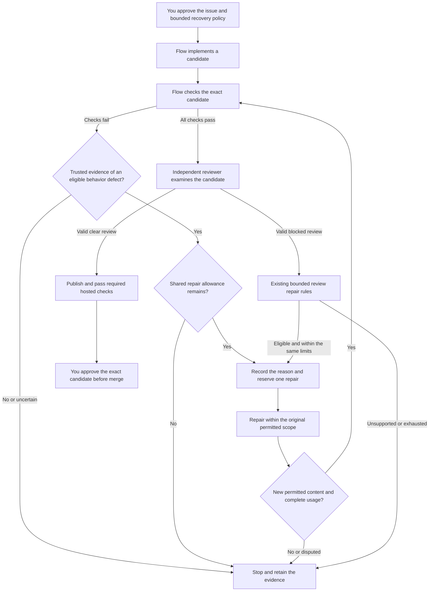

# Bounded verification repair design

This design governs implementation of UC-05 recovery from candidate verification failures before
independent review. The user approved Approach B on September 7, 2026, including limited feedback
disclosure and mandatory verifier-isolation qualification before enabling repairs. Approval permits
implementation and qualification work, not another live pilot, publication, or merge.

The feature is not yet implemented or supported. Existing and retained pilot candidates remain unchanged.

The [usable-checkpoint plan](usable-checkpoint-plan.md) owns delivery status. The existing
[bounded review repair design](bounded-review-repair-design.md) remains the approved contract.
This design extends its coverage without replacing its safety rules or qualification obligations.

## Start from the observed failure

The [fifth issue-106 attempt](field-reports/digital-twin-issue-106-installed.md#permission-verification-attempt)
failed the private acceptance check before independent review. Its candidate reported absent settings
when directory permissions prevented access. All 22 generated public tests passed during independent
reproduction. The improved acceptance check correctly rejected the candidate.

This establishes a recovery gap, not evidence that larger limits or a different model would fix it.
The current controller selects repair only after a valid blocked review. No review ran, so no
repair could start. A future correct one-pass attempt could still complete UC-01 without this extension.

The goal is to repair supported behavioral failures under preapproved limits, then pass every
original gate. Improving the success rate alone is insufficient if false acceptance or operator
burden increases. Keep all five existing attempts in the denominator.

## Compare three approaches

These approaches differ in authority and user experience, not just implementation size:

| Approach | User experience | Simplicity and effort | Flexibility and performance | Principal risk |
| --- | --- | --- | --- | --- |
| A: Better public guidance and regression requirements | A future implementation receives clearer requirements, but verification failures remain terminal. | Smallest change; retains the current lifecycle. | No new runtime work, but an unsuccessful candidate still requires operator intervention. | Can improve this task without delivering general verification-directed repair. |
| B: Typed, bounded verification repair | Flow selects an explicitly eligible repair from trusted verification evidence before review. | Larger change; needs verifier isolation, durable failure receipts, and shared repair selection. | Addresses this failure class without resetting resources; adds bounded verification and repair work. | Forged or misclassified evidence could incorrectly authorize work or disclose private test information. |
| C: Operator-directed correction after a terminal stop | A maintainer diagnoses the failure and authorizes a distinct correction workflow. | Preserves current runtime behavior; requires recurring operator work. | Supports ambiguous failures, but human response dominates completion time. | Does not deliver the intended reduction in operator burden. |

Approach B is selected, subject to the gates below. A is useful preparation, not
a substitute for B. C remains the disposition for unsupported or disputed failures. Do not implement
B by treating every nonzero exit as a behavioral defect.

## Map the intended flow

The proposed flow starts only in the prepublication candidate-verification phase:



Operators approve disclosure and execution policy before the run. They can inspect content-free
stop reasons and retained evidence afterward. The system does not create a background trigger,
reopen a terminal run, or infer merge approval from passing checks.

Verification also runs while preparing review context and rechecking publication or merge gates.
Those failures must not select this repair path. Repair selection belongs only to the explicit
prepublication `verifying` phase, with no pending child reservation or external effect.

## Preserve the source boundaries

The following observations were checked against source at `c99836b`:

| Boundary | Current evidence | Proposed responsibility |
| --- | --- | --- |
| [Verification port](../src/application/github-issue-controller-ports.ts) | `verify` returns successful verification evidence or throws. | Add a separately typed failure observation without turning failure into a successful proof. |
| [Local verifier](../src/infrastructure/git/local-issue-verification.ts) | A nonzero command can become `candidate_holdout_failed`; `verification_failed` can also mean invalid assembled proof. | Distinguish eligible behavioral assertions from command, fixture, and integrity failures. |
| [Issue controller](../src/application/continue-github-issue.ts) | Successful verification advances to review; blocked reviews can select repair. | Select supported verification repair before review, not in a global error handler. |
| [Repair state](../src/domain/issue-lifecycle/review-repair-state.ts) and [events](../src/domain/issue-lifecycle/events.ts) | Selection binds a review and only permits repair start from `reviewing`. | Introduce a distinct verification-evidence selection variant with explicit phase invariants. |
| [Repair projection](../src/application/issue-review-repair-projection.ts) | Context and disposition bind a review report. | Bind a verification failure without inventing a review report or reviewer run. |
| [Workflow accounting](../src/domain/issue-lifecycle/workflow-accounting.ts) | Durable reservations charge unique child settlements to aggregate role pools. | Keep one implementation pool, one review pool, and a shared cycle count across both repair sources. |
| [Command executor](../src/infrastructure/process/command-node-executor.ts) | One sandboxed command uses stdin, stdout, and stderr. | Do not treat candidate-accessible output as a trusted classification channel. |

Keep infrastructure-specific error handling behind the application port. Domain selection and replay
must depend on strict, versioned data, not imports from the concrete command executor. Reuse existing
scope checks, ancestry validation, and accounting rather than creating a second repair scheduler.

## Prove verifier integrity before enabling selection

An exit code identifies process outcome, not the cause of failure. A syntax error, missing import,
unsupported permission fixture, and failed behavioral assertion can all produce the same exit code.
Parsing stderr or asking a model to classify it does not establish trusted eligibility.

The proposed trusted observation has three distinct outcomes: passed, behavioral failure, and
unsupported or infrastructure failure. Only a qualified verifier can produce the behavioral variant.
The host must bind its result to all of these identities and observations:

- Run, frozen contract, original base, exact candidate head and tree, and owned workspace.
- Verification attempt identity, frozen command or verifier identity, and private evidence digest.
- Completed fixture preconditions and cleanup, process termination, and complete bounded output.
- A predeclared assertion identifier and its approved public criterion mapping.
- Successful scope and integrity checks before and after the candidate operation.

The base negative control must fail for an expected behavioral reason, not merely exit nonzero.
Existing generic scripts remain terminal on failure unless a qualified adapter supplies this proof.
This includes the retained fifth-attempt script: its historical error cannot be upgraded into new authority.

The verifier and candidate must have a demonstrated separation boundary. Frozen script bytes,
a JSON schema, a nonce, or a signature alone cannot establish that boundary. Candidate code must
not access the producer's process, key, channel, or writable files. An extra pipe inside the existing
shared sandbox is not sufficient evidence of that separation.

The first implementation gate must prove that candidate execution cannot forge a behavioral receipt.
Use the existing sandbox admission boundary for candidate operations. Keep classification and evidence
publication in a separately protected controller-owned verifier. Do not run arbitrary repository
scripts with controller privileges or expose a general executable-plugin interface.

Qualify each supported verifier adapter and host profile explicitly. If the current sandbox cannot
enforce the required separation, stop this gate and return with the measured limitation and alternatives.
Do not silently fall back to candidate stdout or label a partial adapter as general recovery.

### Reuse controls without inheriting qualification

Source inspection at `ee371db` found existing controls that can inform VR-02. None provides a
qualified behavioral-verification adapter. This assessment does not select a new host profile or
authorize implementation.

| Existing component | Reusable control | Remaining proof |
| --- | --- | --- |
| [Native Linux sandbox](../src/infrastructure/sandbox/srt-command-sandbox.ts) | Admission requires private process and user namespaces, dropped capabilities, and a private `/proc` mount. | Protect the verifier outside candidate authority, including files, descriptors, and process access. |
| [Native macOS sandbox](../src/infrastructure/sandbox/anthropic-sandbox-runtime-manager.ts) | The pinned sandbox dependency applies process-access restrictions as well as filesystem rules. | Qualify the actual verifier boundary on macOS. The executor's process-group label neither proves nor disproves that isolation. |
| [Container command engine](../src/infrastructure/oci/local-docker-container-command-engine.ts) | Execution uses private process isolation, no network, restricted mounts, dropped capabilities, and resource controls. | Keep verifier authority outside candidate-accessible mounts and processes. Container configuration alone does not prove receipt integrity. |
| [Lean proof supervisor](../proof-container/cmd/flow-proof-supervisor/main.go) | A protected supervisor captures compiler output, freezes artifacts, and emits its own result. Compilation runs with reduced privileges. | Qualify behavioral assertions separately. Pinned privileged checkers are not a safe execution path for arbitrary repository scripts. |

Linux's [process namespace documentation](https://man7.org/linux/man-pages/man7/pid_namespaces.7.html)
explains why candidate processes cannot address processes in an ancestor namespace through process IDs.
It also distinguishes process visibility from the mounted `/proc` view. These are necessary boundary
details, not proof that every descriptor, shared file, or result channel is protected.
[Docker's security guidance](https://docs.docker.com/engine/security/) separately identifies daemon
access, mount configuration, capabilities, and kernel controls as security concerns.

Do not copy the Lean verdict taxonomy into repair selection. Its compiler rejection includes missing
modules, permission errors, and resource failures. Those outcomes do not establish an eligible coding
defect. Reuse durable execution identity, effective-policy checks, bounded capture, and confirmed cleanup,
not domain-specific acceptance meanings.

VR-02 must test surviving descendants between verification stages, not only cleanup after the complete
container exits. Existing process-group cleanup and ordinary descendant tests do not prove containment
against a child that creates a new session. This is a verification gap for reuse, not a demonstrated
escape from the complete Lean appliance.

Keep the existing candidate sandbox and add only the protected, qualified observation boundary required
by this flow. Do not introduce a generic verifier-plugin system or silently require a new appliance.
If qualification requires a different deployment profile, return with its measured tradeoffs before changing the supported host contract.

### Qualify the first closed observation contract

The first adapter targets one explicit requirement: an existing inaccessible input must not produce
a successful CLI exit. It does not need a general JSON inventory protocol or a model-based error
classifier. Its implementation remains gated on complete fixture and observer qualification.

Keep fixture creation, precondition checks, classification, and receipt publication in compiled
controller code. Execute repository CLI code only inside the qualified candidate sandbox. Freeze
the exact argument vector and typed fixture-path slots. Do not interpolate a shell command, load
repository verifier callbacks, or expose a general expression language.

Require accessible-input CLI controls, genuine `EACCES` for the denied fixture, complete bounded
output, unchanged identities, and confirmed cleanup. Then distinguish these outcomes:

| Observation after all preconditions pass | Limited adapter result | Permitted consequence |
| --- | --- | --- |
| Normal exit zero for inaccessible existing input | Behavioral contradiction | May select the approved `invalid-fails-closed` feedback under the frozen repair policy. |
| Normal nonzero exit | This predicate passed | Continue original acceptance gates without inferring the cause of the exit. |
| Missing proof, timeout, signal, cancellation, truncation, drift, or uncertain cleanup | Unsupported | Stop without repair selection. |

A passed predicate is not a successful `IssueVerificationResult`. For example, a crash restricted
to the denied-input branch can satisfy this predicate while failing other requirements. Nonzero
exit with success JSON can also fail the original output contract. Always returning nonzero fails
the healthy control. Every original holdout and deterministic gate remains mandatory before review.

The base control is separate. The audited issue-106 base
[`8dcdd755`](https://github.com/danielbentes/digital-twin/blob/8dcdd755b22c1cbc04bc56e49c7bef5e9f72aa48/skills/digital-twin/scripts/install-hook.py#L375)
registers only `install` and `uninstall`. Read-only probes observed successful root and existing-command
help. Its root help advertises those two commands, not `status`. The source and installer digest
corroborate that exact base's missing command. The `status --help` nonzero exit is not the classifier.

Three approaches were considered for that control:

| Approach | Benefit | Tradeoff |
| --- | --- | --- |
| Closed help-inventory profile with audited frozen source, selected for qualification | Uses the existing public interface without target changes. | Qualify exact grammar, runtime, and base identity. Help omission alone does not prove arbitrary functionality is absent. |
| Closed structural source parser plus runtime help | Adds machine-checked registration evidence. | Requires language-specific handling and must reject dynamic or unsupported registration patterns. |
| New machine-readable discovery interface in the target | Provides an explicit discovery protocol. | Changes the target's public interface and requires separate scope approval. |

Python's [argparse documentation](https://docs.python.org/3/library/argparse.html#sub-commands)
describes generated help and customization. It does not establish a universal machine-readable
inventory format. Reject ambiguous, malformed, localized, or unqualified output instead of guessing.
Keep the base observation separately typed as `required-subcommand-unadvertised`, with its exact
source corroboration. Do not mislabel it as the candidate permission failure.

Legacy plans and retained failures keep their original behavior. Only a newly frozen, explicitly
configured adapter contract can produce new selection evidence in the prepublication verification
phase. This design does not migrate a run, expand disclosure, or authorize another pilot.

### Implement one protected observation attempt

The next implementation unit is an internal observer, disconnected from repair selection and legacy
verification. Split fixture ownership from command execution so each boundary has direct tests.
The observer must combine both with exact Git scope and private evidence checks before classifying
an attempt. Neither component alone is a behavioral verifier.

The fixture owner creates bounded inputs outside the candidate workspace. It retains original
file identities, verifies content and permission preconditions, and refuses cleanup of replaced or
unaccounted-for paths. Its host checks do not establish access behavior inside the candidate sandbox.
A separate fixed, controller-owned probe must establish that behavior under the same effective
sandbox policy. Candidate-provided JSON, error names, or receipt claims cannot supply this proof.

The command boundary preserves the original execution evidence. It separately records the admitted
Linux process namespace and successful sandbox release. A normal nonzero exit currently produces
`command_failed` with `sideEffectStatus: "uncertain"`. Ordinary native completion records
`terminationStatus: "not-required"`. Those fields cannot alone classify the attempt or establish
failed cleanup.

Require private containment and release proof, a complete outer command result, and matching
command and output hashes. Preserve fixture and scope integrity. Do not relabel the original fields.

Outer completion is not proof that the inner application launched or exited normally. Bubblewrap
`0.9.0` encodes fatal signals as numeric exit statuses, which can overlap deliberate application
exits. Its [exit-status implementation](https://github.com/containers/bubblewrap/blob/v0.9.0/bubblewrap.c#L409)
and the [Bash exit-status contract](https://www.gnu.org/s/bash/manual/html_node/Exit-Status.html)
establish this ambiguity. Flow's pinned native sandbox also wraps the command through a shell
and a seccomp launcher. A completed command record cannot replace application launch and exit proof.

The internal command helper must label this shell encoding explicitly. It must not infer a signal
cause from a numeric value or classify a behavior result. Qualify the actual application boundary
before composing the observer, including setup failures and deliberate versus signal-encoded exits.
This existing helper does not provide a protected status channel. The approved extension below
must preserve these limits until its separate application boundary is qualified.

### Resolve the application result boundary

Further source inspection found the same ambiguity inside the pinned SRT helper, before bubblewrap.
The helper's [kernel wait handling](https://github.com/anthropic-experimental/sandbox-runtime/blob/44ab607c46f20381aeaf3e22ca0e0151d4c6b29c/vendor/seccomp-src/apply-seccomp.c#L631-L658)
distinguishes normal exit from signal termination, then reduces both to a numeric exit status.
Its worker launches the SRT shell. Setup and failed application launch can share an ordinary
failure code. Flow therefore cannot recover the missing distinction from current outer evidence.

The optional [filesystem observation channel](https://github.com/anthropic-experimental/sandbox-runtime/blob/44ab607c46f20381aeaf3e22ca0e0151d4c6b29c/vendor/seccomp-src/apply-seccomp.c#L92-L110)
is diagnostic, fail-open telemetry. It does not provide an authenticated application-result record.
Its presence is not a reason to enable it for classification.

The user approved revised Approach A on September 7, 2026. The comparison records the alternatives
considered for application-result integrity and the measured fixture-access failure.

| Dimension | A: Extend the pinned native supervisor, selected | B: Add a separate isolated supervisor | C: Keep ambiguous results unsupported |
| --- | --- | --- | --- |
| Mechanism | Launch exact application arguments and preserve protected setup, launch, and kernel wait records at the existing native boundary. | Give a separate trusted process ownership of application launch and wait status, isolated from candidate access. | Stop when the current result cannot establish the required preconditions. |
| Simplicity | Reuses containment, but adds a native result protocol. | Adds a separate containment and lifecycle design. | Preserves the current implementation. |
| Flexibility | Coupled to the pinned sandbox integration. | Could support other execution backends after separate qualification. | Does not resolve this verification-repair requirement. |
| Performance | Unmeasured protocol overhead. | Unmeasured process and isolation overhead. | No added execution overhead. |
| Effort | Medium to large: native changes, artifact provenance, integration, and adversarial tests. | Large: new supervision, deployment, and qualification contracts. | Small: retain unsupported outcomes and document the limitation. |
| Principal risk | A forged, incomplete, or misbound record could falsely establish application completion. | A new boundary could expose controller state or lose descendant ownership. | The usable checkpoint remains incomplete. |
| Fixture boundary | Qualify a narrow profile that restricts further namespace creation or joining after trusted setup. | Qualify separately provisioned fixture ownership outside candidate identity mappings. | Retain the failed fixture qualification and stop without repair selection. |
| Compatibility and operator cost | Requires a maintained native artifact and tests that ordinary subprocesses and threads still work. Namespace-dependent workloads might be unsupported by this observer profile. | Requires additional identity provisioning, deployment, cleanup, and recovery controls. A separate supervisor alone does not protect fixture access. | Requires no new host setup, but verification failures continue to require operator intervention. |

The selected approach reuses the process boundary that already observes the kernel result. It does
not assume that a custom native helper is qualified or inexpensive to maintain. Before implementation,
the selected design must specify descriptor ownership, exact application identity, failed-exec
handling, bounded framing, cancellation, descendant settlement, and source-to-artifact verification.
Candidate output must not substitute for these records. Missing or contradictory records must stop
classification without repair selection.

Cryptographic verification authenticated the npm release attestation for source commit `44ab607c`
against the exact GitHub release-workflow identity. The signed package digest matched the downloaded
tarball, and the packaged x64 helper matched the installed binary by SHA-256. Wrong workflow identity
and modified signed-payload controls were rejected. This establishes authenticated publication and
artifact binding. It does not reproduce the native build, establish semantic safety, or qualify a
modified supervisor.

The expanded Linux qualification also found a separate fixture gap at `e826687`.
A nested user namespace read a mode-000 input after the probe confirmed that chmod and mount-bypass
attempts failed. Sixteen of 17 tests passed, but the fixture profile remains unqualified. A protected exit
protocol alone cannot resolve that failed permission precondition.

The [diagnostic run at `565a89d`](https://github.com/synaptiai/flow-harness/actions/runs/34141891105/job/101805484054)
again passed 16 tests and failed the same read assertion. Before nested mutation attempts, both
denied inputs were readable with permission bits `000`. The child reported effective user and group
IDs of zero, fixture ownership `0:0`, and user/group mappings `0 1001 1`.
Its capability mask `000001ffffffffff` includes both `CAP_DAC_OVERRIDE` and `CAP_DAC_READ_SEARCH`.
Missing and readable controls retained their expected outcomes.

Linux's [namespaced capability rules](https://man7.org/linux/man-pages/man7/user_namespaces.7.html)
permit those capabilities to bypass file-mode checks when the owner and group are mapped.
Upstream Linux 6.17 independently implements the
[mapping check](https://github.com/torvalds/linux/blob/v6.17/kernel/capability.c#L418-L449) and
[read-permission override](https://github.com/torvalds/linux/blob/v6.17/fs/namei.c#L438-L478).
These sources and runtime observations strongly corroborate capability-based access. They do not
trace the exact deployed kernel or provide a controlled capability-removal experiment.

The failed assertion checks the post-attempt read. Its attached diagnostic records reads before
the nested attacks, not before the earlier outer alias-mount attempt. Nested metadata does not
include inode identity. Host controls, distinct synthetic contents, and final integrity checks
reject setup mistakes and persistent drift, but cannot exclude every transient change.

The runtime probe owns its fixture directly. It does not call the new production fixture helper.
This result establishes candidate-view fixture access, not access to protected host files.

Preserve the failing assertion. Any selected observer must qualify both application results and
fixture access under nested execution. Read-only mounts do not establish unreadability.

Do not add an outer `--disable-userns` flag as a shortcut. Bubblewrap applies that restriction
[before launching its command](https://github.com/containers/bubblewrap/blob/v0.9.0/bubblewrap.c#L2988-L3034).
The pinned SRT helper then needs another user namespace for its own trusted setup after capabilities
are dropped. The flag would block that setup under the current profile. `--assert-userns-disabled`
only checks a restriction, and neither flag is exposed by the current integration.

The selected correction applies additional restrictions after trusted setup but before candidate
execution. It requires complete coverage of namespace creation and joining without breaking supported
processes and threads. An alternative puts fixture ownership outside candidate-accessible identity
mappings. New privileged provisioning might not be necessary if the host already supplies a suitable
supplementary group. That alternative still requires mapping and mount proofs and is not selected.
Neither replaces the application-result gate.

For A, keep the stricter profile specific to the closed behavioral observer. Do not silently change
all native commands or require new host privileges. Apply restrictions only after trusted namespace
and mount setup. Prove coverage of namespace creation and joining, including alternative syscall
forms, while preserving supported subprocess and thread behavior. Policy-induced failures must not
become behavioral repair evidence. Missing setup, launch, result, or settlement proof remains unsupported.

Before enabling A, qualify fixture denial with controlled capability comparisons. Independently verify
protected application-result transport, exact argument and artifact identity, failed execution,
signals, cancellation, and descendant cleanup. Maintain source-to-binary provenance and license notices
for the native artifact. The existing signed upstream package does not authenticate a modified binary.
Qualification must also cover ordinary runtime compatibility and the transition to the next model stage.

The approval authorizes implementation and qualification of this observer-specific extension.
It does not enable repairs or authorize another live model pilot, merge, or release.

### Implement the approved extension in phases

Track the native boundary separately from its host integration and behavioral qualification:
Completed implementation items describe source changes, not runtime qualification.

- [x] Preserve the pinned upstream sources and license. Build a Linux x64 artifact with recorded
  toolchain, source, patch, generated-filter, and binary identities. Compare independent clean builds.
- [ ] Define and test bounded private result framing, exact invocation binding, and descriptor ownership.
  - [x] Implement the internal fixed-frame decoder and malformed-record rejection tests.
  - [x] Implement the native frame encoder and cross-check its bytes with the decoder on macOS.
  - [x] Qualify selected native argument and environment rejections with real accepted-invocation controls.
    Complete envelope limits and immutable executable identity remain open.
  - [ ] Qualify native writer ownership, transport completion, and exact executable identity.
    - [x] Test stdout forgery and actual proc-FD/pidfd writer access with accessible controls.
    - [ ] Qualify remaining writer paths and immutable executable/runtime custody.
- [ ] Extend trusted setup and the existing supervisor to launch the exact admitted application.
  Preserve failed execution, normal exit, signal, and policy-interference distinctions.
  - [x] Record an observer-only patch separately from unchanged vendored source and baseline output.
  - [x] Connect the three private channels to the actual outer-stub, inner-init, and worker processes.
  - [x] Replace flattened wait statuses and unchecked setup with the observer-specific contract below.
  - [x] Pass the first real Linux x64 application-result control: exact output, private exit 7, and channel EOF.
  - [x] Test all 256 normal exits, SIGTERM, invalid inputs, and execution/reporting/self-kill denial on Linux x64.
  - [x] Test held ordinary and new-session descendants with independent live/zombie/reaped calibration.
  - [x] Test cooperative TERM handling and host escalation for a resistant fixed application with a held descendant.
    Startup races, other signals, and native-only escalation remain unqualified.
  - [ ] Qualify the remaining worker setup, reporting, signal-state, and termination failure paths.
- [ ] Apply observer-only namespace restrictions after trusted setup. Observe policy interference
  from the application and all descendants through a mandatory protected channel.
- [ ] Integrate private descriptors through the existing managed command boundary. Preserve ordinary
  command evidence and require stream completion, process settlement, and successful sandbox release.
  - [ ] Adapt and review the observer-specific launch producer. The current production SRT manager
    emits a proxy wrapper even when its domain allowlist is empty. Exact template matching requires
    independently admitted relay and socket identities. Host-side admission and integration remain open.
- [ ] Qualify namespace restrictions, application results, and fixture denial on native Linux x64.
  Test ordinary processes and threads, cancellation, forged records, and descendant cleanup.
- [ ] Compose the behavioral observer and complete the remaining verification-repair gates.

Policy interference must remain unsupported even when the application catches a child failure and
exits normally. A denied-input branch can depend on a namespace operation that accessible controls
never exercise. Normal exit alone cannot exclude that case.

The first transport milestone passed in
[run 34154482610](https://github.com/synaptiai/flow-harness/actions/runs/34154482610) at `e615d44`.
Two clean builds produced 23 identical artifacts. The fixed application returned its expected
marker and private normal-exit record for 7, with outer status 0 and private-channel EOF.
Both direct-host and unchanged-sandbox canary controls detected the extra descriptor.
The observer path prevented that descriptor from reaching application entry. This does not yet
qualify helper-entry attribution, other exit codes, failed execution, signals, private-writer
protection, full descendant cleanup, policy interference, or repair eligibility.

The expanded result gate passed all 266 cases without skips in
[run 34155655729](https://github.com/synaptiai/flow-harness/actions/runs/34155655729) at `063843a`.
It distinguished every normal exit from SIGTERM and rejected missing descriptors and malformed headers.
A valid non-executable ELF produced an execution error. Real syscall restrictions preserved execution
failure, signal 9 after blocked reporting, and signal 4 after also blocking self-termination.
Inside-sandbox launcher calibration and outside-sandbox rejection both passed.

Two clean builds again produced 23 identical artifacts, including the unchanged observer binary.
These controls qualify the tested result paths, not every failure mode or a protected execution boundary.
Writer authenticity, exact immutable runtime custody, descendant cleanup, cancellation, policy
interference, and repair eligibility remain open.

The next [native run](https://github.com/synaptiai/flow-harness/actions/runs/34157941663) at
`e39737a` passed all 275 cases without skips. It adds real writer-access controls and held ordinary
and new-session descendants. Host observations separately distinguish live, zombie, and reaped
processes. The private-frame event triggers the host settlement check without first waiting for
ordinary-output closure. The check must establish termination and original-identity absence before
result acceptance, not atomic ordering between frame arrival and termination.
The [testing guide](testing-and-evaluation.md#develop-the-native-result-transport-independently)
retains the preceding fixture failure, diagnostic proof, correction, and exact evidence scope.

This closes those bounded controls only. The next test expansion implements inherited ignored and
blocked signal-state checks and a separately identified false-normal executable. It inspects actual
application dispositions and masks, then requires the genuine failure assertion to reject the mutant's
complete false-normal result. All 289 cases passed without skips in
[run 34159189998](https://github.com/synaptiai/flow-harness/actions/runs/34159189998) at `0255e9d`.
Two clean builds matched all 29 artifacts without changing the genuine observer binary.

The later [296-case run](https://github.com/synaptiai/flow-harness/actions/runs/34160441703) at
`2f9552b` passed all cases without skips. It adds four fixed-descriptor reporting controls and corrects
two reproduced late-cancellation acceptance gaps in the test helper. Both clean builds matched all
29 artifacts without changing the genuine observer binary. This is not native graceful-cancellation
qualification. Remaining reporting failures, native cancellation, immutable custody, outer relays,
and policy interference remain mandatory.

Selected argument and environment rejections passed in the
[303-case run](https://github.com/synaptiai/flow-harness/actions/runs/34161291314) at `0c3d6a9`,
without skips. Two clean builds matched all 29 artifacts. The
[testing guide](testing-and-evaluation.md#check-selected-native-invocation-rejections) defines the six
malformed inputs and real accepted-invocation counterexamples. This qualifies those existing validation
paths, not the complete input envelope, immutable identity, or the remaining observer gates.

The [306-case run](https://github.com/synaptiai/flow-harness/actions/runs/34162298538) at `a234415`
passed without skips and matched all 29 artifacts across two clean builds. It adds real TERM
forwarding controls and host escalation with independent held-descendant termination checks.
The [testing guide](testing-and-evaluation.md#check-native-interruption-and-host-escalation) distinguishes
observed interruption from the cooperative fixture's unexposed raw worker status. This does not
qualify every startup race, signal, native-only escalation path, or outer-relay cleanup.

Use mandatory, fail-closed policy observation in the trusted supervisor. Record interference before
responding to a forbidden operation or stopping the observed namespace. Missing observation, listener
failure, and incomplete settlement must prevent behavioral classification. Optional diagnostic telemetry
cannot satisfy this contract.

Notification delivery alone does not prove complete policy history. Linux can cancel a syscall
notification before the supervisor reads it. The kernel's
[notification wait and removal paths](https://github.com/torvalds/linux/blob/v6.17/kernel/seccomp.c#L1066-L1152)
permit interruption before delivery. `SECCOMP_FILTER_FLAG_WAIT_KILLABLE_RECV` does not close that earlier window.
A child can catch the interruption and return normally. Queue exhaustion and descendant reaping
therefore cannot establish that no forbidden attempt occurred.

Do not implement notification-only clean classification. Qualify a mechanism that preserves policy
interference across cancellation, descendant termination, and thread-group exit. Tracing in the existing
supervisor is under investigation. It is not yet a qualified replacement.

Treat `clone3` fallback separately. A constant `ENOSYS` response prevents namespace creation through
its pointer-based arguments, but does not prove application compatibility. Record fallback use and
keep the observation unsupported until the frozen adapter and runtime have a qualified fallback contract.
Do not inspect mutable pointed-to arguments and then authorize the syscall.

#### Investigate existing supplementary groups without changing the selected policy

Source review identified a narrower fixture alternative worth testing. An unprivileged owner can
change a file's group to a group the owner already belongs to, according to
[the Linux ownership contract](https://man7.org/linux/man-pages/man2/chown.2.html).
Linux's `capable_wrt_inode_uidgid()` requires both the inode's user and group identities to be
mapped before granting the relevant capability bypass. See the
[kernel capability check](https://github.com/torvalds/linux/blob/v6.8/kernel/capability.c).

The hypothesis is that a held supplementary group, distinct from the primary group, remains outside
the sandbox's group mapping. Descendant mappings cannot introduce an identity absent from their
parent mapping. Under that condition, nested capabilities cannot bypass a mode-zero fixture's
permissions. Inherited supplementary membership alone does not establish an inode group mapping.
Read-only mounts remain necessary because the candidate can retain the fixture's owner identity.

Test this hypothesis under unchanged SRT with paired primary-group and supplementary-group fixtures.
Require the primary-group control to reproduce the bypass and the supplementary-group arm to deny
access. Record actual mappings and unchanged host inode, owner, group, mode, and content identities.
Check credential changes and remapping attempts. An overflow group displayed by `stat` is not proof
that the actual fixture group is unmapped.

This is test-only research, not a production policy change. Suitable group availability, actual
runner mappings, filesystem behavior, and mount-identity attack coverage remain unqualified.
Hosts without a suitable existing group must not silently gain new privileges or skip qualification.
Even a passing experiment would not establish private-result authenticity or qualify a complete observer.

#### Private result framing

The internal decoder recognizes one 64-byte frame. It does not authenticate the writer or prove
launch, executable identity, stream completion, or descendant settlement. Keep it disconnected from
repair selection until the native transport and composed observer pass qualification.

The separate C encoder now passes portable macOS checks for 670 valid records, 83 rejected
records, and memory boundaries. These checks include all normal exit codes and signal fields
under both flag values. Deliberate byte-order and invalid-flag mutations failed the tests and were
removed. This evidence covers byte compatibility only. The unchanged upstream baseline does not
include this encoder, and protected transport and Linux artifact integration remain unqualified.

The frame uses these exact byte offsets. Encode integers explicitly in little-endian order, not
by copying a native C structure:

| Offset | Length | Field |
| --- | --- | --- |
| 0 | 8 | ASCII magic and version, `FLOWOBS1`. |
| 8 | 32 | Invocation correlation bytes, matching the host's 64-character lowercase hexadecimal token. |
| 40 | 4 | Terminal kind. |
| 44 | 4 | Exit code, worker signal, or error number according to kind. |
| 48 | 4 | Failure phase, or zero. |
| 52 | 4 | Flags: bit zero records `clone3` fallback; all other bits must be zero. |
| 56 | 8 | Reserved bytes, all zero. |

Interpret terminal fields through this closed table:

| Kind | Meaning | Detail | Permitted phase |
| --- | --- | --- | --- |
| 1 | Normal exit record | Exit code 0–255 | 0 |
| 2 | Worker terminated by a signal; application launch might be unproven | Signal 1–64 | 0 |
| 3 | Setup failure | Error number 1–4095 | 1–4 |
| 4 | Failed application execution | Error number 1–4095 | 0 |
| 5 | Policy interference | 0 | 0 |
| 6 | Supervisor failure | Error number 1–4095 | 4–5 |

Phases identify bootstrap (1), namespace setup (2), filter setup (3), private-descriptor handoff (4),
and settlement (5). These phases do not carry candidate-provided messages or paths.

Reject wrong versions, incomplete frames, duplicate frames, trailing bytes, mismatched correlations,
unknown flags, and contradictory fields. Retain fallback use in every terminal variant. A matching
correlation is a binding check, not a secret or proof of writer authenticity.

The native transport must keep three channels separate:

| Process | Retained authority |
| --- | --- |
| Host | Read the final result and ordinary command output. |
| Outer trusted stub | Own the sole final-result writer and read the inner supervisor's report. |
| Inner PID 1 | Report the raw worker wait result and read the worker's setup or execution error. |
| Trusted worker before execution | Write a bounded failure record and hold the admitted executable descriptor. |
| Executed application | Hold only admitted ordinary descriptors, with no result-channel endpoint. |

Close unnecessary endpoints immediately after each fork. Mark the worker error channel and
executable descriptor close-on-exec. The outer stub must wait for the inner supervisor and its
namespace teardown before emitting a successful transport result. The host still requires complete
streams, exact frame EOF, cancellation checks, and successful sandbox release.

The observer launch must preserve the admitted sandbox options and replace only the shell-based
workload with the exact trusted helper invocation. Do not add a `--preserve-fds` option: bubblewrap
0.9.0 does not provide it. Its
[workload launch path](https://github.com/containers/bubblewrap/blob/v0.9.0/bubblewrap.c#L3088-L3149)
inherits extra open descriptors, while its monitoring processes close their copies. This source
inspection is not runtime qualification. Before integration, verify the host's child-descriptor
mapping, inheritance through the actual installed launcher, closure before application execution,
and final EOF after all trusted writers settle.

The proposed fixed mapping reserves child descriptor
3 for the final-result writer and descriptor 4 for the admitted executable. Neither descriptor can
remain available to application code. Reject unsupported launch shapes without running a fallback.

The production SRT manager supplies proxy sockets even for an empty domain allowlist. Its Linux
generator adds proxy environment variables and a shell wrapper that starts relay processes.
The rewrite checks either the exact proxy-free helper form or the pinned proxy-bootstrap template.
The latter requires independently admitted relay and socket metadata. Missing metadata, unsafe
paths, startup-injection variables, and template mismatches remain unsupported.

Host-side identity admission and integration are still required. Template compatibility alone is not
proof of executable custody, protected transport, or production observer readiness.

#### Preserve the production proxy bootstrap

The selected adaptation preserves the existing proxy policy. Its alternatives are:

| Mechanism | Benefit | Cost and remaining proof |
| --- | --- | --- |
| Exact pinned bootstrap reconstruction, selected for qualification | Preserves the admitted mounts, proxy settings, and relay topology. | Requires closed template matching, startup suppression, descriptor exclusion, and explicit relay settlement. |
| Proxy-free observer producer | Simplifies process and descriptor ownership. | Changes observable network failures, proxy settings, and dynamic policy behavior. Requires a separate policy decision. |
| Native relay bootstrap | Avoids shell startup and permits explicit relay execution-error reporting. | Adds relay startup, signal, readiness, and reaping responsibilities to the native implementation. |

Treat the original shell text as data. Match the complete pinned template against independently
admitted helper, relay, socket, and application identities. Reject unknown clauses and unsafe socket
paths. The upstream template interpolates socket paths without quoting, so matching its output is
not sufficient for arbitrary paths. Exclude shell syntax and relay-address delimiters from those paths.

Preserve every admitted sandbox option and environment entry. Start bubblewrap directly, with an
observer-only `/bin/bash --noprofile --norc -c` bootstrap inside it. Reject shell-startup variables,
imported shell functions and options, and dynamic-loader injection instead of silently dropping them.
Close descriptors 3 and 4 on each relay before its executable starts. Replace the final workload
with `exec` of the exact trusted observer helper and application arguments.

Keep application arguments separate from the bootstrap script. Use fixed `exec "$@"` syntax with
an explicit shell argument zero, followed by the helper and its exact ordered arguments.
For example, 64 arguments containing 512 single quotes each consume Flow's 32,768-byte aggregate
budget. Single-quoting them produces 164,031 bytes before adding the helper or bootstrap text.

That exceeds Linux's
[per-string execution limit](https://github.com/torvalds/linux/blob/v6.17/include/uapi/linux/binfmts.h#L8-L14)
of 32 pages on a 4-KiB-page host. Positional arguments avoid this expansion without changing the
approved command budget. Host admission must still check complete platform execution limits.

Bash can read startup files in some noninteractive executions, including when standard input
appears to be a network connection. An environment without `HOME` does not prevent that behavior.
The [Bash startup rules](https://www.gnu.org/software/bash/manual/html_node/Bash-Startup-Files)
therefore matter before private descriptors reach the helper. A local macOS control observed startup
execution with an explicit environment containing only `PATH`. `--norc` suppressed it, while
`--noprofile` alone did not. This observation does not qualify Linux behavior.

Successful `exec` replaces the shell. Its previous exit trap no longer performs relay cleanup.
The host must therefore prove outer namespace settlement and relay termination separately from
receiving the inner application's result. An outer monitor's exit alone is insufficient.
Background relay launch also does not prove successful execution or listener readiness.
Missing relay, helper, namespace, or release evidence remains unsupported.

The pinned SRT host-bridge cleanup also resolves after sending its timeout kill signal without
waiting for the resulting exit. Do not treat manager reset completion as independent proof that
every host bridge process settled. The observer's private descriptors must never enter those bridges.

This mechanism is not enabled by its argument tests. Require real-process controls for private
descriptor exclusion, startup suppression, failed relay execution, interrupted bootstrap, blocked
relay teardown, descendant cleanup, and final result EOF. Do not connect this transformation to
production execution until those gates pass. Keep ordinary command execution unchanged.

An empty close-on-exec error channel does not independently prove successful execution. For an
initial normal-exit-only classifier, audit every trusted pre-execution path. A failed or partial
error-record write must stop the worker without a normal exit. Writing an error and then using a
nonzero exit code is insufficient if the write itself failed.

Every exit code from 0 through 255 is also a valid application result. Qualify a non-normal fail-stop.
Verify that a failed fail-stop cannot fall through to an ordinary exit.

Keep signaled workers launch-unproven and unsupported unless a separate trusted execution witness
is qualified. Test descriptor errors such as `EBADF` independently from a broken reader and
`SIGPIPE`. An initial-execution tracing witness is a stronger alternative. It requires separate
tracing, signal, cancellation, and detachment qualification. Neither inference nor tracing is
qualified by this design alone.

Bind ordered arguments, an explicit environment, working directory, stdin, and the admitted runtime
to the invocation. Launch the admitted ELF descriptor without PATH lookup or script fallback.
An open descriptor pins an inode, not immutable contents. Artifact custody must also protect the
executable bytes, dynamic loader, and libraries. Do not replace existing command evidence with the
application result or treat ordinary command status as the private transport's success witness.

#### Connect the native application-result path

Implement this path in an observer-only patch to the pinned supervisor. Preserve the unchanged
upstream source and baseline build. Record the patch, resulting source, toolchain, and binary hashes
separately. The next slice must execute an actual admitted ELF and connect the existing encoder to
its real wait result. Another standalone parser or encoder does not complete this slice.

This path can be developed under the existing namespace topology before the additional fixture
policy is resolved. Its records are application-result evidence only. They do not assert absence of
policy interference, classify a private test failure, or enable repair. Missing custody or setup
evidence must prevent a trusted normal-result record.

Apply these changes to the actual process paths:

1. Validate the observer invocation and inherited descriptors before creating private channels.
   Keep descriptor 3 exclusively in the outer stub. Close unused endpoints after each fork.
2. Check signal setup and non-dumpability in the outer stub and inner init before the worker starts.
   Require the protected process view. Do not reuse ignored dumpability errors or tolerated
   `/proc` mount failures as successful observer setup.
3. In the worker, mark the executable and error writer close-on-exec. Execute descriptor 4 with
   `execveat` and `AT_EMPTY_PATH`, using exact arguments and the bound environment. Do not use
   `execvp`, PATH search, a shell, or script fallback. See the
   [descriptor execution contract](https://man7.org/linux/man-pages/man2/execveat.2.html).
4. In inner init, preserve the raw worker wait status and validate the complete error channel.
   Do not reuse the upstream `128 + signal` conversion. Send one private report, then terminate.
5. In the outer stub, wait for the exact inner-init PID and validate its report and termination.
   A proxy child can exit first, so a wait for any child cannot substitute for this identity check.
   Emit one final frame only after the inner settlement requirement is satisfied.

The observer's outer exit code is 0 only after successful result delivery and required inner
settlement. The private frame carries the application result, including a nonzero exit code.
Retain the actual outer status in ordinary command evidence. Do not rewrite it to the application's
exit code or infer application success from outer status 0. This observer-only protocol does not
change the ordinary SRT helper's exit behavior.

Linux's
[PID namespace teardown](https://github.com/torvalds/linux/blob/v6.17/kernel/pid_namespace.c#L179-L264)
waits for namespace processes before allowing its init process to be reaped. This supports the
targeted inner-init wait as an application-tree settlement mechanism. Qualify it on the deployed
kernel and profile. It does not settle outer relays or host bridges. Becoming a subreaper after
helper entry does not recover children that were already orphaned elsewhere.

The worker failure mechanism must remain distinguishable when its own error write fails. Compare
these mechanisms without changing the selected normal-exit-only contract:

| Mechanism | What it establishes | Required qualification |
| --- | --- | --- |
| Non-normal fail-stop, next implementation candidate | An audited trusted worker cannot return a normal status after failed setup or execution, even if reporting fails. | Raw self-SIGKILL with a validated worker PID, a non-returning x64 instruction-trap fallback, inherited signal state, denied writes and kill calls, and every pre-execution exit path. |
| Initial-execution tracing witness | A specific trusted worker reached the kernel's execution event before application instructions ran. | Trace admission, `PTRACE_O_TRACEEXEC`, exact worker identity, signal handling, cancellation, and confirmed detachment at the execution stop. |
| Full-lifetime tracing | Could also observe later policy-relevant operations. | All thread and process events, signal races, ordering, cancellation, overhead, and complete policy history. This is not the next application-result slice. |

The fail-stop candidate attempts a bounded error record and raw self-SIGKILL, then uses an explicit
non-returning x64 trap if the kill call returns. It must never fall through to `exit`, `_exit`,
upstream `die`, or a normal function return. A trusted active signal handler that exits normally
would invalidate the inference. Check signal dispositions and masks before applying filters.
These are Linux x64 requirements, not portable POSIX guarantees.

Initial-execution tracing is narrower than full-lifetime tracing. The trusted single-threaded
worker can stop at
[`PTRACE_EVENT_EXEC`](https://man7.org/linux/man-pages/man2/ptrace.2.html)
and detach before application instructions run. That design still needs independent qualification.
It does not establish complete policy-interference history. Neither mechanism proves that application
`main` ran: dynamic-loader failure remains possible after successful kernel execution.

Run these controls through the actual patched artifact and SRT launch on Linux x64:

- All 256 normal exit codes, real signals, and execution failures must remain distinct.
- Invalid executable descriptors, malformed ELF files, and denied execution must not become
  application failures. Verify complete error records separately from their fail-stop signals.
- Closed readers, invalid writers, partial records, and denied writes must remain unsupported
  without a complete valid failure record. Deny both writing and self-killing to test the trap fallback.
- Test ignored and blocked signals. Mutate the worker failure path to `_exit(0)` and require
  the negative control to detect false normal classification.
- Applications and descendants must not retain private endpoints or forge a valid final report.
- Inject owned non-private descriptors after test-runner isolation. Require the observer to close
  all unadmitted handles, not just its known channel endpoints. Clean test startup is not proof of
  that native boundary. Qualification found a non-close-on-exec pipe inherited through Node's
  Linux launch path before sandbox initialization. Ordinary command hardening remains a separate
  release follow-up. The observer-specific patch does not implement it.
- Long-lived descendants must be gone before accepting inner settlement. Early proxy exits must
  not replace the application's result. Outer relay and host-bridge settlement remain separate gates.
- Cancellation, missing or extra frames, unsupported setup, and unconfirmed release must prevent
  behavioral classification.

Evaluate existing Flow code before introducing another supervisor. The
[Prime process driver](../prime-container/internal/supervisor/driver_process_unix.go)
checks kernel signal status and launches with explicit credentials. The
[proof supervisor](../proof-container/cmd/flow-proof-supervisor/containment_linux.go)
verifies its isolated identity, capabilities, and resource policy. These are reusable design patterns,
not drop-in observer implementations. Their existing qualification does not prove private result
transport or fixture denial in the native SRT profile.

Real-process qualification must cover correct rejection, incorrect success, an always-failing CLI,
forged output, damaged fixtures, stale identity, interruption, bounded output, and descendant cleanup.
The separately qualified base control, durable attempt accounting, cross-stage privacy gate, and
lifecycle integration remain required after this unit. There is no new public adapter interface
or supported repair capability until those gates pass.

## Bound disclosure as well as execution

Freeze a public feedback catalog before the first model invocation. Each allowed entry maps a
trusted assertion identifier to an existing public criterion and static corrective guidance. The
catalog does not include private examples, expected values, source, stdin, paths, or stack traces.

The model receives only the approved catalog entries and necessary candidate, cycle, and context
bindings. Keep raw verifier evidence, private receipt digests, and host details outside model context.
Use a host-held binding to validate the model's structured `changed` or `disputed` disposition.
Reject unexpected fields, unknown identifiers, and oversized records rather than truncating them.

Selecting a public criterion based on a private test still discloses information. Approval must
explicitly cover that limited outcome signal. Private bytes remaining hidden does not make the
test an untouched statistical holdout once its outcomes guide repair.

Keep the feedback alphabet and ordering fixed. Bound disclosures by the shared repair cycle limit.
Do not add more detailed hints after unsuccessful repairs. Evaluation must distinguish qualification
on this feedback-guided task from fresh tasks that were not used to tune the harness.

### Prevent disclosure between stages

Candidate execution can copy any readable fixture data into its writable workspace. Protecting
the observer's receipt file during execution does not prevent that separate disclosure channel.
Qualify the transition to the next model workflow as well as the observation itself.

The current [review evidence reader](../src/infrastructure/git/local-issue-review-evidence.ts)
removes and recreates the verification worktree at the exact candidate before returning review
context. Its final proof requires a pristine worktree, including no ignored files. This protects
the existing successful-verification-to-review transition. Verification command postconditions
permit ignored output, so a failed command alone does not provide the same cleanup proof.

The new verification-to-repair transition must satisfy these requirements before model dispatch:

- Confirm termination of all verification descendants and cleanup of their private temporary storage.
- Recreate the owned verification worktree from the exact candidate and prove it pristine. Retain
  private evidence in controller-owned storage, not in a workspace that a later model can read.
- Explicitly deny repair subprocess access to private fixtures, receipts, and the verification
  worktree. Do not rely on the project being inside the operator's home directory.
- Test direct paths, aliases, ignored files, and shared temporary paths across consecutive stages.
  A built-in file tool's workspace restriction does not establish a subprocess read restriction.
- If cleanup, identity, or disclosure-boundary proof is missing, retain the evidence and stop
  before admitting model work. Do not weaken these checks to recover a failed verification.

This is a requirement for the proposed transition, not a demonstrated leak in the existing review
flow. Repair currently follows review, whose preparation already resets the verification worktree.
Source tracing alone does not qualify the new transition or every writable-path channel.

## Reuse limits without resetting them

Verification repair and review repair consume the same monotonic repair count and implementation
resource pool. Reviews continue to consume the review pool. A failed verification does not fabricate
review usage, and unused review resources cannot fund repairs.

For each role and resource dimension, reuse checked-integer admission:

```text
consumed + reserved + nextChildEnvelope <= frozenRoleLimit
verificationRepairs + reviewRepairs <= maxCycles
```

If the shared limit is one cycle, verification repair consumes it. A later blocked review then
stops instead of receiving another implicit cycle. This tradeoff must appear in the authored plan.
The old experiment's values remain historical, not authorization for a new experiment.

A verification failure is not itself a model child. Record its actual command time and bounded
evidence separately. Before execution, freeze verification-attempt, command-time, output, and retained-byte
limits in addition to the existing five model-workflow dimensions. Include repeated gate checks
in the timing calculation. Do not claim that model active time bounds total wall time.

Every new candidate must rerun all original acceptance checks and receive a fresh independent review.
Unchanged and repeated trees stop under the existing rules. A changed tree or fewer failures is
not proof of progress. Disputes stop without waiving the assertion or granting broader write authority.

## Make replay and failure handling explicit

Persist a stable verification-attempt identity and reserve its complete verification allowance before
any fixture or candidate command starts. This reservation is separate from model-child accounting.
Bind it to the exact candidate, verifier, frozen contract, and planned command envelope.

After execution, persist the trusted observation and settle actual verification usage exactly once.
Only then select repair. Persist selection before reserving the child. Bind selection to its evidence
variant, exact candidate, frozen policy, workflow, and next cycle. Reserve before dispatch, then settle
complete child usage exactly once before interpreting the repair result.

After restart, reconcile the same verification attempt under the owner lock. Unknown execution or
usage retains its reservation and blocks another attempt. A missing observation does not prove
non-execution. Never infer zero consumption or restart solely because observation timed out.

| Failure or interruption | Required outcome |
| --- | --- |
| Generic nonzero exit, malformed output, or missing fixture proof | Stop without repair selection. |
| Timeout, signal, cancellation, output limit, or uncertain termination | Preserve existing failure handling and uncertainty; do not classify it as a coding defect. |
| Base, candidate, workspace, command, scope, or evidence mismatch | Stop for integrity failure. |
| Unsupported host, dependency outage, or failed cleanup | Stop with a distinct diagnostic; never grant repair authority. |
| Failure after publication or during review-context preparation | Preserve the existing stop or recovery behavior; no new repair selection. |
| Verification prepared but execution has not started | Use the same identity; start only after exact non-execution is established. |
| Verification started but observation is absent | Reconcile the live or terminal attempt; unknown execution retains its reservation and prohibits rerunning. |
| Observation stored but verification settlement is missing | Verify identity and settle actual usage once; never charge twice or release an unknown reservation. |
| Observation stored but no selection event | Reconcile the same verification attempt; do not rerun only to seek a passing result. |
| Selection committed but no child started | Recover the same selection and dispatch identity under the owner lock. |
| Child terminal but settlement missing | Verify its ledger and settle once before any new work. |
| Missing or corrupt evidence, or unknown usage | Keep the reservation and stop admission; unknown is not zero. |
| Exhausted cycle, model allowance, or verification allowance | Stop without clipping the next envelope or expanding limits. |

Version the new policy, selection, projection, and observation explicitly. Preserve old omitted-policy
digests and review-only behavior. Unsupported readers must reject new records. Do not migrate active
or terminal runs to the new contract.

## Verify the recommendation against alternatives

The primary sources support design principles, not this proposal's correctness or a universal budget:

- [Anthropic's evaluation guidance](https://www.anthropic.com/engineering/demystifying-evals-for-ai-agents)
  distinguishes observed outcomes from agent claims and recommends stable environments, grader review,
  and resistance to test bypass. This supports inspecting fixture validity before attributing failure.
- [SWE-agent's documented retry implementation](https://swe-agent.com/latest/reference/agent/)
  retains attempt trajectories and aggregate model statistics. Its score and chooser loops are
  useful alternatives, but do not establish Flow's exact-head acceptance or private-feedback authority.
- [AWS's idempotent API guidance](https://aws.amazon.com/builders-library/making-retries-safe-with-idempotent-APIs/)
  separates stable request identity from new intent. This supports recovering one dispatch rather
  than silently creating replacement work after an observation failure.

Source inspection, the authenticated hosted receipt, and independent exact-source reproduction agree
on the fifth attempt's failure. That agreement does not prove that a generic classifier can safely
recognize every future failure. The isolation boundary and live repair effectiveness remain unverified.

## Decide and implement in gated phases

The Approach A maintainer owns these phases. Approval completes VR-01 only. VR-02 targets hosted
native Linux first, following the user's September 7, 2026, host-strategy approval.
VR-03 through VR-05 remain pending, and VR-06 requires separate experiment authorization.

| Phase | Deliverable | Required evidence |
| --- | --- | --- |
| VR-01 | Approved: recovery scope and limited disclosure. | The user selected B on September 7, 2026; exact merge approval and all qualification gates remain required. |
| VR-02 | Qualify verifier isolation and typed outcomes. | Real processes cannot forge receipts through stdout, files, inherited descriptors, or process access. Unsupported fixtures stop without model work. |
| VR-03 | Freeze exact schemas, compatibility, and resource accounting. | Strict parsing, byte bounds, legacy digest tests, shared cycles, model and verification reservations, once-only settlement, and timing arithmetic. |
| VR-04 | Integrate selection, repair context, replay, and complete re-verification. | Real Git ancestry and scope checks; crash-boundary replay; no stale review, approval, duplicate dispatch, or duplicate charge. |
| VR-05 | Complete independent code, test, security, and documentation review. | No unresolved P1–P3 findings; full static, runtime, adversarial, and documentation gates pass. |
| VR-06 | Qualify an exact installed package in a separately authorized experiment. | Observed eligible failure, bounded repair, all original checks, fresh clear review, hosted checks, exact approval, merge, and post-merge proof. |

Adversarial verification must include fake receipt output, forged identifiers, fixture failure, and
candidate attempts to read private feedback data. Also test mixed verification and review repairs,
cycle exhaustion, overshoot, unavailable usage, scope expansion, repeated trees, and stale approvals.
Test the public noninteractive contract with actual closed stdin and bounded subprocess timeouts.

Crash tests must cover verification preparation before start, execution before observation, and
observation before settlement. Verify duplicate reconciliation and retention of unknown reservations
before permitting any further command or model work.

Retain every failed case and verify that no unauthorized model call, write, publication, or merge
occurred. Unit doubles cannot replace real containment tests or the installed live qualification.
Fresh-task comparisons remain required before claiming reduced operator burden or broader readiness.

### Execute the isolation gate first

Track VR-02 as the following dependency-ordered checks:

- [ ] Trace the existing candidate execution boundary and select a concrete protected observer without adding arbitrary privileged scripts.
- [ ] Define explicit fixture, process, output, cleanup, and behavioral-classification preconditions for that observer.
- [ ] Test real candidate attempts against private files, process access, inherited descriptors, and forged result output.
- [ ] Test new-session descendants between verification stages and confirm complete cleanup before classification.
- [ ] Run positive and negative controls on each claimed host profile, retaining unsupported outcomes and failures.
- [ ] Complete independent adversarial review before enabling any repair-selection path.

Keep repair selection disabled throughout this gate. A passing sandbox probe does not qualify a
behavioral observer, and a passing observer does not complete installed lifecycle qualification.

### Resolve the measured native macOS gap

On September 7, 2026, three real-process runs tested native SRT `0.0.70` on macOS ARM64 with Node.js
`26.7.0`. Every run observed ordinary and new-session descendants writing after successful command
settlement. Readiness and process-identity controls passed before release. The private-file and
open-descriptor probe passed. Owned helpers exited after cleanup. This establishes a failed cleanup
prerequisite for this observer, not a demonstrated escape into private controller state.

The [command executor](../src/infrastructure/process/command-node-executor.ts) does not request
process-group confirmation on ordinary command completion. Adding that confirmation alone cannot
contain a child in another session. [Node.js documents detached process groups](https://nodejs.org/api/child_process.html#optionsdetached).
Linux [process namespaces](https://man7.org/linux/man-pages/man7/pid_namespaces.7.html) provide a
different lifecycle boundary. The first hosted prerequisite result is recorded in the next section.
The complete behavioral observer remains unqualified.

The host-strategy decision considered these alternatives:

| Strategy | Benefit | Cost or limitation |
| --- | --- | --- |
| Native Linux first, selected | Reuse the existing namespace boundary and target the hosted pilot environment. | Keep the new repair capability unavailable on native macOS until separately qualified. |
| Linux appliance accessible from macOS | Use a Linux-hosted controller for Mac users as well. | Adds deployment and operational requirements that are not part of the current approved host contract. |
| Stronger native macOS boundary first | Preserve a native Mac experience for the new capability. | Requires further containment research and implementation before qualification; feasibility is not established. |

The user selected native Linux first, using GitHub Actions for initial qualification. The Mac
remains the operator's computer. That decision itself supplied no runtime evidence.
The existing container-command implementation also uses Linux process-owner records. Docker
availability on a Mac does not establish a supported Mac controller.

A tested Mac-local Linux launcher and execution environment is a required follow-up usability
deliverable under UC-03. It must run the complete controller inside Linux, preserve run state,
protect credentials, bound resource use, and support evidence inspection and exact merge approval.
Select and qualify its deployment mechanism before documenting it as supported. Hosted Linux x64
qualification does not establish local Linux ARM64 qualification or native macOS repair support.

This strategy authorizes model-free hosted qualification and implementation work, not another live
pilot, retained-candidate modification, publication, or merge.

### Record the first hosted Linux prerequisite result

The [dedicated isolation job](https://github.com/synaptiai/flow-harness/actions/runs/34128675526/job/101763285298)
passed all five real-process tests without skips at source
`fd8cf95dd6af3d910f120308fa1ab97930f7c472` on September 7, 2026. The runner used Ubuntu 24.04 x64,
kernel `6.17.0-1022-azure`, Node.js `26.7.0`, bubblewrap `0.9.0`, and SRT `0.0.70`.
Test execution took 1.37 seconds, with 3.75 seconds total test-runner duration.

The probes established ordinary and new-session descendant termination. They also established
denial of private-file, inherited-descriptor, and host-process access. Forged candidate output
remained untrusted command data. Independent review corrected two probe weaknesses before execution. Job metadata and
the completed job log separately confirmed the exact-head result and test counts.

GitHub checked out synthetic merge `55023ba6a29fda99f951473b0d6f57e9d9912d90`. The commit API
independently confirmed that this merge and the PR head have the same tree,
`79ef26b968d60d564ce8ee117be0c94a3a84e349`. Preserve both commit identities with the result.
The workflow's head field alone does not establish the actual checkout.

This is one passing prerequisite run, not complete observer qualification. The future adapter still
needs immutable fixtures that preserve real permission errors, trusted typed outcomes, valid base
controls, and protected receipt publication. Native macOS, Linux ARM64, the Mac-local launcher,
repair selection, and the installed end-to-end experiment remain unqualified by this result.

The first slice does not provide cross-host transfer, post-publication repair, new provider selection,
human adjudication, semantic convergence guarantees, or automatic merging. It does not remove the
UC-03 and UC-04 onboarding priorities or complete the wider NV-03 research program.
