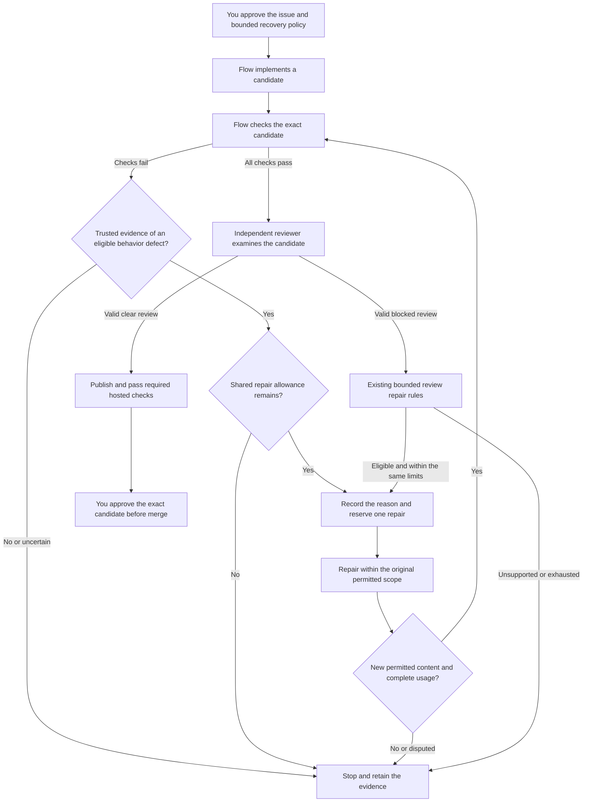

# Bounded verification repair design

This design governs implementation of UC-05 recovery from candidate verification failures before
independent review. The user approved Approach B on September 7, 2026, including limited feedback
disclosure and mandatory verifier-isolation qualification before enabling repairs. Approval permits
implementation and qualification work, not another live pilot, publication, or merge.

The feature is not yet implemented or supported. Existing and retained pilot candidates remain unchanged.

The [usable-checkpoint plan](usable-checkpoint-plan.md) owns delivery status. The existing
[bounded review repair design](bounded-review-repair-design.md) remains the approved contract.
This design extends its coverage without replacing its safety rules or qualification obligations.

## Start from the observed failure

The [fifth issue-106 attempt](field-reports/digital-twin-issue-106-installed.md#permission-verification-attempt)
failed the private acceptance check before independent review. Its candidate reported absent settings
when directory permissions prevented access. All 22 generated public tests passed during independent
reproduction. The improved acceptance check correctly rejected the candidate.

This establishes a recovery gap, not evidence that larger limits or a different model would fix it.
The current controller selects repair only after a valid blocked review. No review ran, so no
repair could start. A future correct one-pass attempt could still complete UC-01 without this extension.

The goal is to repair supported behavioral failures under preapproved limits, then pass every
original gate. Improving the success rate alone is insufficient if false acceptance or operator
burden increases. Keep all five existing attempts in the denominator.

## Compare three approaches

These approaches differ in authority and user experience, not just implementation size:

| Approach | User experience | Simplicity and effort | Flexibility and performance | Principal risk |
| --- | --- | --- | --- | --- |
| A: Better public guidance and regression requirements | A future implementation receives clearer requirements, but verification failures remain terminal. | Smallest change; retains the current lifecycle. | No new runtime work, but an unsuccessful candidate still requires operator intervention. | Can improve this task without delivering general verification-directed repair. |
| B: Typed, bounded verification repair | Flow selects an explicitly eligible repair from trusted verification evidence before review. | Larger change; needs verifier isolation, durable failure receipts, and shared repair selection. | Addresses this failure class without resetting resources; adds bounded verification and repair work. | Forged or misclassified evidence could incorrectly authorize work or disclose private test information. |
| C: Operator-directed correction after a terminal stop | A maintainer diagnoses the failure and authorizes a distinct correction workflow. | Preserves current runtime behavior; requires recurring operator work. | Supports ambiguous failures, but human response dominates completion time. | Does not deliver the intended reduction in operator burden. |

Approach B is selected, subject to the gates below. A is useful preparation, not
a substitute for B. C remains the disposition for unsupported or disputed failures. Do not implement
B by treating every nonzero exit as a behavioral defect.

## Map the intended flow

The proposed flow starts only in the prepublication candidate-verification phase:



Operators approve disclosure and execution policy before the run. They can inspect content-free
stop reasons and retained evidence afterward. The system does not create a background trigger,
reopen a terminal run, or infer merge approval from passing checks.

Verification also runs while preparing review context and rechecking publication or merge gates.
Those failures must not select this repair path. Repair selection belongs only to the explicit
prepublication `verifying` phase, with no pending child reservation or external effect.

## Preserve the source boundaries

The following observations were checked against source at `c99836b`:

| Boundary | Current evidence | Proposed responsibility |
| --- | --- | --- |
| [Verification port](../src/application/github-issue-controller-ports.ts) | `verify` returns successful verification evidence or throws. | Add a separately typed failure observation without turning failure into a successful proof. |
| [Local verifier](../src/infrastructure/git/local-issue-verification.ts) | A nonzero command can become `candidate_holdout_failed`; `verification_failed` can also mean invalid assembled proof. | Distinguish eligible behavioral assertions from command, fixture, and integrity failures. |
| [Issue controller](../src/application/continue-github-issue.ts) | Successful verification advances to review; blocked reviews can select repair. | Select supported verification repair before review, not in a global error handler. |
| [Repair state](../src/domain/issue-lifecycle/review-repair-state.ts) and [events](../src/domain/issue-lifecycle/events.ts) | Selection binds a review and only permits repair start from `reviewing`. | Introduce a distinct verification-evidence selection variant with explicit phase invariants. |
| [Repair projection](../src/application/issue-review-repair-projection.ts) | Context and disposition bind a review report. | Bind a verification failure without inventing a review report or reviewer run. |
| [Workflow accounting](../src/domain/issue-lifecycle/workflow-accounting.ts) | Durable reservations charge unique child settlements to aggregate role pools. | Keep one implementation pool, one review pool, and a shared cycle count across both repair sources. |
| [Command executor](../src/infrastructure/process/command-node-executor.ts) | One sandboxed command uses stdin, stdout, and stderr. | Do not treat candidate-accessible output as a trusted classification channel. |

Keep infrastructure-specific error handling behind the application port. Domain selection and replay
must depend on strict, versioned data, not imports from the concrete command executor. Reuse existing
scope checks, ancestry validation, and accounting rather than creating a second repair scheduler.

## Prove verifier integrity before enabling selection

An exit code identifies process outcome, not the cause of failure. A syntax error, missing import,
unsupported permission fixture, and failed behavioral assertion can all produce the same exit code.
Parsing stderr or asking a model to classify it does not establish trusted eligibility.

The proposed trusted observation has three distinct outcomes: passed, behavioral failure, and
unsupported or infrastructure failure. Only a qualified verifier can produce the behavioral variant.
The host must bind its result to all of these identities and observations:

- Run, frozen contract, original base, exact candidate head and tree, and owned workspace.
- Verification attempt identity, frozen command or verifier identity, and private evidence digest.
- Completed fixture preconditions and cleanup, process termination, and complete bounded output.
- A predeclared assertion identifier and its approved public criterion mapping.
- Successful scope and integrity checks before and after the candidate operation.

The base negative control must fail for an expected behavioral reason, not merely exit nonzero.
Existing generic scripts remain terminal on failure unless a qualified adapter supplies this proof.
This includes the retained fifth-attempt script: its historical error cannot be upgraded into new authority.

The verifier and candidate must have a demonstrated separation boundary. Frozen script bytes,
a JSON schema, a nonce, or a signature alone cannot establish that boundary. Candidate code must
not access the producer's process, key, channel, or writable files. An extra pipe inside the existing
shared sandbox is not sufficient evidence of that separation.

The first implementation gate must prove that candidate execution cannot forge a behavioral receipt.
Use the existing sandbox admission boundary for candidate operations. Keep classification and evidence
publication in a separately protected controller-owned verifier. Do not run arbitrary repository
scripts with controller privileges or expose a general executable-plugin interface.

Qualify each supported verifier adapter and host profile explicitly. If the current sandbox cannot
enforce the required separation, stop this gate and return with the measured limitation and alternatives.
Do not silently fall back to candidate stdout or label a partial adapter as general recovery.

### Reuse controls without inheriting qualification

Source inspection at `ee371db` found existing controls that can inform VR-02. None provides a
qualified behavioral-verification adapter. This assessment does not select a new host profile or
authorize implementation.

| Existing component | Reusable control | Remaining proof |
| --- | --- | --- |
| [Native Linux sandbox](../src/infrastructure/sandbox/srt-command-sandbox.ts) | Admission requires private process and user namespaces, dropped capabilities, and a private `/proc` mount. | Protect the verifier outside candidate authority, including files, descriptors, and process access. |
| [Native macOS sandbox](../src/infrastructure/sandbox/anthropic-sandbox-runtime-manager.ts) | The pinned sandbox dependency applies process-access restrictions as well as filesystem rules. | Qualify the actual verifier boundary on macOS. The executor's process-group label neither proves nor disproves that isolation. |
| [Container command engine](../src/infrastructure/oci/local-docker-container-command-engine.ts) | Execution uses private process isolation, no network, restricted mounts, dropped capabilities, and resource controls. | Keep verifier authority outside candidate-accessible mounts and processes. Container configuration alone does not prove receipt integrity. |
| [Lean proof supervisor](../proof-container/cmd/flow-proof-supervisor/main.go) | A protected supervisor captures compiler output, freezes artifacts, and emits its own result. Compilation runs with reduced privileges. | Qualify behavioral assertions separately. Pinned privileged checkers are not a safe execution path for arbitrary repository scripts. |

Linux's [process namespace documentation](https://man7.org/linux/man-pages/man7/pid_namespaces.7.html)
explains why candidate processes cannot address processes in an ancestor namespace through process IDs.
It also distinguishes process visibility from the mounted `/proc` view. These are necessary boundary
details, not proof that every descriptor, shared file, or result channel is protected.
[Docker's security guidance](https://docs.docker.com/engine/security/) separately identifies daemon
access, mount configuration, capabilities, and kernel controls as security concerns.

Do not copy the Lean verdict taxonomy into repair selection. Its compiler rejection includes missing
modules, permission errors, and resource failures. Those outcomes do not establish an eligible coding
defect. Reuse durable execution identity, effective-policy checks, bounded capture, and confirmed cleanup,
not domain-specific acceptance meanings.

VR-02 must test surviving descendants between verification stages, not only cleanup after the complete
container exits. Existing process-group cleanup and ordinary descendant tests do not prove containment
against a child that creates a new session. This is a verification gap for reuse, not a demonstrated
escape from the complete Lean appliance.

Keep the existing candidate sandbox and add only the protected, qualified observation boundary required
by this flow. Do not introduce a generic verifier-plugin system or silently require a new appliance.
If qualification requires a different deployment profile, return with its measured tradeoffs before changing the supported host contract.

## Bound disclosure as well as execution

Freeze a public feedback catalog before the first model invocation. Each allowed entry maps a
trusted assertion identifier to an existing public criterion and static corrective guidance. The
catalog does not include private examples, expected values, source, stdin, paths, or stack traces.

The model receives only the approved catalog entries and necessary candidate, cycle, and context
bindings. Keep raw verifier evidence, private receipt digests, and host details outside model context.
Use a host-held binding to validate the model's structured `changed` or `disputed` disposition.
Reject unexpected fields, unknown identifiers, and oversized records rather than truncating them.

Selecting a public criterion based on a private test still discloses information. Approval must
explicitly cover that limited outcome signal. Private bytes remaining hidden does not make the
test an untouched statistical holdout once its outcomes guide repair.

Keep the feedback alphabet and ordering fixed. Bound disclosures by the shared repair cycle limit.
Do not add more detailed hints after unsuccessful repairs. Evaluation must distinguish qualification
on this feedback-guided task from fresh tasks that were not used to tune the harness.

## Reuse limits without resetting them

Verification repair and review repair consume the same monotonic repair count and implementation
resource pool. Reviews continue to consume the review pool. A failed verification does not fabricate
review usage, and unused review resources cannot fund repairs.

For each role and resource dimension, reuse checked-integer admission:

```text
consumed + reserved + nextChildEnvelope <= frozenRoleLimit
verificationRepairs + reviewRepairs <= maxCycles
```

If the shared limit is one cycle, verification repair consumes it. A later blocked review then
stops instead of receiving another implicit cycle. This tradeoff must appear in the authored plan.
The old experiment's values remain historical, not authorization for a new experiment.

A verification failure is not itself a model child. Record its actual command time and bounded
evidence separately. Before execution, freeze verification-attempt, command-time, output, and retained-byte
limits in addition to the existing five model-workflow dimensions. Include repeated gate checks
in the timing calculation. Do not claim that model active time bounds total wall time.

Every new candidate must rerun all original acceptance checks and receive a fresh independent review.
Unchanged and repeated trees stop under the existing rules. A changed tree or fewer failures is
not proof of progress. Disputes stop without waiving the assertion or granting broader write authority.

## Make replay and failure handling explicit

Persist a stable verification-attempt identity and reserve its complete verification allowance before
any fixture or candidate command starts. This reservation is separate from model-child accounting.
Bind it to the exact candidate, verifier, frozen contract, and planned command envelope.

After execution, persist the trusted observation and settle actual verification usage exactly once.
Only then select repair. Persist selection before reserving the child. Bind selection to its evidence
variant, exact candidate, frozen policy, workflow, and next cycle. Reserve before dispatch, then settle
complete child usage exactly once before interpreting the repair result.

After restart, reconcile the same verification attempt under the owner lock. Unknown execution or
usage retains its reservation and blocks another attempt. A missing observation does not prove
non-execution. Never infer zero consumption or restart solely because observation timed out.

| Failure or interruption | Required outcome |
| --- | --- |
| Generic nonzero exit, malformed output, or missing fixture proof | Stop without repair selection. |
| Timeout, signal, cancellation, output limit, or uncertain termination | Preserve existing failure handling and uncertainty; do not classify it as a coding defect. |
| Base, candidate, workspace, command, scope, or evidence mismatch | Stop for integrity failure. |
| Unsupported host, dependency outage, or failed cleanup | Stop with a distinct diagnostic; never grant repair authority. |
| Failure after publication or during review-context preparation | Preserve the existing stop or recovery behavior; no new repair selection. |
| Verification prepared but execution has not started | Use the same identity; start only after exact non-execution is established. |
| Verification started but observation is absent | Reconcile the live or terminal attempt; unknown execution retains its reservation and prohibits rerunning. |
| Observation stored but verification settlement is missing | Verify identity and settle actual usage once; never charge twice or release an unknown reservation. |
| Observation stored but no selection event | Reconcile the same verification attempt; do not rerun only to seek a passing result. |
| Selection committed but no child started | Recover the same selection and dispatch identity under the owner lock. |
| Child terminal but settlement missing | Verify its ledger and settle once before any new work. |
| Missing or corrupt evidence, or unknown usage | Keep the reservation and stop admission; unknown is not zero. |
| Exhausted cycle, model allowance, or verification allowance | Stop without clipping the next envelope or expanding limits. |

Version the new policy, selection, projection, and observation explicitly. Preserve old omitted-policy
digests and review-only behavior. Unsupported readers must reject new records. Do not migrate active
or terminal runs to the new contract.

## Verify the recommendation against alternatives

The primary sources support design principles, not this proposal's correctness or a universal budget:

- [Anthropic's evaluation guidance](https://www.anthropic.com/engineering/demystifying-evals-for-ai-agents)
  distinguishes observed outcomes from agent claims and recommends stable environments, grader review,
  and resistance to test bypass. This supports inspecting fixture validity before attributing failure.
- [SWE-agent's documented retry implementation](https://swe-agent.com/latest/reference/agent/)
  retains attempt trajectories and aggregate model statistics. Its score and chooser loops are
  useful alternatives, but do not establish Flow's exact-head acceptance or private-feedback authority.
- [AWS's idempotent API guidance](https://aws.amazon.com/builders-library/making-retries-safe-with-idempotent-APIs/)
  separates stable request identity from new intent. This supports recovering one dispatch rather
  than silently creating replacement work after an observation failure.

Source inspection, the authenticated hosted receipt, and independent exact-source reproduction agree
on the fifth attempt's failure. That agreement does not prove that a generic classifier can safely
recognize every future failure. The isolation boundary and live repair effectiveness remain unverified.

## Decide and implement in gated phases

The Approach A maintainer owns these phases. Approval completes VR-01 only. VR-02 targets hosted
native Linux first, following the user's September 7, 2026, host-strategy approval.
VR-03 through VR-05 remain pending, and VR-06 requires separate experiment authorization.

| Phase | Deliverable | Required evidence |
| --- | --- | --- |
| VR-01 | Approved: recovery scope and limited disclosure. | The user selected B on September 7, 2026; exact merge approval and all qualification gates remain required. |
| VR-02 | Qualify verifier isolation and typed outcomes. | Real processes cannot forge receipts through stdout, files, inherited descriptors, or process access. Unsupported fixtures stop without model work. |
| VR-03 | Freeze exact schemas, compatibility, and resource accounting. | Strict parsing, byte bounds, legacy digest tests, shared cycles, model and verification reservations, once-only settlement, and timing arithmetic. |
| VR-04 | Integrate selection, repair context, replay, and complete re-verification. | Real Git ancestry and scope checks; crash-boundary replay; no stale review, approval, duplicate dispatch, or duplicate charge. |
| VR-05 | Complete independent code, test, security, and documentation review. | No unresolved P1–P3 findings; full static, runtime, adversarial, and documentation gates pass. |
| VR-06 | Qualify an exact installed package in a separately authorized experiment. | Observed eligible failure, bounded repair, all original checks, fresh clear review, hosted checks, exact approval, merge, and post-merge proof. |

Adversarial verification must include fake receipt output, forged identifiers, fixture failure, and
candidate attempts to read private feedback data. Also test mixed verification and review repairs,
cycle exhaustion, overshoot, unavailable usage, scope expansion, repeated trees, and stale approvals.
Test the public noninteractive contract with actual closed stdin and bounded subprocess timeouts.

Crash tests must cover verification preparation before start, execution before observation, and
observation before settlement. Verify duplicate reconciliation and retention of unknown reservations
before permitting any further command or model work.

Retain every failed case and verify that no unauthorized model call, write, publication, or merge
occurred. Unit doubles cannot replace real containment tests or the installed live qualification.
Fresh-task comparisons remain required before claiming reduced operator burden or broader readiness.

### Execute the isolation gate first

Track VR-02 as the following dependency-ordered checks:

- [ ] Trace the existing candidate execution boundary and select a concrete protected observer without adding arbitrary privileged scripts.
- [ ] Define explicit fixture, process, output, cleanup, and behavioral-classification preconditions for that observer.
- [ ] Test real candidate attempts against private files, process access, inherited descriptors, and forged result output.
- [ ] Test new-session descendants between verification stages and confirm complete cleanup before classification.
- [ ] Run positive and negative controls on each claimed host profile, retaining unsupported outcomes and failures.
- [ ] Complete independent adversarial review before enabling any repair-selection path.

Keep repair selection disabled throughout this gate. A passing sandbox probe does not qualify a
behavioral observer, and a passing observer does not complete installed lifecycle qualification.

### Resolve the measured native macOS gap

On September 7, 2026, three real-process runs tested native SRT `0.0.70` on macOS ARM64 with Node.js
`26.7.0`. Every run observed ordinary and new-session descendants writing after successful command
settlement. Readiness and process-identity controls passed before release. The private-file and
open-descriptor probe passed. Owned helpers exited after cleanup. This establishes a failed cleanup
prerequisite for this observer, not a demonstrated escape into private controller state.

The [command executor](../src/infrastructure/process/command-node-executor.ts) does not request
process-group confirmation on ordinary command completion. Adding that confirmation alone cannot
contain a child in another session. [Node.js documents detached process groups](https://nodejs.org/api/child_process.html#optionsdetached).
Linux [process namespaces](https://man7.org/linux/man-pages/man7/pid_namespaces.7.html) provide a
different lifecycle boundary, but the new observer probes have not qualified Linux yet.

The host-strategy decision considered these alternatives:

| Strategy | Benefit | Cost or limitation |
| --- | --- | --- |
| Native Linux first, selected | Reuse the existing namespace boundary and target the hosted pilot environment. | Keep the new repair capability unavailable on native macOS until separately qualified. |
| Linux appliance accessible from macOS | Use a Linux-hosted controller for Mac users as well. | Adds deployment and operational requirements that are not part of the current approved host contract. |
| Stronger native macOS boundary first | Preserve a native Mac experience for the new capability. | Requires further containment research and implementation before qualification; feasibility is not established. |

The user selected native Linux first, using GitHub Actions for initial qualification. The Mac
remains the operator's computer. No Linux probe result is yet qualified by that decision.
The existing container-command implementation also uses Linux process-owner records. Docker
availability on a Mac does not establish a supported Mac controller.

A tested Mac-local Linux launcher and execution environment is a required follow-up usability
deliverable under UC-03. It must run the complete controller inside Linux, preserve run state,
protect credentials, bound resource use, and support evidence inspection and exact merge approval.
Select and qualify its deployment mechanism before documenting it as supported. Hosted Linux x64
qualification does not establish local Linux ARM64 qualification or native macOS repair support.

This strategy authorizes model-free hosted qualification and implementation work, not another live
pilot, retained-candidate modification, publication, or merge.

The first slice does not provide cross-host transfer, post-publication repair, new provider selection,
human adjudication, semantic convergence guarantees, or automatic merging. It does not remove the
UC-03 and UC-04 onboarding priorities or complete the wider NV-03 research program.
