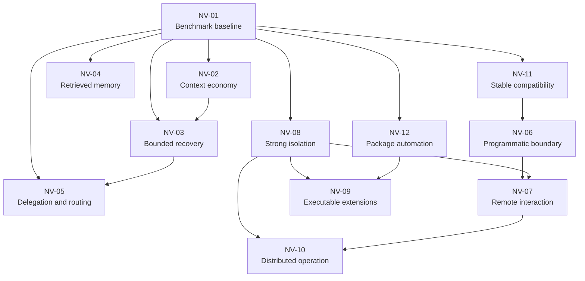

# Next-version capability research

This document helps maintainers choose the scope of the next Flow version. It inventories deferred
capabilities, records how much decision-grade research exists, and defines the evidence required
before a candidate becomes a delivery slice.

The [delivery roadmap](roadmap.md) owns gate order and release commitments. This document owns
future-capability research and release-shaping alternatives. A row in this document is not a
commitment, compatibility promise, or claim that Flow supports the capability.

## Interpret research maturity

Use these terms consistently when comparing candidates:

| Maturity | Meaning |
| --- | --- |
| Assessed | Flow has mapped the relevant flows, authority boundary, alternatives, failure modes, non-goals, and evidence gate. Implementation or adoption can still be blocked. |
| Partial | Flow has useful primary-source research, architecture, or field evidence, but at least one material threat, prototype, demand, or comparative-evaluation question remains open. |
| Initial | Flow has named the boundary or adjacent standard but lacks a decision-grade design and falsifiable evaluation. |

Maturity describes the quality of the decision evidence. It does not rank product value or imply
that an assessed capability belongs in the next release.

## Start from the target flows

Every candidate must serve at least one of these flows. Delete or defer a candidate that cannot
name a user, operator, or system outcome.

| Actor | Trigger | Required outcome |
| --- | --- | --- |
| User | A long coding run approaches a provider context limit | The run preserves protected constraints, exact evidence, tool-pair integrity, and route identity while reducing only the provider projection. |
| User | Deterministic verification rejects an attempted change | Flow can present or execute only a predeclared, bounded repair path without changing the frozen goal, verifier, holdout, authority, or aggregate budget. |
| Consumer application | A local program needs validation, execution, or observation | The consumer uses a versioned boundary with bounded messages, typed errors, cancellation, binary identity, and unambiguous lifecycle ownership. |
| Team member | A remote or shared client observes or steers a run | Authentication, authorization, tenancy, replay, reconnect, and exact decision binding prevent one user or client from gaining another run's authority. |
| Operator | A workload might be hostile or belongs to another tenant | The complete agent and tool runtime executes inside a measured isolation boundary with resource controls, teardown proof, and no ambient host authority. |
| Publisher | A capability needs behavior that inert manifests cannot express | Executable authority is explicit, signed, isolated, revocable, versioned, and unable to bypass Flow policy, evidence, or scheduling. |
| Maintainer | A new version changes a supported contract | The release has a declared support window, compatibility corpus, migration path, rollback path, and evidence-backed channel policy. |
| Evaluator | A capability is proposed for production | Fresh held-out tasks measure verified success, false acceptance, cost, latency, context, recovery, human intervention, policy violations, and missingness. |

## Keep standards at their owning boundaries

The standards landscape is active and must be reverified when a design starts. As of August 27,
2026:

- The [Agent Client Protocol architecture](https://agentclientprotocol.com/get-started/architecture)
  defines a client-to-agent JSON-RPC boundary for a trusted client and agent relationship.
- The [Agent2Agent Protocol specification](https://a2a-protocol.org/v0.3.0/specification/) defines
  discovery, task exchange, and interaction between independent agents. Version `0.3.0` is the
  current specification listed by the project.
- The [Agent User Interaction Protocol](https://docs.ag-ui.com/) defines a bidirectional,
  event-based agent-to-frontend boundary.
- The [A2UI specification](https://a2ui.org/) defines declarative agent-produced UI content. The
  project lists `v0.9.1` as current and `v1.0` as a candidate.

These standards cover different layers. None defines Flow's workflow graph, durable run ledger,
policy decisions, package governance, tenant boundary, or acceptance rules. Flow's current local
ACP and closed A2UI-profile surfaces remain separate from remote ACP, A2A, AG-UI, or full A2UI
conformance claims.

## Research the deferred capability groups

The following register consolidates deferred work that was previously distributed across gates,
non-goals, and status notes.

### NV-01: Product benchmark and claim baseline

- **Outcome:** Decide whether a new capability improves verified user outcomes under fixed controls.
- **Maturity:** Partial. Flow has paired evaluators, native comparison adapters, private holdouts,
  complete denominators, and two digital-twin field series.
- **Missing research:** The evidence covers two issues in one repository and doesn't establish
  cross-repository, cross-language, cross-provider, crash-recovery, or unattended-repair behavior.
  The task taxonomy, minimum sample sizes, equivalence rules, leakage controls, and claim thresholds
  aren't frozen for a broader benchmark.
- **Authority change:** None when evaluation remains offline and cannot activate a candidate.
- **Prerequisite:** None. This group is a prerequisite for every production capability in this
  document.
- **Research exit:** Approve a versioned benchmark plan with fresh private tasks. Define
  deterministic acceptance, environment matching, complete missingness, fixed stopping rules, and
  claim-specific thresholds. Publish every attempted result. Include failures and human
  interventions.

### NV-02: Context economy and overflow recovery

- **Outcome:** Keep long model sessions within capacity with lower context cost and fewer avoidable
  failures.
- **Maturity:** Partial, with strong architecture research. Flow already has an append-only session
  record, derived surfaces, artifact references, evaluated summaries, and an opt-in rolling policy.
  The [capability-sourcing review](capability-sourcing.md#learned-from-deepseek-harness) covers
  DeepSeek's compaction seam, deterministic pruning, routed capacity, prefix-cache behavior, and
  overflow recovery.
- **Missing research:** Flow has not measured model-free pruning or cache-aware summary economics.
  It also lacks provider-specific overflow classification and post-request retry measurements. The
  correct pressure and retained-tail policy remains workload-specific.
- **Authority change:** Low. A projection can change model-visible context but must never change
  primary events, workflow evidence, tools, policy, route, or output allowance.
- **Prerequisites:** NV-01 and exact provider-adapter conformance tests.
- **Research exit:** Compare complete history, references, deterministic pruning, summaries, and
  post-overflow recovery on balanced held-out tasks. Require protected-constraint retention,
  complete tool pairs, exact source attribution, measurable byte or token progress, and no increase
  in false acceptance.

### NV-03: Bounded verifier-directed recovery

- **Outcome:** Let Flow choose a safe repair class after deterministic rejection. Remove the need
  for an operator to author every next step.
- **Maturity:** Partial. The second digital-twin series proves that bounded repair workflows can
  recover an accepted change. An operator still selected and authored every repair. The series
  doesn't prove autonomous selection.
- **Missing research:** Flow lacks a closed failure taxonomy and deterministic selection
  controller. It also lacks a progress measure, cross-cycle settlement contract, and adversarial
  holdouts. Comparison with operator-authored repair remains open. Flow needs separate tests for
  oscillation, ineffective repair, and attempts to reinterpret a frozen contract.
- **Authority change:** Medium. The controller selects execution that can mutate a workspace, even
  when every candidate workflow is predeclared.
- **Prerequisites:** NV-01, stable effect reconciliation, frozen external holdouts, and a complete
  aggregate budget across every full and repair attempt.
- **Research exit:** Build a deterministic controller that selects only predeclared repair classes
  from durable failure evidence. It must make measured progress and stop within fixed ceilings. It
  cannot change the goal, verifier, holdout, authority, or acceptance contract. Compare it with
  operator-authored repair on fresh tasks.

### NV-04: Persistent conversation and retrieved memory

- **Outcome:** Carry reviewed knowledge across runs without treating provider transcripts or model
  output as truth.
- **Maturity:** Initial. Flow supports immutable supplemental memory and evidence-backed
  relationships. It doesn't support conversation persistence, live retrieval, automatic memory
  activation, or runtime model-written memory.
- **Missing research:** Retention and deletion policy, tenant and agent scoping, retrieval quality,
  and poisoning resistance remain undefined. Flow also lacks contracts for prompt injection,
  contradictions, source revocation, staleness, privacy, cost, user correction, and replay.
- **Authority change:** Medium to high. Retrieved bytes can influence future tool use even when they
  don't directly grant a tool.
- **Prerequisites:** NV-01, a privacy and threat model, and an explicit distinction between context,
  evidence, and authority.
- **Research exit:** Compare no memory, reviewed static memory, and retrieved memory on fresh tasks.
  Prove exact source attribution, bounded retrieval, deletion, and revocation. Keep unresolved
  contradictions visible. Prevent automatic promotion from model output to accepted memory.

### NV-05: Adaptive delegation and routing

- **Outcome:** Assign work to an appropriate local or remote specialist while preserving identity,
  budgets, settlement, and acceptance.
- **Maturity:** Partial. Static phase-aware routing can activate after qualification. One-shot local
  delegation is evaluation-only. Dynamic, learned, recursive, parallel, background, remote,
  multi-node, and fallback behavior remains unavailable.
- **Missing research:** Task-fit classification, delegation overhead, nested budget accounting,
  cancellation propagation, and partial result settlement need comparative evidence. Flow also
  lacks evidence for route drift, specialist drift, false completion, fallback semantics, remote
  identity, and multi-agent prompt injection.
- **Authority change:** High. Dynamic selection lets runtime observations choose a model or child
  execution path.
- **Prerequisites:** NV-01 and NV-03. Remote variants also require NV-07, NV-08, and NV-10.
- **Research exit:** Qualify one additional delegation dimension at a time against a sequential
  control. Freeze models, tools, packages, task order, budgets, retries, and verification. Require
  complete child and parent settlement and prohibit production activation for an unmeasured task
  class.

### NV-06: Programmatic validation and process control

- **Outcome:** Let applications validate workflows or control Flow without importing internal
  modules or parsing human-facing output.
- **Maturity:** Assessed but blocked. The [library API assessment](library-api-assessment.md)
  recommends a separately versioned read-only validator after a demand gate. It recommends a
  process-isolated typed client after a Flow protocol exists. The assessment rejects exports of the
  current module tree. It also rejects ACP as Flow's general API.
- **Missing research:** Independent consumer demand remains below the documented threshold. A
  process protocol still needs message framing, negotiation, idempotency, backpressure, reconnect,
  errors, cancellation, binary identity, and cleanup tests.
- **Authority change:** Low for a pure validator. It is high for execution and control.
- **Prerequisites:** Three independent consumer tasks for a validator. Execution also requires a
  versioned local process protocol and complete lifecycle evidence.
- **Research exit:** Meet the existing demand, contract, verification, lifecycle, and release gates.
  Do not repeat the architectural comparison unless new evidence changes a premise.

### NV-07: Remote and multi-user interaction

- **Outcome:** Let authenticated users observe and steer runs from remote clients or shared user
  interfaces.
- **Maturity:** Initial. Flow has local terminal, browser, and ACP presentation with exact local
  controls. It doesn't provide a remote endpoint, reverse proxy contract, remote approval,
  role-based access control, or multi-user state.
- **Missing research:** Standard selection and transport negotiation require a threat model.
  Authentication, authorization, tenant identity, and reconnect also need research. Flow also
  lacks decisions for replay cursors, approval attribution, cross-site request defenses, and rate
  limits. Audit retention and operator remediation need a prototype. ACP, AG-UI, and A2UI must stay
  at their distinct boundaries.
- **Authority change:** High. A remote request can steer or approve consequential work.
- **Prerequisites:** NV-06 for process control, NV-08 for tenant isolation, and NV-10 for remote
  ownership and quotas.
- **Research exit:** Choose one narrow read-only remote flow first. Pin the standard and protocol
  versions. Authenticate every request and bind each cursor and decision to one tenant and run.
  Prove reconnect and revocation. Complete an independent security review before adding steering.

### NV-08: VM-grade or managed isolation

- **Outcome:** Run hostile or multi-tenant agent workloads without relying on the invoking user's
  host authority or a shared-kernel container boundary.
- **Maturity:** Initial. Flow has native SRT containment for commands, a shared-kernel container
  profile, and a reproducible isolated proof appliance. It hasn't selected or qualified a complete
  agent-runtime microVM or managed sandbox.
- **Missing research:** Threat model, provider comparison, image and kernel trust, attestation,
  workspace transfer, secret injection, and network egress remain open. Flow also lacks decisions
  for resource enforcement, snapshots, cleanup, cold starts, cost, regions, and incident response.
- **Authority change:** This group reduces host authority but introduces a larger infrastructure
  and service trust boundary.
- **Prerequisites:** NV-01 and an explicit hosted versus local product decision.
- **Research exit:** Compare at least three implementable boundaries against one threat model and
  workload suite. Require measured isolation, resource enforcement, exact image identity,
  credential non-persistence, teardown proof, recovery behavior, cost, and latency.

### NV-09: Executable capability extensions

- **Outcome:** Add behavior that inert skills, declarative tools, workflows, policies, and
  presentation manifests cannot express.
- **Maturity:** Initial. Flow's current package system intentionally admits inert content and closed
  declarative operations. Executable modules, generated scripts, executable resources, and
  package-rendered UI remain outside the authority model.
- **Missing research:** Runtime choice and the capability ABI need a supply-chain threat model.
  Dependency closure, reproducible builds, signatures, and vulnerability response also need
  research. Isolation, permissions, revocation, deterministic output, lifecycle ownership,
  compatibility, and malicious-publisher behavior remain open.
- **Authority change:** Very high. Package bytes would gain execution authority.
- **Prerequisites:** NV-08, a stable process or capability ABI, and a separate executable-package
  security policy. Existing TUF and Sigstore controls establish publisher and byte identity but do
  not make code safe.
- **Research exit:** Prove one closed executable profile in VM-grade isolation. Require exact
  dependency identity, no ambient authority, Flow-brokered effects, bounded output, teardown,
  revocation, rollback, and adversarial package tests. Keep package UI code out of scope.

### NV-10: Distributed supervision and hosted operation

- **Outcome:** Coordinate scheduled, remote, or multi-host work with durable ownership and bounded
  capacity.
- **Maturity:** Initial. Flow has one-host FIFO admission, authenticated local workers, durable
  cancellation, and same-host ownership. It has no distributed lease, remote storage, tenant quota,
  general trigger package, mailbox, or hosted service contract.
- **Missing research:** Consensus or lease semantics, clock and partition behavior, duplicate
  execution, remote effect uncertainty, and queue fairness remain undefined. Flow also lacks
  decisions for artifact storage, secrets, distributed budgets, tenant quotas, upgrades,
  observability, disaster recovery, and operator responsibility.
- **Authority change:** Very high. A remote controller can schedule work and hold credentials across
  machines and users.
- **Prerequisites:** NV-01, NV-08, a hosted product decision, and a remote identity model.
- **Research exit:** Start with a read-only remote status prototype or one nonrecursive trigger that
  uses the existing queue. Prove partition, duplicate, crash, adoption, cancellation, and quota
  behavior before enabling remote execution or approval.

### NV-11: Stable compatibility, migration, and release channels

- **Outcome:** Give consumers a predictable support window and a tested path between releases.
- **Maturity:** Partial. Alpha.4 has a classified compatibility policy, immutable historical corpus,
  read-only compatibility check, package boundary, provenance, and recoverable staged publication.
  It doesn't promise a stable executable format, automated migration, long-term support window, or
  stable npm channel.
- **Missing research:** Consumer demand and supported surface inventory need multi-release
  evidence. Migration ownership and cross-release storage behavior also remain open. Flow lacks
  evidence for deprecation telemetry, channel promotion, rollback duration, and support cost.
- **Authority change:** Low, but the maintenance and backward-compatibility cost is durable.
- **Prerequisites:** At least two compatibility-governed published checkpoints and a selected
  next-version product thesis.
- **Research exit:** Approve the supported surfaces and window. Run every retained corpus across
  the proposed matrix. Prove upgrade and rollback, and document incompatible-state remediation.
  Fund the ongoing release and security response obligation.

### NV-12: Automated package lifecycle

- **Outcome:** Safely operate package trust roots, major changes, private acquisition, rollback,
  and retired storage with less manual work.
- **Maturity:** Partial. Flow has TUF metadata, offline root trust, publisher-authenticated content,
  atomic replacement, a finite first activator, and a foreground watcher. It also has digest-bound
  retired-blob pruning.
- **Missing research:** Online root bootstrap and refresh, credential helpers, mutable tags, major
  and policy-package replacement remain outside the current contract. Automatic rollback,
  background collection, trigger ownership, and compromised-publisher recovery also remain open.
- **Authority change:** Medium to high. Automation can change active packages or delete physical
  content without a contemporaneous operator decision.
- **Prerequisites:** NV-01 and a trigger policy that cannot bypass Flow admission, review, or
  generation-pinned readers.
- **Research exit:** Evaluate each automation independently. Require exact target and publisher
  binding. Prove bounded schedules, exclusive ownership, interruption settlement, and rollback.
  Include compromised-key exercises and a manual recovery path. Keep trust-root bootstrap, major
  replacement, rollback, and collection out of one first slice.

## Respect the dependency order

The dependency graph prevents high-authority features from entering a release before their
measurement, process, and isolation foundations.

The graph is a minimum ordering constraint, not a promise to implement every descendant.

## Compare possible next-version shapes

The next version needs one primary thesis. Combining all three approaches would hide failure causes,
expand authority across several boundaries, and make the release impossible to evaluate.

| Dimension | Approach A: Evidence-first usable checkpoint | Approach B: Long-horizon recovery | Approach C: Integration platform |
| --- | --- | --- | --- |
| Primary user | Current CLI operator | Operator running long coding tasks | Application or team integrating Flow |
| Production scope | Benchmark expansion, field usability, compatibility corpus, diagnostics, and release hardening | Context projection and one bounded repair controller, with memory and broader delegation kept evaluation-only | Process protocol, one remote read-only client flow, and isolation research |
| New authority | Low | Medium | High |
| Immediate usability | High | Medium | Medium for new integrators, low for current users |
| Differentiation | Medium | High | High |
| Research effort | Medium | Large | Very large |
| Verification cost | Medium | High | Very high |
| Main failure risk | Polished release without a major new capability | False autonomy, contract drift, or ineffective repair loops | Premature protocol and security commitments across evolving standards |
| Earliest credible evidence | Broader held-out benchmark and a second compatibility-governed release | NV-01, then NV-02 and NV-03 exit gates | NV-06 demand, NV-08 isolation decision, and a remote threat model |

### Approach A: Evidence-first usable checkpoint

Ship the strongest version of the product users can exercise today. Expand field tasks and the
compatibility corpus, reduce setup and diagnosis friction, and qualify current source behavior on
the release matrix. Keep NV-02 and NV-03 as bounded research tracks without production authority.

- **Benefits:** Lowest authority expansion, fastest trustworthy feedback, and the clearest basis
  for later claims or compatibility commitments.
- **Costs:** Less visible novelty and continued operator involvement in repair selection.
- **Effort:** Medium.
- **Risk:** Low to medium.

### Approach B: Long-horizon recovery

Make bounded long-running coding the release thesis. Research and qualify deterministic context
pruning and post-overflow behavior, then prototype one verifier-directed repair controller. Keep
retrieved memory, dynamic routing, and recursive or remote delegation outside production.

- **Benefits:** Builds directly on the field pilot, rolling context, effect journals, and
  deterministic verification. It creates a capability that is distinct from a thin agent wrapper.
- **Costs:** Requires a broader benchmark first and can consume substantial provider and CI budget.
- **Effort:** Large.
- **Risk:** Medium to high.

### Approach C: Integration platform

Make application and team integration the release thesis. Define the local process protocol,
select one read-only remote observation flow, and choose a stronger isolation direction. Treat ACP,
A2A, AG-UI, and A2UI as separate candidate boundaries instead of one combined protocol strategy.

- **Benefits:** Opens a path to IDEs, services, shared UIs, and remote agents without exporting
  internal modules.
- **Costs:** Requires consumer demand, protocol maintenance, identity and tenancy design, stronger
  isolation, and security operations before consequential remote control.
- **Effort:** Very large.
- **Risk:** High.

## Use the recommended release sequence

Prefer **Approach A** for the next version, with NV-02 and NV-03 as explicitly evaluation-only
research. This sequence strengthens the working product, creates the missing benchmark base, and
tests the most distinctive long-horizon ideas without prematurely granting new runtime authority.

Choose Approach B only if long-horizon autonomous repair is the version's primary product claim.
Its evaluation budget must also be funded. Choose Approach C only after three independent consumer
flows justify a programmatic boundary. The project must also accept new remote security and
operations responsibilities.

Do not assign a semantic version number until the release thesis defines its compatibility level.
The result can be another governed alpha checkpoint, a breaking preview line, or a stable-support
program.

## Require a research dossier before implementation

For every selected capability, complete one reviewed dossier with these sections:

1. Name the user, operator, and system flows.
2. Pin primary sources, standards versions, dependencies, and licenses.
3. Map reusable Flow components and dependency direction.
4. State the authority added, removed, or delegated.
5. Compare two to four implementable approaches, including the simplest viable alternative.
6. Define non-goals and behavior for timeouts, partial failures, invalid input, missing context,
   dependency outage, resource exhaustion, cancellation, restart, and upgrade.
7. Build the smallest isolated prototype that can falsify the preferred approach.
8. Freeze holdouts, controls, budgets, success thresholds, stopping rules, and abort criteria before
   evaluation.
9. Record security, compatibility, migration, release, support, and operational consequences.
10. Convert the accepted design into independently verifiable roadmap slices and GitHub issues.

If a dossier cannot define a deterministic or independently reviewable acceptance signal, keep the
capability in research.

## Handle research failure safely

| Condition | Required behavior |
| --- | --- |
| A standard or dependency changes during research | Pin the observed version, reassess compatibility and threats, and don't infer support for the new version. |
| A prototype needs more authority than the dossier approved | Stop the prototype and return to design review. Do not widen policy through implementation. |
| Held-out evidence is missing, leaked, or environment-mismatched | Report insufficient evidence and make no activation or product claim. |
| A candidate improves average quality but increases false acceptance or policy violations | Reject production adoption regardless of cost or latency improvement. |
| A release shape requires two unrelated high-authority boundaries | Split the version or select one thesis. |
| Consumer demand doesn't meet a documented gate | Keep the current CLI or local boundary and don't freeze a new public contract. |

## Keep explicit non-goals

This research program does not:

- Commit every deferred capability to implementation.
- Promise a stable release, hosted service, public library, or remote API.
- Treat standards adoption as proof of Flow compatibility or security.
- Let evaluation prototypes activate themselves or merge into production authority.
- Replace independent security review for remote, multi-tenant, executable-package, or managed
  isolation work.
- Use feature count, one repository, or one successful run as evidence of product superiority.
