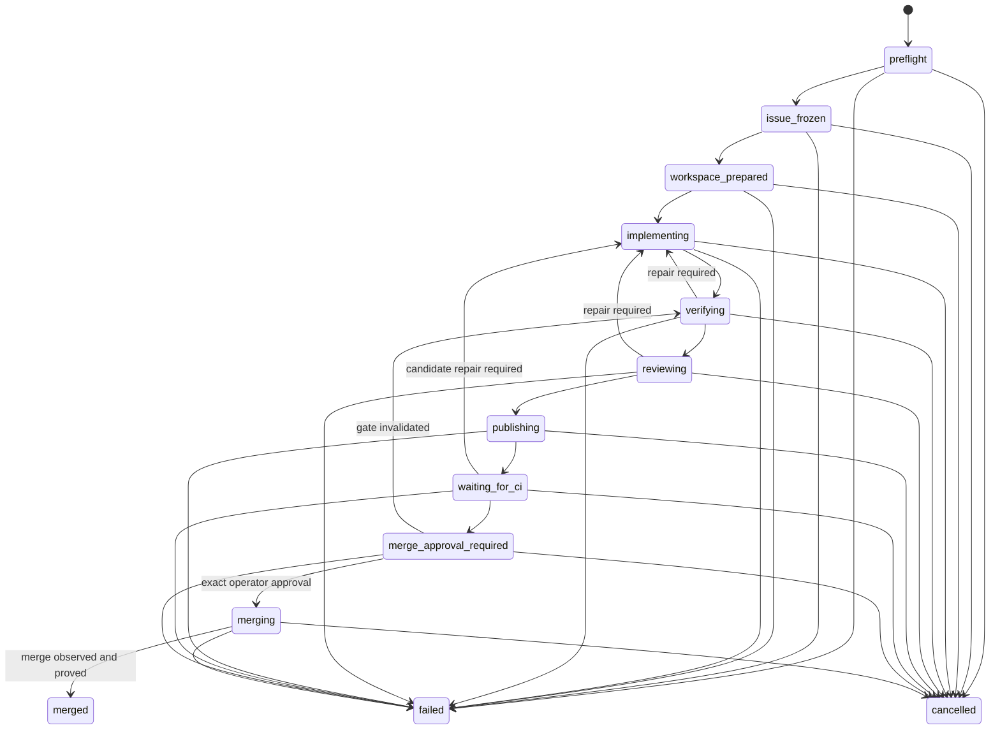

# GitHub issue lifecycle specification

This specification defines Flow's bounded `github.com` issue lifecycle. It is normative for plan
admission, authority separation, durable state, verification, review, publication, hosted-check
observation, explicit merge approval, and public output.

The lifecycle lets an operator use Flow for one issue in one repository. The model receives no
network, credential, Git metadata, pull request, continuous integration (CI), review, or merge
authority.

## Availability

Current source registers `flow issue`. The published `0.1.0-alpha.4` package doesn't include the
command group. The lifecycle becomes a qualified public preview only when a later release's help
and release notes identify it and the external-repository acceptance pilot passes.

## Command surface

The preview command surface is:

```text
flow issue validate <plan.yaml>
flow issue doctor <issue-url> --plan <plan.yaml> --provider <provider> --model <model>
flow issue run <issue-url> --plan <plan.yaml> --provider <provider> --model <model> [--command-id <uuid>]
flow issue inspect <run-id>
flow issue events <run-id> [--after <sequence>] [--limit <count>]
flow issue resume <run-id> [--command-id <uuid>]
flow issue cancel <run-id> --actor <label> [--reason <text>] [--command-id <uuid>]
flow issue merge <run-id> --actor <label> --expected-pr <number> \
  --expected-head <40-lowercase-hex> --expected-gate-digest <sha256> [--command-id <uuid>]
```

`run`, `resume`, `cancel`, and `merge` accept `--command-id <uuid>` for idempotent submission.
These commands don't accept raw Git, GitHub CLI, API, shell, executable, or environment arguments.
Repository, branch, pull request, and merge arguments must come from the admitted plan and frozen
run identity.

## Authority model

The lifecycle has three separate authorities:

| Authority | Trusted input | Permitted effects | Prohibited effects |
| --- | --- | --- | --- |
| Operator | Reviewed plan and exact merge approval | Select fixed policy, workflows, commands, provider, model, and exact merge gate | Delegate approval through issue text or model output |
| Host controller | Admitted plan and frozen identities | Invoke fixed Git and GitHub operations, prepare the workspace, observe hosted state, and append durable events | Parse shell text, reveal credentials, bypass policy, or merge without exact approval |
| Model runtime | Frozen issue as untrusted data and bounded workspace context | Read and change admitted candidate paths through declared Flow tools | Access network, credentials, `.git`, host GitHub state, or delivery operations |

The host controller must resolve exact Git and GitHub CLI executables and invoke fixed argument
arrays without shell parsing. GitHub credentials must remain inside the GitHub CLI credential
boundary. The controller must not place a credential in a prompt, workflow environment, command
sandbox, process argument, event, artifact, public projection, or error.

Issue bodies, comments, repository files, provider output, review text, command output, and hosted
check text are untrusted data. None can select or change a host operation.

## Plan contract

The plan is UTF-8 YAML with one strict object. Every object rejects unknown fields. Every string,
list, argument vector, timeout, path, and identifier must satisfy the implementation's published
semantic bound. Lists marked nonempty must contain at least one value. Values marked unique must
not contain duplicates after normalization.

The top-level discriminator is exact:

```yaml
apiVersion: flow.synapti.ai/v1alpha1
kind: GitHubIssuePlan
```

An issue URL must have the form
`https://github.com/<owner>/<repository>/issues/<positive-integer>`. It must not contain user
information, a port, query, fragment, alternate host, extra path segment, or a noncanonical issue
number. One trailing slash is accepted and removed from the canonical result. Admission returns the
canonical host, lowercase owner, lowercase repository, `owner/repository` identity, issue number,
and URL.

A repository name can start with a dot. For example, `owner/.github` is valid. The owner component
cannot start with a dot. Both components must satisfy the canonical syntax and length bounds, and
the repository component cannot be `.`, `..`, or a name that ends in `.git`.

The complete shape is:

```yaml
apiVersion: flow.synapti.ai/v1alpha1
kind: GitHubIssuePlan
repository:
  expected: owner/repository
  baseBranch: main
branch:
  prefix: flow/issue-
implementation:
  workflow: .flow/workflows/implement-issue.workflow.yaml
candidate:
  allowedPathPrefixes: [src/, tests/]
holdout:
  stdin:
    path: .flow/verification/issue-holdout.py
  command:
    executable: python3
    args: ["-"]
    timeoutMs: 120000
verification:
  - id: test
    command:
      executable: npm
      args: [test]
      timeoutMs: 300000
hostedChecks:
  required:
    - name: CI / test
      sourceApp:
        id: 15368
        slug: github-actions
review:
  workflow: .flow/workflows/review-issue.workflow.yaml
  resultNode: review-result
  blockingSeverities: [P1, P2, P3]
merge:
  method: squash
  deleteBranch: true
```

### Plan fields

| Field | Requirement |
| --- | --- |
| `apiVersion` | Must equal `flow.synapti.ai/v1alpha1`. |
| `kind` | Must equal `GitHubIssuePlan`. |
| `repository.expected` | Must be one `owner/name` identity. Admission converts it to canonical lowercase and requires an exact match with `origin` and the issue URL after GitHub resolution. |
| `repository.baseBranch` | Must name the attached checkout's allowed base branch. It must satisfy the Git branch-name restrictions and must not be a revision expression. |
| `branch.prefix` | Must be a safe Flow-owned branch prefix that satisfies the documented Git ref restrictions. The controller derives the complete branch name. The model cannot supply it. |
| `implementation.workflow` | Must be a project-relative regular-file path to a valid Flow workflow. It can use `.flow/workflows/**` but must exclude `.git` and private `.flow` state. |
| `candidate.allowedPathPrefixes` | Must be a nonempty, unique list of project-relative exact files or directory prefixes. Entries must stay within the repository and exclude `.git` and `.flow`. |
| `holdout.command` | Must be one fixed command vector. It must return nonzero on the frozen base and zero on the candidate. |
| `holdout.stdin.path` | Optional. Must identify one regular file below `.flow/verification/`. The controller freezes at most 1,048,576 bytes and streams the exact bytes to both holdout executions without exposing the source path to the command. |
| `verification` | Must be a nonempty list of commands with unique `id` values. Every command must return zero on the exact candidate. |
| `hostedChecks.required` | Must be a nonempty list of strict `{name, sourceApp: {id, slug}}` objects with unique names. The app ID must be a positive safe integer, and the slug must be canonical lowercase. Every named check must come from that exact app and settle successfully for the exact published head. |
| `review.workflow` | Must be a project-relative regular-file path to a valid, read-only Flow workflow. It has the same path restrictions as `implementation.workflow`. |
| `review.resultNode` | Must be the bounded ID of the one agent node that owns the structured review result. The node must succeed, and its result must be complete and untruncated. |
| `review.blockingSeverities` | Must be the exact tuple `[P1, P2, P3]`. |
| `merge.method` | Must be exactly `squash`, `merge`, or `rebase`. The repository must permit the selected method. |
| `merge.deleteBranch` | Must state whether the controller deletes the Flow-owned remote branch after a proved merge. |

The implementation and review workflow paths must be different. Plan parsing returns
`invalid_yaml`, `invalid_schema`, or `limit_exceeded`. It doesn't expose parser internals in the
public error.

### Plan limits

Plan admission applies these exact limits:

| Input | Limit |
| --- | --- |
| Complete plan | 65,536 UTF-8 bytes |
| Private holdout standard input | 1,048,576 bytes |
| Verification commands | 32 |
| Required hosted checks | 32 |
| Candidate path prefixes | 64 |
| Command arguments | 64 arguments and 65,536 UTF-8 bytes in total |
| One command argument | 4,096 characters |
| Executable name or path | 4,096 characters |
| Command timeout | 86,400,000 milliseconds |
| Project path or candidate prefix | 1,024 characters |
| Verification ID or review result-node ID | 64 characters |
| Base branch | 255 characters |
| Flow-owned branch prefix | 128 characters |
| Hosted-check name | 256 trimmed characters |
| Hosted-check source app slug | 256 characters |

Identifiers must start with a lowercase letter. They can contain lowercase letters, digits, and
single hyphens between segments. Command arguments can be empty but cannot contain a NUL byte.

Base branches and Flow-owned branch prefixes follow the applicable
[Git ref-name restrictions](https://git-scm.com/docs/git-check-ref-format). A slash-separated
component cannot start with `.` or end with `.lock`. A ref cannot contain `..`, `@{`, a backslash,
space, `~`, `^`, `:`, `?`, `*`, `[`, an ASCII control character, or DEL. It cannot be the single
character `@`. A base branch cannot end with `/` or `.`, and a branch prefix cannot end with `.`.

### Command vectors

Each command has this strict shape:

```yaml
executable: npm
args: [test]
timeoutMs: 300000
```

`executable` is one program name or absolute executable path admitted by the host. `args` is the
ordered argument vector, and `timeoutMs` is a positive bounded integer. The controller must not
invoke a shell to interpret a command. Shell operators, substitutions, redirections, environment
assignments, and executable paths derived from repository content are invalid.

### Plan paths

The controller resolves every plan path against the frozen repository root. A path must remain
inside that root after lexical and real-path resolution. Absolute paths, empty segments, `.` and
`..` traversal, NUL bytes, platform aliases, symbolic-link escapes, `.git`, and private `.flow`
run state are invalid.

The plan can store workflow inputs under `.flow/workflows/**`. It can select one optional private
holdout input below `.flow/verification/**`. It cannot select `.git`, `.flow/runs`,
`.flow/issue-runs`, or another private `.flow` path. The runtime must reject a path whose real path
or symbolic-link target escapes its admitted namespace.

`candidate.allowedPathPrefixes` cannot grant the model write access to `.flow` or `.git`. A
workflow path identifies immutable input. It doesn't create a candidate write permission.

## Admission and frozen identity

`validate` parses the plan without GitHub access or repository mutation. `doctor` performs
read-only host and live-state checks. `run` must complete both forms of admission before the first
mutation.

The initial frozen identity contains digests or bounded identities for:

- GitHub host and repository.
- issue node, number, state, content digest, and exact update time.
- configured base branch and the exact commit observed at its remote `refs/heads/<baseBranch>` ref.
- frozen contract, plan, implementation template workflow, review template workflow, verification
  commands, holdout command, optional private holdout input, and budgets.
- derived Flow-owned branch.
- run and idempotency identities.

The issue must be open and belong to the expected repository. The checkout must be clean, attached,
and at the admitted base. `origin` must resolve to the same `github.com` repository. A mismatch or
drift must fail before worktree, branch, commit, push, pull request, or merge mutation.

The admitted compiled implementation template must declare `goal`. Its ordered
`goal.criteria[].id` values are the authoritative acceptance-criterion identifiers for review and
merge evidence. The issue title and body provide untrusted task context, but they don't create a
second criterion-ID source. The plan and review workflow cannot replace, add, or omit those IDs.

Repository identities use the canonical lowercase `owner/name` returned by the GitHub identity
parser. The derived Flow branch must differ from the frozen base branch. Issue numbers, pull request
numbers, check-run IDs, and source app IDs must be positive safe integers. GitHub node IDs must
contain 1 to 256 characters and cannot contain Unicode whitespace, control characters, or format
characters.

## Lifecycle state machine

The durable lifecycle follows this state machine:



Every transition must be derived by replaying complete durable events. A command cannot skip a
state, revise history, or adopt unbound external state. `failed` and `cancelled` preserve settled
evidence. `external_state_uncertain` is recovery metadata for one pending effect, not a forward
lifecycle phase. Settling that exact effect returns control to the phase that prepared it.

## Event and effect contract

The run root is `.flow/issue-runs/<run-id>/`. The lifecycle stores append-only public event records
and owner-only private evidence under that root. The controller must use the repository's
single-owner and durable-tail rules when it appends or repairs the final partial record.

The controller must store lifecycle-owned candidate and verification Git worktrees outside the
checkout and outside an operating-system temporary directory. The production path is
`<checkout-parent>/.flow-issue-host-<uid>/<project-hash>/worktrees/`, where `project-hash` is the
first 32 hexadecimal characters of the SHA-256 digest of the canonical checkout path. The
collection and project directory must be real, owner-only directories. Reconstructing a missing
worktree from the branch or ledger is forbidden because the worktree might contain uncommitted
model changes. Resume must fail closed when either worktree or its exact ownership record is
missing or divergent.

Every public event has this envelope:

```json
{
  "version": 1,
  "runId": "issue-run-identity",
  "sequence": 1,
  "at": "2026-08-28T12:00:00.000Z",
  "type": "phase_transitioned"
}
```

The event payload depends on `type`:

| Type | Payload |
| --- | --- |
| `phase_transitioned` | `from` and `to` lifecycle phases, plus the required `receipt` |
| `external_effect_prepared` | `effectId`, `effectKind`, and `operationDigest` |
| `external_effect_settled` | `effectId`, `outcome` as `applied` or `not_applied`, and `observationDigest`. An `applied` settlement also requires its typed `result` |
| `external_state_uncertain` | `effectId`, bounded `code`, and `evidenceDigest` |
| `run_failed` | Bounded `code` and `evidenceDigest` |
| `run_cancelled` | `actorDigest` and optional `reasonDigest` |

The closed external-effect kinds are `workspace`, `commit`, `push`, `pull_request`,
`pull_request_ready`, and `merge`. Only one effect can be pending. A run cannot progress until that
effect settles. An uncertainty event must refer to the exact pending effect. Its settlement returns
the run to the phase that prepared it.

An effect ID has the deterministic form
`effect-<kind-with-hyphens>-<operationDigest>`. The operation digest is part of the ID so replay can
distinguish an exact retry from a different intended operation.

An applied settlement must bind the effect to its observed result:

| Effect kind | Required result fields |
| --- | --- |
| `workspace` | `kind`, `workspaceIdentityDigest` |
| `commit` | `kind`, `candidateHead` |
| `push` | `kind`, `candidateHead`, `branch` |
| `pull_request` | `kind`, `repositoryIdentity`, `candidateHead`, `headBranch`, `baseBranch`, `pullRequestNumber`, `pullRequestNodeId`, `isDraft` as `true` |
| `pull_request_ready` | `kind`, `repositoryIdentity`, `candidateHead`, `headBranch`, `baseBranch`, `pullRequestNumber`, `pullRequestNodeId`, `isDraft` as `false` |
| `merge` | `kind`, `candidateHead`, `gateDigest`, `mergeCommit`, `deleteBranchRequested`, `branchDeleted`, `proofDigest` |

A `not_applied` settlement has no `result`. The result kind must equal the prepared effect kind,
and every identity must match the current frozen or approved lifecycle identity.

The `commit` effect belongs to `implementing` and must settle before the transition to `verifying`.
Publishing doesn't create the candidate commit. First publication must settle `push`, draft
`pull_request`, and `pull_request_ready`, in that order, before the transition to `waiting_for_ci`.
The ready result must bind the same repository, pull request number, node ID, head commit, head
branch, and base branch as the draft result.

A candidate repair preserves the existing pull request number, node ID, head branch, and base
branch. Repaired publication must settle a new `push` for the replacement candidate and then
observe that exact existing pull request as ready. It must not prepare or settle another
`pull_request` creation effect. The new ready observation and publication receipt bind the
replacement candidate head.

Every legal phase transition requires the matching receipt:

| Transition | Receipt kind | Bounded receipt fields |
| --- | --- | --- |
| `preflight` to `issue_frozen` | `issue_snapshot` | `repositoryIdentity`, `issueNumber`, `issueNodeId`, `issueUpdatedAt`, `baseBranch`, `baseCommit`, `branch`, `issueDigest`, `frozenContractDigest`, `planDigest`, `implementationTemplateWorkflowDigest`, `reviewTemplateWorkflowDigest`, `budgetDigest`, `evidenceDigest` |
| `issue_frozen` to `workspace_prepared` | `workspace` | `workspaceIdentityDigest`, `evidenceDigest` |
| Any repair or initial transition to `implementing` | `implementation_started` | `iteration`, `evidenceDigest` |
| `implementing` to `verifying` | `implementation` | `candidateHead`, `flowRunId`, `executionWorkflowDigest`, `terminalSequence`, `evidenceDigest` |
| `verifying` to `reviewing` | `verification` | `candidateHead`, `evidenceDigest` |
| `reviewing` to `publishing` | `review` | `candidateHead`, `flowRunId`, `executionWorkflowDigest`, `terminalSequence`, `reportDigest`, `evidenceDigest` |
| `publishing` to `waiting_for_ci` | `publication` | `candidateHead`, `branch`, `baseBranch`, `pullRequestNumber`, `pullRequestNodeId`, `evidenceDigest` |
| `waiting_for_ci` to `merge_approval_required` | `merge_gate` | `repositoryIdentity`, `baseBranch`, `baseCommit`, `branch`, `pullRequestNumber`, `pullRequestNodeId`, `candidateHead`, `checksDigest`, `gateDigest`, `deleteBranch`, `evidenceDigest` |
| `merge_approval_required` to `verifying` | `gate_invalidated` | `candidateHead`, `gateDigest`, `evidenceDigest` |
| `merge_approval_required` to `merging` | `merge_approval` | `candidateHead`, `gateDigest`, `actorDigest`, `evidenceDigest` |
| `merging` to `merged` | `merge` | `candidateHead`, `gateDigest`, `mergeCommit`, `deleteBranchRequested`, `branchDeleted`, `evidenceDigest` |

An implementation iteration must be a positive integer no greater than 64. Commit identities must
be 40-character lowercase hexadecimal values. Evidence, issue, check, report, actor, and gate
digests must be lowercase SHA-256 values.

Every external mutation uses two durable phases:

1. Record a prepare event before execution. It binds the operation kind, exact target identity,
   intended argument digest, and idempotency identity.
2. A settlement event binds the observed result to the prepare event and the exact resulting local
   or remote identity.

A prepare event without settlement is not permission to repeat an operation. `resume` must first
observe Git or GitHub and choose one result:

- Settle the effect when the exact intended state exists.
- Retry only when exact observation proves that no effect occurred and the operation is safe to
  repeat.
- Enter or remain in `external_state_uncertain` when neither conclusion is proven.
- Fail on a collision with a different branch, commit, pull request, head, or merge.

This contract applies to worktree and branch creation, candidate commit, push, draft pull request
creation, pull request readiness, and merge. Implementation, publication, and merge must not create
duplicate external effects after an acknowledgement loss.

## Command idempotency

`--command-id` identifies one operator submission. Callers that can retry must create and persist
one UUID before the first request. Repeating the UUID with byte-equivalent admitted input returns
the recorded or reconciled result. Repeating it with different input is a conflict and must not
mutate state.

A command ID doesn't authorize a merge. `merge` also requires an actor label and the exact pull
request, head commit, and gate digest from the current public projection.

## Candidate and verification contract

The implementation workflow can change only admitted candidate paths in the isolated worktree.
The resulting diff must be nonempty and task-relevant. A changed path outside the admitted prefixes
fails the run.

The implementation workflow cannot contain ordinary command, approval, child, optimization, or
command-tool-package nodes. It can contain a command verifier when the command has an exact digest
match in the plan's frozen `verification` list. The digest covers the normalized executable,
complete ordered arguments, and timeout. An implementation agent can use `exec` under the same
frozen command authority. Any undeclared command fails admission or execution.

Review workflows remain read-only. They cannot contain command verifiers or command-capable
agents.

An admitted command verifier runs through the production command sandbox and records typed verdict
evidence. It provides an early deterministic boundary inside the implementation graph. It doesn't
replace the controller's later execution of every frozen verification command against the exact
committed candidate.

Before it prepares a commit effect, the controller constructs an exact candidate snapshot. The
snapshot binds the base commit, changed paths, Git attributes, private candidate index, tree delta,
and logical byte count. If the pinned Git executable returns one malformed response during it,
the controller retries the complete snapshot once. The second snapshot repeats every branch,
ancestry, path, filter, symbolic-link, tree-drift, and byte-limit check. A second malformed response
fails closed with `git_response_invalid`. This retry cannot create a commit, update a branch,
contact GitHub, or authorize an external effect.

The controller runs the frozen holdout twice:

1. The untouched frozen base must return nonzero.
2. The exact candidate must return zero.

If `holdout.stdin.path` is present, the freezer reads the source before the first mutable effect.
It binds the raw SHA-256 digest and the typed, content-addressed private blob reference into the run
manifest.

Verification retrieves only that blob. It verifies the media type, size, blob identity, and raw
digest. It then sends copied bytes to both commands through standard input. Verification never
reads the live plan path.

Command evidence contains `stdinHash` only after transport write settlement. It doesn't prove that
the application consumed the input. Use an interpreter mode whose successful execution requires
reading standard input. The executor rejects missing, substituted, or oversized input. The native
executor also rejects a pipe that errors or closes before write settlement.

Command evidence has no dedicated input-byte field. Standard output and standard error remain
exact owner-only private evidence. A holdout that echoes its input can copy source bytes into that
evidence. Public projections and model context don't include private command evidence.

The native process sandbox supports this input channel. A managed backend that can't prove stdin
delivery must fail before command execution. The preview container backend does so because its
current attach protocol transports output only.

The controller then runs every `verification` command against the exact candidate. Each result
binds the command identity, executable and argument-vector digest, timeout, exit result, bounded
output digest, workspace identity, and candidate identity. A timeout, signal, nonzero result,
missing executable, output policy violation, or candidate mutation fails verification.

The base negative control prevents a pre-existing passing repository from becoming evidence that
the issue was implemented. It doesn't prove that the holdout is complete, so the independent
review must also assess the holdout and test design.

## Review contract

The review workflow is fresh, read-only, and separate from implementation. Its inputs are the
frozen issue contract, exact candidate diff, and bounded deterministic evidence. It must complete
two stages:

1. Map every acceptance criterion to implementation and evidence, and identify missing or
   contradictory coverage.
2. Evaluate security, correctness, performance, reliability, maintainability, test quality, and
   documentation.

Before provider input/output, the host must validate the private review evidence. It must then
construct one replay-stable projection. The projection must include:

- All frozen criterion IDs and descriptions.
- The expected result identities and frozen contract digest.
- The frozen base, candidate, tree, sorted changed paths, and logical byte count.
- The exact UTF-8 diff and its content-addressed metadata.
- Stable negative-control, deterministic-check, and candidate-delta outcomes.

The projection must exclude workspace identity, absolute paths, and raw command output. It must
also exclude GitHub node IDs, credentials, and volatile evidence-instance digests.

The exact diff must not exceed 131,072 UTF-8 bytes. The complete serialized JSON projection must
not exceed 262,144 UTF-8 bytes after escaping. These reviewer-only limits don't change the 65,536
UTF-8-byte issue-workflow context limit. Flow must reject an oversized diff or projection without
truncating or omitting any field. Reconstructing the same candidate and frozen contract from a
later process must produce the same projection even when private verification timestamps and
evidence-instance digests differ.

The projection must be one canonical JSON object. Trusted admission embeds the object directly in
the review context envelope and rejects a noncanonical representation. This rule prevents another
JSON string layer from consuming the bounded model-input surface.

Trusted issue admission binds the review projection to each review model prompt. A bound prompt
can contain at most 786,432 characters. A review model verifier can receive at most 786,432 UTF-8
bytes of rubric, projection, evidence, and work-profile context. Repository-authored workflow
source cannot request this review-only policy. Generic model verifiers retain the 262,144-byte
aggregate input limit.

Flow frames untrusted verifier rubric and evidence with deterministic boundaries that don't occur
in the corresponding content. It also binds the rubric's exact UTF-8 byte length and SHA-256
digest.

Every finding has a stable identity and one severity from `P1`, `P2`, or `P3`. Any severity listed
in `review.blockingSeverities` blocks publication or invalidates a later merge gate. A reviewer
failure, malformed result, incomplete criterion map, or candidate mutation also blocks progress.

Flow reads structured review JSON only from the exact successful agent node named by
`review.resultNode`. A missing, unsuccessful, ambiguous, or truncated result fails review. Flow
must not infer a result from another terminal node, console text, or model prose outside the
structured payload.

The structured result has this strict JSON shape:

```json
{
  "version": 1,
  "candidateHead": "aaaaaaaaaaaaaaaaaaaaaaaaaaaaaaaaaaaaaaaa",
  "issueDigest": "bbbbbbbbbbbbbbbbbbbbbbbbbbbbbbbbbbbbbbbbbbbbbbbbbbbbbbbbbbbbbbbb",
  "reviewWorkflowDigest": "cccccccccccccccccccccccccccccccccccccccccccccccccccccccccccccccc",
  "acceptanceMapping": [
    {
      "criterionId": "criterion-id",
      "status": "satisfied",
      "evidence": "The exact test and implementation evidence for this criterion."
    }
  ],
  "findings": [
    {
      "id": "finding-id",
      "severity": "P2",
      "category": "correctness",
      "file": "src/example.ts",
      "startLine": 42,
      "endLine": 44,
      "summary": "The candidate accepts a stale identity.",
      "evidence": "The compared value does not bind the frozen head.",
      "recommendation": "Compare the observed value with the frozen head before mutation."
    }
  ],
  "verdict": "blocked"
}
```

`category` must be `security`, `correctness`, `performance`, `reliability`, `maintainability`,
`tests`, or `documentation`. `status` must be `satisfied` or `unsatisfied`. `verdict` must be
`clear` or `blocked`.

Criterion and finding IDs must be unique. The acceptance map must contain every expected criterion
exactly once. Every mapping requires bounded evidence text. Any unsatisfied criterion or finding
requires `blocked`. Only a complete satisfied map with no findings permits `clear`.

An acceptance map can contain 128 entries, and a report can contain 128 findings. A report
identifier can contain 128 characters. Each evidence, summary, or recommendation string can
contain 8,192 characters and at most 8,192 UTF-8 bytes.

A finding file must be a project-relative source path outside `.flow` and `.git`. It cannot contain
a Unicode control character (`General_Category=Cc`). It can contain at most 1,024 characters and
1,024 UTF-8 bytes. Line numbers must be positive, and `endLine` cannot precede `startLine`.

Review parsing returns `invalid_schema`, `identity_mismatch`, `incomplete_mapping`, or
`inconsistent_verdict`. `candidateHead`, `issueDigest`, and `reviewWorkflowDigest` must match the
exact expected identities.

Review-report digest calculation requires the expected acceptance-criterion IDs and the same three
expected identities. It must apply the complete review parser before hashing. A caller cannot hash a
truncated acceptance map, contradictory verdict, duplicate ID, or report bound to another issue,
workflow, or candidate.

Model review is probabilistic evidence. It cannot replace deterministic verification, hosted
checks, repository policy, or explicit operator approval.

## Publication and hosted checks

The controller creates the candidate commit after implementation and before deterministic
verification. After review clears, it pushes one Flow-owned branch and creates one draft pull
request for the frozen issue. It must reconcile an existing branch or pull request only when every
prepared identity matches. It must reject an unrelated collision. A distinct prepared and settled
readiness effect must observe the same exact pull request with `isDraft` set to `false` before
merge-gate creation.

If review or CI requires a candidate repair after first publication, the controller must reuse the
same ready pull request. It pushes the replacement candidate and observes the same pull request
number, node ID, head branch, and base branch at the replacement head. It must not create a second
pull request or move the run to another visible review identity.

The hosted-check gate binds each configured check name and source GitHub App requirement to its
GitHub run identity, conclusion, and exact pull request head. The source app identity contains a
positive numeric `id` and a canonical lowercase `slug` of at most 256 characters. The slug starts
and ends with a lowercase letter or digit and can contain single hyphens between segments. GitHub's
[check-run response](https://docs.github.com/en/rest/checks/runs) exposes both values in its `app`
object. A missing source app, changed app identity, queued, pending, skipped, neutral, cancelled,
timed-out, action-required, stale, or failed check doesn't satisfy the Flow gate. Flow intentionally
requires an explicit successful result even when GitHub branch protection can treat some other
conclusions as acceptable.

Checks from an earlier commit don't satisfy the gate. GitHub documents the same exact-head
requirement in [Troubleshooting required status checks](https://docs.github.com/en/pull-requests/how-tos/merge-and-close-pull-requests/troubleshooting-required-status-checks#required-check-needs-to-succeed-against-the-latest-commit-sha).

## Merge-gate contract

The controller can create a merge gate only after all earlier evidence is current and blocking
findings are closed. The gate binds:

- repository, issue, pull request, and pull request node identities.
- exact head and observed base commits.
- frozen-contract digest, plan, merge method, and branch-deletion policy.
- stable implementation and review template workflow digests.
- implementation, negative-control, positive-control, and deterministic verification evidence.
- implementation and review nested-run IDs, execution workflow digests, terminal sequences, and
  evidence digests.
- the exact deterministic-verification requirement set as `id` and `commandDigest` pairs.
- exact-head review evidence and blocking-severity result.
- the exact hosted-check requirement set as `name` and immutable source app identity pairs.
- hosted-check run identities, conclusions, source app identities, and exact candidate heads.
- current comments, reviews, unresolved review threads, and mergeability.
- gate creation sequence and digest algorithm.
- a SHA-256 digest over the complete closed gate document.

The top-level `implementationWorkflowDigest` and `reviewWorkflowDigest` fields are the stable
template workflow digests. Each nested `executionWorkflowDigest` identifies the compiled workflow
that its implementation or review run executed.

The pull request must be open and not draft. The observed base commit and pull request base commit
must both equal the frozen base commit. All candidate evidence must bind the pull request head. The
negative control must bind the frozen base. Verification IDs and hosted-check names must be unique.

The pull request head branch must equal the derived Flow branch. Its base branch must equal the
frozen base branch, and those two branches must differ.

The deterministic observations must equal the complete required `id` and `commandDigest` set. The
hosted-check observations must equal the complete required `name` and `sourceApp` set. Missing,
extra, substituted, or duplicated requirements or observations invalidate the gate.

To calculate the digest, sort required and observed deterministic verification by `id`, and sort
required and observed hosted checks by `name`. Canonicalize every object by lexically sorting its
keys and preserving array order. Prefix the canonical JSON bytes with `flow.issue.merge-gate.v1`
and one NUL byte. Calculate lowercase SHA-256 over the combined bytes.

`flow issue run` and `flow issue resume` must stop at `merge_approval_required`. Only `flow issue
merge` can request merge. It must require the current pull request number, 40-character lowercase
head commit, SHA-256 gate digest, and actor label as explicit operator input.

Immediately before merge, the controller must observe every bound fact again. Any change
invalidates the gate and consumes no approval for a replacement gate. The controller must use the
configured merge method and an exact-head comparison. It must not request `--admin`, `--auto`, a
merge queue, or branch-protection bypass.

A successful request isn't proof of merge. The controller must observe GitHub's merged identity.
It must also prove that the resulting base history represents the approved head under the selected
merge method. The merge result and receipt must record the gate policy as
`deleteBranchRequested` and the observed repository state as `branchDeleted`. The request must
equal the gate's `deleteBranch` value. If deletion was requested, the branch must be observed as
deleted before the lifecycle can enter `merged`.

If deletion wasn't requested, `branchDeleted` can still be `true`. GitHub can apply a
repository-level automatic deletion policy independently of Flow.

## Public and private data contract

`inspect` exposes only bounded data needed to understand durable progress:

- `version`, `runId`, `phase`, `sequence`, and `lastEventAt`.
- optional `pendingEffect` with `effectId`, `effectKind`, `operationDigest`, and
  `preparedSequence`.
- `settledEffectCount`.
- `receiptCount` and optional `latestReceipt` from the transition-receipt contract.
- optional `terminal` with one bounded `code`.
- optional `mergeApproval` with `pullRequestNumber`, `headCommit`, and `gateDigest`.

`mergeApproval` must be present only in `merge_approval_required`. It must come from the durable
gate receipt. It must be absent after invalidation and in every other phase.

`events` exposes the bounded event envelope and payload defined in
[Event and effect contract](#event-and-effect-contract). Neither projection includes raw content
or the internal recovery state.

Public output must not contain:

- credentials, environment values, HTTP headers, or authentication locations.
- issue bodies, comments, review text, model prompts, provider content, or command output.
- repository file content, diffs, secret values, nested private causes, or absolute paths.
- arbitrary GitHub, Git, provider, process, or operating-system error text.

Private evidence can contain sensitive repository data and command output. It must use owner-only
permissions and remain outside prompts and public projections. Flow doesn't make private evidence
safe to publish.

## Failure behavior

The lifecycle fails closed under these conditions:

| Condition | Required behavior |
| --- | --- |
| Invalid plan, URL, or repository identity | Fail before mutation with bounded recovery guidance |
| Dirty or detached checkout | Fail before worktree or branch creation |
| Missing Git, GitHub CLI, authentication, permission, provider, or sandbox | Fail preflight without mutation |
| Closed, transferred, changed, or repository-mismatched issue | Reject before mutation |
| Base movement before implementation | Require a new freeze. Never silently adopt it |
| Base movement after implementation begins | Fail and preserve the workspace |
| Malformed Git response during a candidate snapshot | Retry the complete read-only snapshot once. Fail and preserve the workspace if the second response is malformed |
| Holdout, verifier, or review failure | Preserve evidence. Don't publish or merge |
| Branch or pull-request collision | Reconcile only an exact prepared identity. Reuse the stable ready pull request after candidate repair. Otherwise fail |
| Lost external acknowledgement | Enter `external_state_uncertain` and reconcile before retry |
| Missing, incomplete, stale, or failed hosted check | Don't create a merge gate |
| Changed issue, head, base, checks, review, comments, threads, mergeability, or policy | Invalidate the gate and require new evidence and approval |
| Cancellation after publication | Preserve evidence and visible remote state |
| Torn ledger tail | Replay complete events and repair only the final partial record under single ownership |
| Unsupported repository policy | Fail without auto-merge, administrator bypass, or policy changes |

### Public admission error codes

Read-only host and GitHub admission use these stable public codes:

| Code | Meaning |
| --- | --- |
| `executable_unavailable` | The resolved Git or GitHub CLI executable isn't available. |
| `repository_identity_invalid` | The trusted expected repository identity is malformed. |
| `repository_unavailable` | The invocation root isn't an accessible Git worktree. |
| `repository_dirty` | The source checkout has staged, unstaged, or untracked changes. |
| `repository_detached` | The source checkout isn't attached to a branch. |
| `flow_runtime_not_ignored` | Git doesn't ignore the private Flow issue-run path, tracked content exists under it, or `.flow` or `.flow/issue-runs` has unsafe directory ancestry. Preserve existing content, correct the relevant condition, and retry from a clean checkout. |
| `repository_origin_unsupported` | `origin` isn't one supported `github.com` repository remote. |
| `repository_identity_mismatch` | The local or GitHub repository doesn't match the trusted expected identity. |
| `command_failed` | A fixed read-only host command returned an unsuccessful result. |
| `command_timed_out` | A fixed read-only host command exceeded its admitted timeout. |
| `command_output_limit_exceeded` | A fixed read-only host command exceeded its bounded output limit. |
| `command_response_invalid` | A fixed read-only host command returned a response that failed strict admission. |
| `github_authentication_failed` | GitHub CLI couldn't authenticate the active `github.com` account. |
| `github_repository_not_found` | GitHub didn't return the expected repository. This result can also represent insufficient access. |
| `github_repository_identity_mismatch` | GitHub returned repository metadata that doesn't match the request, or the configured qualified base ref is missing or mismatched. |
| `github_issue_not_found` | GitHub didn't return the requested issue in the expected repository. |
| `github_issue_not_open` | The requested issue isn't open. |
| `github_issue_identity_mismatch` | GitHub's issue identity differs from the requested frozen identity. |
| `operation_aborted` | The caller interrupted admission before it completed. |

Public errors include only the code and bounded recovery guidance. They must not include GitHub CLI
output, Git output, response bodies, environment values, credentials, absolute paths, or nested
private causes.

## Compatibility boundary

The first lifecycle supports:

- one public or private `github.com` repository with one `origin` remote.
- one clean, attached source checkout and one Flow-owned isolated worktree.
- one branch under the configured Flow-owned prefix.
- one issue and one exact-head pull request that Flow creates as a draft and then makes ready.
- a nonempty set of exact GitHub Actions check names and source app identities.
- one plan-selected `squash`, `merge`, or `rebase` method allowed by the repository.

## Non-goals

The lifecycle doesn't provide:

- generic connectors, workflow-level network nodes, arbitrary host commands, or a public SDK.
- model-held network, credential, Git, pull request, CI, review, or merge authority.
- autonomous repair selection, approval, merge, auto-merge, or administrator bypass.
- fork pull requests, merge queues, GitHub Enterprise, multiple remotes, non-GitHub forges, or
  cross-host recovery.
- remote multi-user operation or a hardened hostile multi-tenant boundary.
- a general-readiness claim from one successful repository, language, provider, model, or task.
